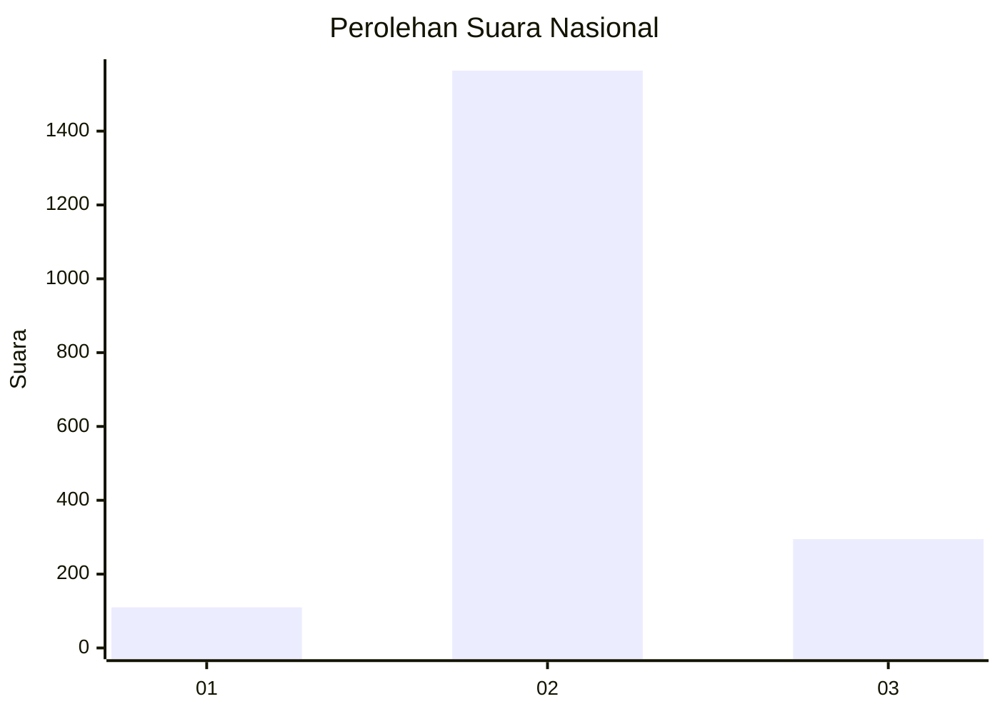
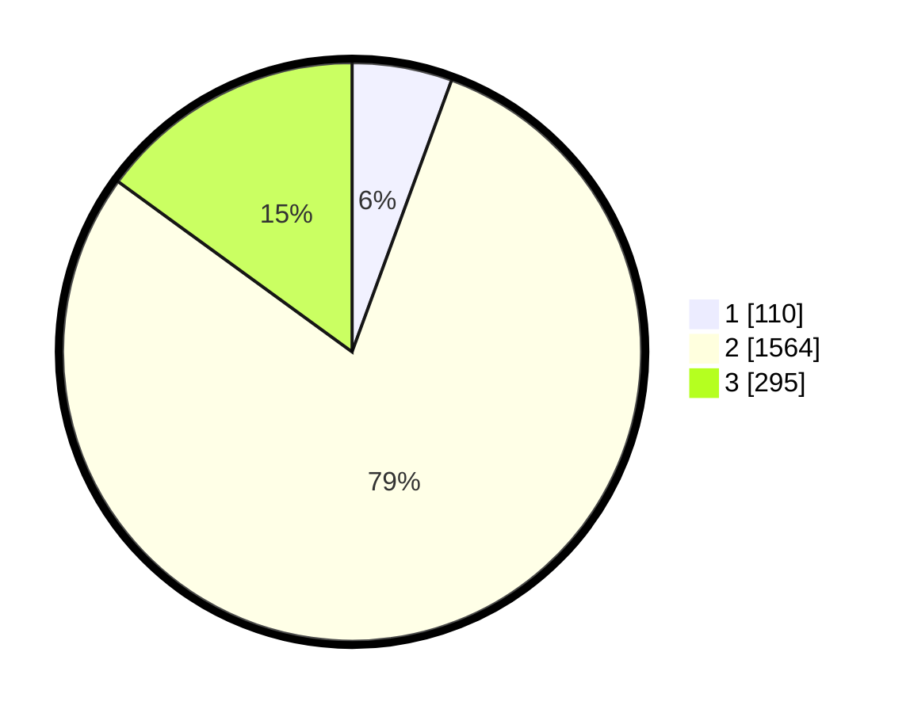

# Hasil

## Grafik

## Tabel

| No. | Nama Paslon    | Suara | Suara (raw) | Persentase |
|:--- |:-------------- | -----:| -----------:| ----------:|
| 1   | ANIES MUHAIMIN | 110   | [110][p-1]  | 5,59       |
| 2   | PRABOWO GIBRAN | 1.564 | [1564][p-2] | 79,43      |
| 3   | GANJAR MAHFUD  | 295   | [295][p-3]  | 14,98      |

[p-1]: https://github.com/gigit-pemilu/pemilu-2024/blob/main/pilpres/hitung-suara/sub/99-luar-negeri/sub/49-hong-kong-republik-rakyat-tiongkok/sub/01-hong-kong-republik-rakyat-tiongkok/sub/0001-hong-kong-republik-rakyat-tiongkok/sub/036-pos-032/sub/paslon-1.txt
[p-2]: https://github.com/gigit-pemilu/pemilu-2024/blob/main/pilpres/hitung-suara/sub/99-luar-negeri/sub/49-hong-kong-republik-rakyat-tiongkok/sub/01-hong-kong-republik-rakyat-tiongkok/sub/0001-hong-kong-republik-rakyat-tiongkok/sub/036-pos-032/sub/paslon-2.txt
[p-3]: https://github.com/gigit-pemilu/pemilu-2024/blob/main/pilpres/hitung-suara/sub/99-luar-negeri/sub/49-hong-kong-republik-rakyat-tiongkok/sub/01-hong-kong-republik-rakyat-tiongkok/sub/0001-hong-kong-republik-rakyat-tiongkok/sub/036-pos-032/sub/paslon-3.txt

## Foto C Plano

https://sirekap-obj-formc.kpu.go.id/136d/pemilu/ppwp/99/49/01/00/01/9949010001036-20240217-194512--ee4e1c73-c129-49d6-8812-5c246545f6f0.jpg

https://sirekap-obj-formc.kpu.go.id/136d/pemilu/ppwp/99/49/01/00/01/9949010001036-20240217-194731--cba0c0eb-a640-4439-8442-5f231ec17a5c.jpg

https://sirekap-obj-formc.kpu.go.id/136d/pemilu/ppwp/99/49/01/00/01/9949010001036-20240217-194817--62e033ad-c394-4531-a52c-09f10eb549cb.jpg

## Metadata

| Key        | Value               |
| ---------- | ------------------- |
| Time Stamp | 2024-02-19 06:16:00 |

## DATA PEMILIH TETAP

Jumlah pemilih dalam DPT: **4509**.
 * L: **46**.
 * P: **4463**.

## DATA PENGGUNA HAK PILIH

Jumlah pengguna hak pilih dalam DPT: **1810**.
 * L: **8**.
 * P: **1802**.

Jumlah pengguna hak pilih dalam DPTb: **0**.
 * L: **0**.
 * P: **0**.

Jumlah pengguna hak pilih dalam DPK: **0**.
 * L: **0**.
 * P: **0**.

Jumlah pengguna hak pilih: **1810**.
 * L: **8**.
 * P: **1802**.

## JUMLAH SUARA SAH DAN TIDAK SAH

JUMLAH SELURUH SUARA SAH: **1969**.

JUMLAH SUARA TIDAK SAH: **119**.

JUMLAH SELURUH SUARA SAH DAN SUARA TIDAK SAH: **2088**.

