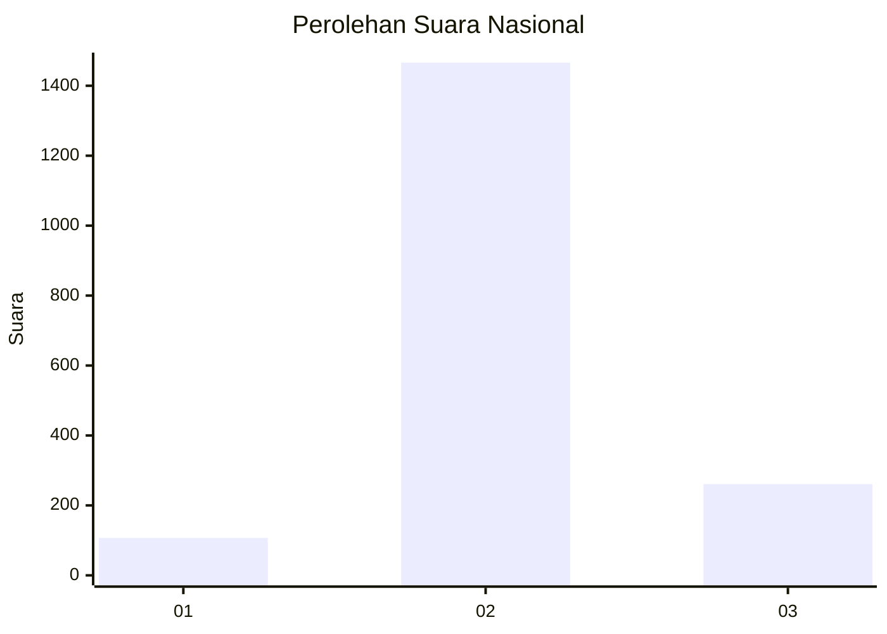

# Hasil

## Grafik

## Tabel

| No. | Nama Paslon    | Suara | Suara (raw) | Persentase |
|:--- |:-------------- | -----:| -----------:| ----------:|
| 1   | ANIES MUHAIMIN | 107   | [107][p-1]  | 5,83       |
| 2   | PRABOWO GIBRAN | 1.466 | [1466][p-2] | 79,93      |
| 3   | GANJAR MAHFUD  | 261   | [261][p-3]  | 14,23      |

[p-1]: https://github.com/gigit-pemilu/pemilu-2024/blob/main/pilpres/hitung-suara/sub/99-luar-negeri/sub/49-hong-kong-republik-rakyat-tiongkok/sub/01-hong-kong-republik-rakyat-tiongkok/sub/0001-hong-kong-republik-rakyat-tiongkok/sub/037-pos-033/sub/paslon-1.txt
[p-2]: https://github.com/gigit-pemilu/pemilu-2024/blob/main/pilpres/hitung-suara/sub/99-luar-negeri/sub/49-hong-kong-republik-rakyat-tiongkok/sub/01-hong-kong-republik-rakyat-tiongkok/sub/0001-hong-kong-republik-rakyat-tiongkok/sub/037-pos-033/sub/paslon-2.txt
[p-3]: https://github.com/gigit-pemilu/pemilu-2024/blob/main/pilpres/hitung-suara/sub/99-luar-negeri/sub/49-hong-kong-republik-rakyat-tiongkok/sub/01-hong-kong-republik-rakyat-tiongkok/sub/0001-hong-kong-republik-rakyat-tiongkok/sub/037-pos-033/sub/paslon-3.txt

## Foto C Plano

https://sirekap-obj-formc.kpu.go.id/fe0a/pemilu/ppwp/99/49/01/00/01/9949010001037-20240220-182219--096dc5eb-c030-43b7-9c67-6eccb78b11c0.jpg

https://sirekap-obj-formc.kpu.go.id/fe0a/pemilu/ppwp/99/49/01/00/01/9949010001037-20240220-182358--066c47bc-44cd-4888-9fdb-a131b23074ea.jpg

https://sirekap-obj-formc.kpu.go.id/fe0a/pemilu/ppwp/99/49/01/00/01/9949010001037-20240220-182530--7d964b8b-957d-4823-bd88-c94ef6093e1e.jpg

## Metadata

| Key        | Value               |
| ---------- | ------------------- |
| Time Stamp | 2024-02-20 19:00:00 |

## DATA PEMILIH TETAP

Jumlah pemilih dalam DPT: **4502**.
 * L: **46**.
 * P: **4456**.

## DATA PENGGUNA HAK PILIH

Jumlah pengguna hak pilih dalam DPT: **1502**.
 * L: **10**.
 * P: **1492**.

Jumlah pengguna hak pilih dalam DPTb: **0**.
 * L: **0**.
 * P: **0**.

Jumlah pengguna hak pilih dalam DPK: **0**.
 * L: **0**.
 * P: **0**.

Jumlah pengguna hak pilih: **1502**.
 * L: **10**.
 * P: **1492**.

## JUMLAH SUARA SAH DAN TIDAK SAH

JUMLAH SELURUH SUARA SAH: **1834**.

JUMLAH SUARA TIDAK SAH: **99**.

JUMLAH SELURUH SUARA SAH DAN SUARA TIDAK SAH: **1933**.

