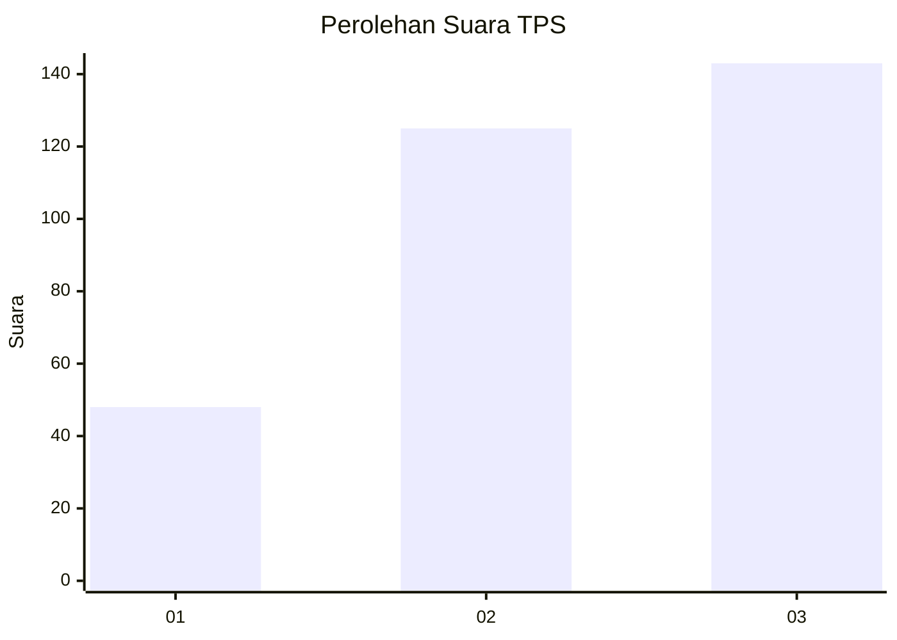
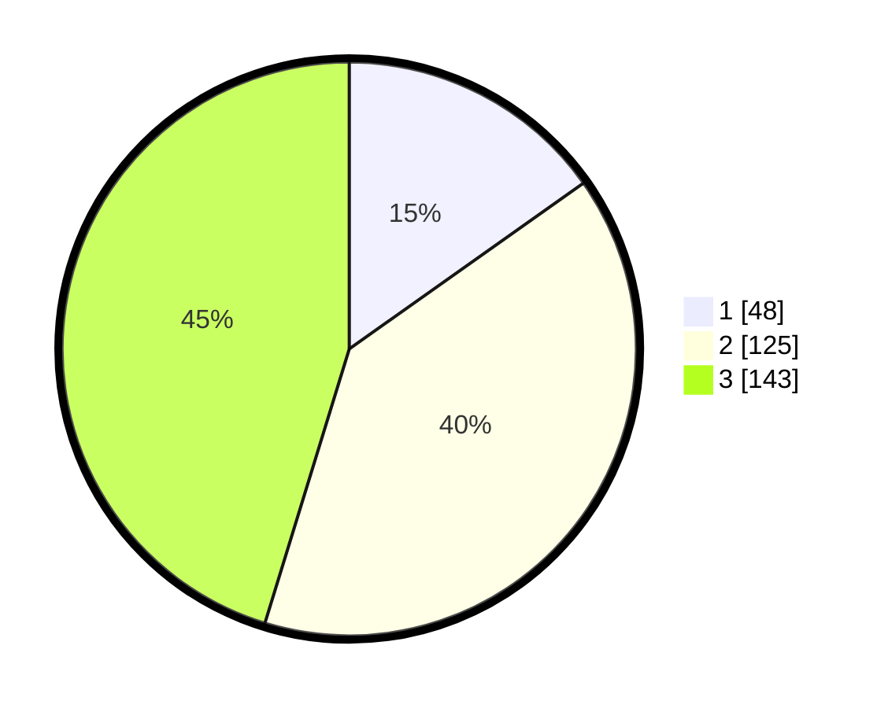

# Hasil

## Grafik

## Tabel

| No. | Nama Paslon    | Suara | Suara (raw) | Persentase |
|:--- |:-------------- | -----:| -----------:| ----------:|
| 1   | ANIES MUHAIMIN | 48    | [48][p-1]   | 15,19      |
| 2   | PRABOWO GIBRAN | 125   | [125][p-2]  | 39,56      |
| 3   | GANJAR MAHFUD  | 143   | [143][p-3]  | 45,25      |

[p-1]: https://github.com/gigit-pemilu/pemilu-2024-99-luar-negeri/blob/main/pilpres/hitung-suara/sub/99-luar-negeri/sub/50-houston-amerika-serikat/sub/01-houston-amerika-serikat/sub/0001-houston-amerika-serikat/sub/001-pos-001/sub/paslon-1.txt
[p-2]: https://github.com/gigit-pemilu/pemilu-2024-99-luar-negeri/blob/main/pilpres/hitung-suara/sub/99-luar-negeri/sub/50-houston-amerika-serikat/sub/01-houston-amerika-serikat/sub/0001-houston-amerika-serikat/sub/001-pos-001/sub/paslon-2.txt
[p-3]: https://github.com/gigit-pemilu/pemilu-2024-99-luar-negeri/blob/main/pilpres/hitung-suara/sub/99-luar-negeri/sub/50-houston-amerika-serikat/sub/01-houston-amerika-serikat/sub/0001-houston-amerika-serikat/sub/001-pos-001/sub/paslon-3.txt

## Foto C Plano

https://sirekap-obj-formc.kpu.go.id/1e62/pemilu/ppwp/99/50/01/00/01/9950010001001-20240222-131348--2ddef481-3b30-45a0-87fc-3e934d71f883.jpg

https://sirekap-obj-formc.kpu.go.id/1e62/pemilu/ppwp/99/50/01/00/01/9950010001001-20240222-132148--0b5374ad-becf-482c-95e5-140aab94fc57.jpg

https://sirekap-obj-formc.kpu.go.id/1e62/pemilu/ppwp/99/50/01/00/01/9950010001001-20240222-131736--c221a7ec-4f43-4832-b7e1-37bd6494bca2.jpg

## Metadata

| Key        | Value               |
| ---------- | ------------------- |
| Time Stamp | 2024-02-22 14:00:00 |

## DATA PEMILIH TETAP

Jumlah pemilih dalam DPT: **1297**.
 * L: **595**.
 * P: **702**.

## DATA PENGGUNA HAK PILIH

Jumlah pengguna hak pilih dalam DPT: **318**.
 * L: **98**.
 * P: **220**.

Jumlah pengguna hak pilih dalam DPTb: **0**.
 * L: **0**.
 * P: **0**.

Jumlah pengguna hak pilih dalam DPK: **1**.
 * L: **1**.
 * P: **0**.

Jumlah pengguna hak pilih: **319**.
 * L: **99**.
 * P: **220**.

## JUMLAH SUARA SAH DAN TIDAK SAH

JUMLAH SELURUH SUARA SAH: **316**.

JUMLAH SUARA TIDAK SAH: **3**.

JUMLAH SELURUH SUARA SAH DAN SUARA TIDAK SAH: **319**.

