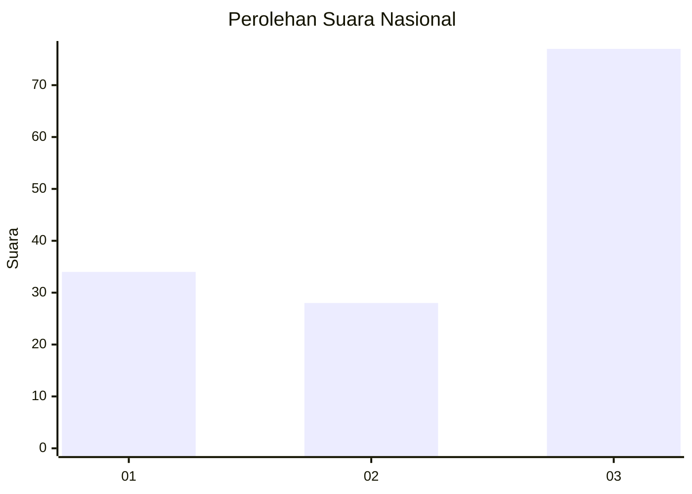
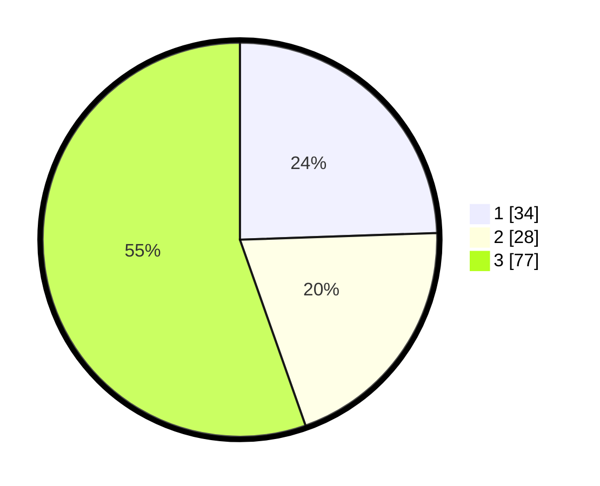

# Hasil

## Grafik

## Tabel

| No. | Nama Paslon    | Suara | Suara (raw) | Persentase |
|:--- |:-------------- | -----:| -----------:| ----------:|
| 1   | ANIES MUHAIMIN | 34    | [34][p-1]   | 24,46      |
| 2   | PRABOWO GIBRAN | 28    | [28][p-2]   | 20,14      |
| 3   | GANJAR MAHFUD  | 77    | [77][p-3]   | 55,40      |

[p-1]: https://github.com/gigit-pemilu/pemilu-2024/blob/main/pilpres/hitung-suara/sub/99-luar-negeri/sub/50-houston-amerika-serikat/sub/01-houston-amerika-serikat/sub/0001-houston-amerika-serikat/sub/002-tps-001/sub/paslon-1.txt
[p-2]: https://github.com/gigit-pemilu/pemilu-2024/blob/main/pilpres/hitung-suara/sub/99-luar-negeri/sub/50-houston-amerika-serikat/sub/01-houston-amerika-serikat/sub/0001-houston-amerika-serikat/sub/002-tps-001/sub/paslon-2.txt
[p-3]: https://github.com/gigit-pemilu/pemilu-2024/blob/main/pilpres/hitung-suara/sub/99-luar-negeri/sub/50-houston-amerika-serikat/sub/01-houston-amerika-serikat/sub/0001-houston-amerika-serikat/sub/002-tps-001/sub/paslon-3.txt

## Foto C Plano

https://sirekap-obj-formc.kpu.go.id/b889/pemilu/ppwp/99/50/01/00/01/9950010001002-20240215-083904--961c6908-c72e-47ca-a199-6a60942b56f7.jpg

https://sirekap-obj-formc.kpu.go.id/b889/pemilu/ppwp/99/50/01/00/01/9950010001002-20240215-064032--7a8b8bc6-06a3-424f-b67b-35128d9e8703.jpg

https://sirekap-obj-formc.kpu.go.id/b889/pemilu/ppwp/99/50/01/00/01/9950010001002-20240215-084001--d2c5a1b1-942c-4c60-a9a7-9d6ee0c8107c.jpg

## Metadata

| Key        | Value               |
| ---------- | ------------------- |
| Time Stamp | 2024-02-17 13:42:09 |

## DATA PEMILIH TETAP

Jumlah pemilih dalam DPT: **564**.
 * L: **245**.
 * P: **319**.

## DATA PENGGUNA HAK PILIH

Jumlah pengguna hak pilih dalam DPT: **99**.
 * L: **42**.
 * P: **57**.

Jumlah pengguna hak pilih dalam DPTb: **18**.
 * L: **8**.
 * P: **10**.

Jumlah pengguna hak pilih dalam DPK: **23**.
 * L: **10**.
 * P: **13**.

Jumlah pengguna hak pilih: **140**.
 * L: **60**.
 * P: **80**.

## JUMLAH SUARA SAH DAN TIDAK SAH

JUMLAH SELURUH SUARA SAH: **139**.

JUMLAH SUARA TIDAK SAH: **1**.

JUMLAH SELURUH SUARA SAH DAN SUARA TIDAK SAH: **140**.

