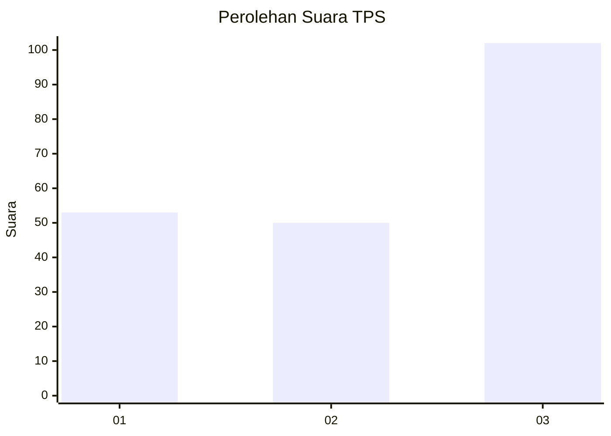
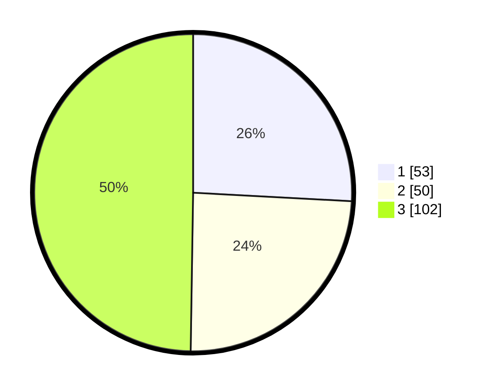

# Hasil

## Grafik

## Tabel

| No. | Nama Paslon    | Suara | Suara (raw) | Persentase |
|:--- |:-------------- | -----:| -----------:| ----------:|
| 1   | ANIES MUHAIMIN | 53    | [53][p-1]   | 25,85      |
| 2   | PRABOWO GIBRAN | 50    | [50][p-2]   | 24,39      |
| 3   | GANJAR MAHFUD  | 102   | [102][p-3]  | 49,76      |

[p-1]: https://github.com/gigit-pemilu/pemilu-2024-99-luar-negeri/blob/main/pilpres/hitung-suara/sub/99-luar-negeri/sub/50-houston-amerika-serikat/sub/01-houston-amerika-serikat/sub/0001-houston-amerika-serikat/sub/003-tps-002/sub/paslon-1.txt
[p-2]: https://github.com/gigit-pemilu/pemilu-2024-99-luar-negeri/blob/main/pilpres/hitung-suara/sub/99-luar-negeri/sub/50-houston-amerika-serikat/sub/01-houston-amerika-serikat/sub/0001-houston-amerika-serikat/sub/003-tps-002/sub/paslon-2.txt
[p-3]: https://github.com/gigit-pemilu/pemilu-2024-99-luar-negeri/blob/main/pilpres/hitung-suara/sub/99-luar-negeri/sub/50-houston-amerika-serikat/sub/01-houston-amerika-serikat/sub/0001-houston-amerika-serikat/sub/003-tps-002/sub/paslon-3.txt

## Foto C Plano

https://sirekap-obj-formc.kpu.go.id/ab1b/pemilu/ppwp/99/50/01/00/01/9950010001003-20240215-051340--4217d085-7656-4bf3-8b45-db7e33fa4a54.jpg

https://sirekap-obj-formc.kpu.go.id/ab1b/pemilu/ppwp/99/50/01/00/01/9950010001003-20240214-230243--1968cceb-382b-47ea-a663-5af1a0a6bd95.jpg

https://sirekap-obj-formc.kpu.go.id/ab1b/pemilu/ppwp/99/50/01/00/01/9950010001003-20240214-222749--c9680aa5-a9d6-419d-b1a5-2cc3916fac36.jpg

## Metadata

| Key        | Value               |
| ---------- | ------------------- |
| Time Stamp | 2024-02-15 18:30:25 |

