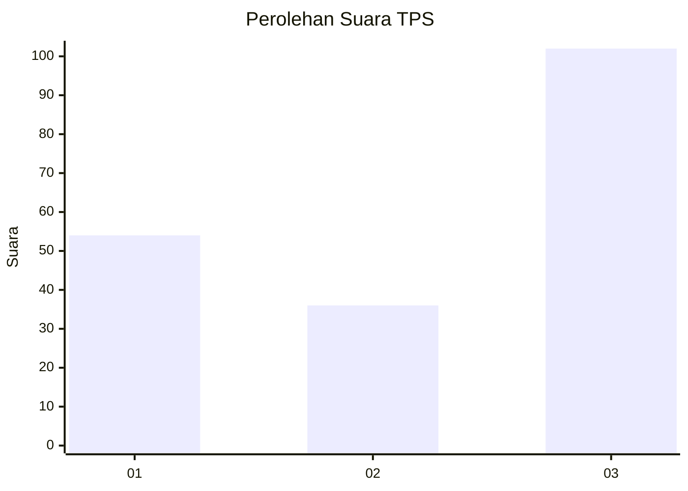
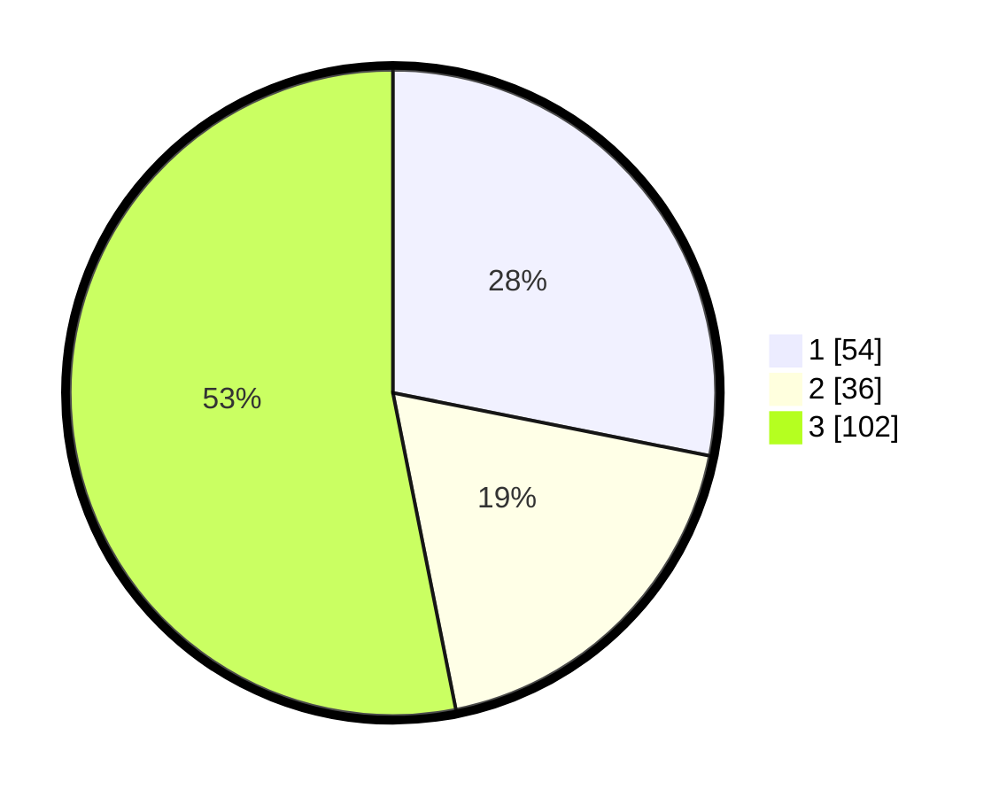

# Hasil

## Grafik

## Tabel

| No. | Nama Paslon    | Suara | Suara (raw) | Persentase |
|:--- |:-------------- | -----:| -----------:| ----------:|
| 1   | ANIES MUHAIMIN | 54    | [54][p-1]   | 28,13      |
| 2   | PRABOWO GIBRAN | 36    | [36][p-2]   | 18,75      |
| 3   | GANJAR MAHFUD  | 102   | [102][p-3]  | 53,13      |

[p-1]: https://github.com/gigit-pemilu/pemilu-2024-99-luar-negeri/blob/main/pilpres/hitung-suara/sub/99-luar-negeri/sub/50-houston-amerika-serikat/sub/01-houston-amerika-serikat/sub/0001-houston-amerika-serikat/sub/004-tps-003/sub/paslon-1.txt
[p-2]: https://github.com/gigit-pemilu/pemilu-2024-99-luar-negeri/blob/main/pilpres/hitung-suara/sub/99-luar-negeri/sub/50-houston-amerika-serikat/sub/01-houston-amerika-serikat/sub/0001-houston-amerika-serikat/sub/004-tps-003/sub/paslon-2.txt
[p-3]: https://github.com/gigit-pemilu/pemilu-2024-99-luar-negeri/blob/main/pilpres/hitung-suara/sub/99-luar-negeri/sub/50-houston-amerika-serikat/sub/01-houston-amerika-serikat/sub/0001-houston-amerika-serikat/sub/004-tps-003/sub/paslon-3.txt

## Foto C Plano

https://sirekap-obj-formc.kpu.go.id/1c57/pemilu/ppwp/99/50/01/00/01/9950010001004-20240215-060812--9c53d8ae-adc0-4e2c-860f-fc2120f22d18.jpg

https://sirekap-obj-formc.kpu.go.id/1c57/pemilu/ppwp/99/50/01/00/01/9950010001004-20240215-052221--9e24677a-88c3-49d4-aead-4cdc8f43b385.jpg

https://sirekap-obj-formc.kpu.go.id/1c57/pemilu/ppwp/99/50/01/00/01/9950010001004-20240215-060945--c7471b28-1946-40c2-9793-df478ac1bf4a.jpg

## Metadata

| Key        | Value               |
| ---------- | ------------------- |
| Time Stamp | 2024-02-17 14:45:18 |

## DATA PEMILIH TETAP

Jumlah pemilih dalam DPT: **480**.
 * L: **198**.
 * P: **282**.

## DATA PENGGUNA HAK PILIH

Jumlah pengguna hak pilih dalam DPT: **136**.
 * L: **48**.
 * P: **88**.

Jumlah pengguna hak pilih dalam DPTb: **25**.
 * L: **11**.
 * P: **14**.

Jumlah pengguna hak pilih dalam DPK: **32**.
 * L: **14**.
 * P: **18**.

Jumlah pengguna hak pilih: **193**.
 * L: **73**.
 * P: **120**.

## JUMLAH SUARA SAH DAN TIDAK SAH

JUMLAH SELURUH SUARA SAH: **192**.

JUMLAH SUARA TIDAK SAH: **1**.

JUMLAH SELURUH SUARA SAH DAN SUARA TIDAK SAH: **193**.

