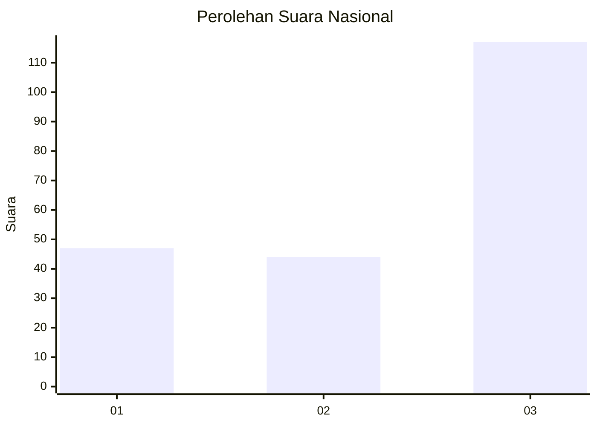
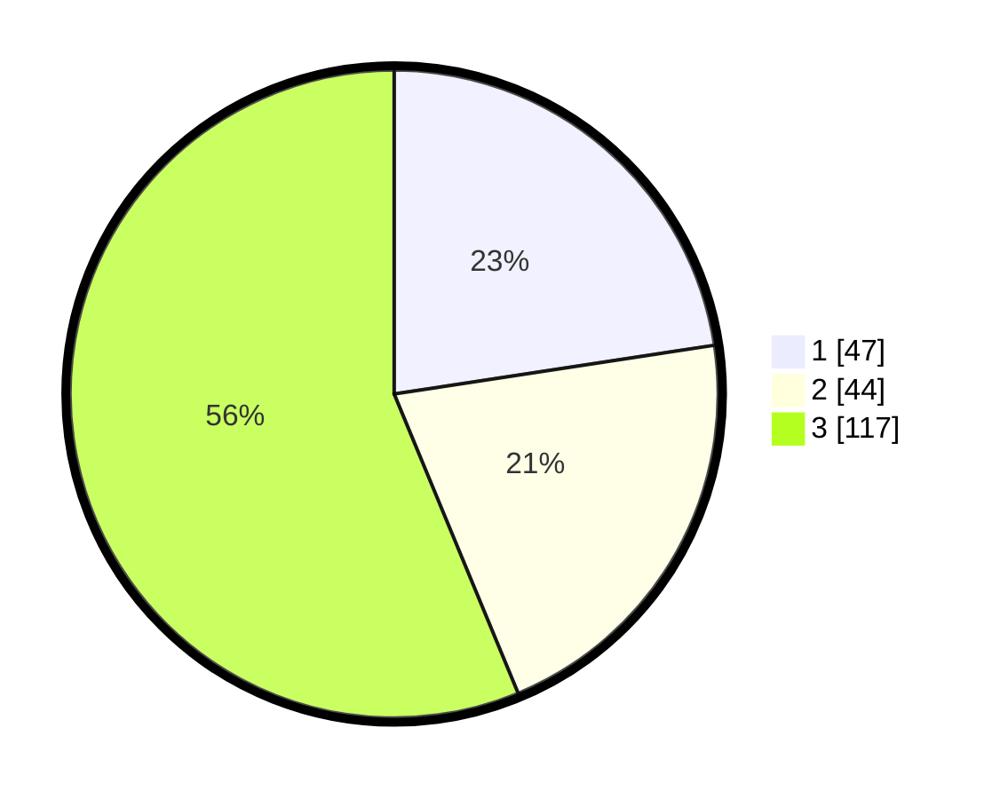

# Hasil

## Grafik

## Tabel

| No. | Nama Paslon    | Suara | Suara (raw) | Persentase |
|:--- |:-------------- | -----:| -----------:| ----------:|
| 1   | ANIES MUHAIMIN | 47    | [47][p-1]   | 22,60      |
| 2   | PRABOWO GIBRAN | 44    | [44][p-2]   | 21,15      |
| 3   | GANJAR MAHFUD  | 117   | [117][p-3]  | 56,25      |

[p-1]: https://github.com/gigit-pemilu/pemilu-2024/blob/main/pilpres/hitung-suara/sub/99-luar-negeri/sub/50-houston-amerika-serikat/sub/01-houston-amerika-serikat/sub/0001-houston-amerika-serikat/sub/005-ksk-001/sub/paslon-1.txt
[p-2]: https://github.com/gigit-pemilu/pemilu-2024/blob/main/pilpres/hitung-suara/sub/99-luar-negeri/sub/50-houston-amerika-serikat/sub/01-houston-amerika-serikat/sub/0001-houston-amerika-serikat/sub/005-ksk-001/sub/paslon-2.txt
[p-3]: https://github.com/gigit-pemilu/pemilu-2024/blob/main/pilpres/hitung-suara/sub/99-luar-negeri/sub/50-houston-amerika-serikat/sub/01-houston-amerika-serikat/sub/0001-houston-amerika-serikat/sub/005-ksk-001/sub/paslon-3.txt

## Foto C Plano

https://sirekap-obj-formc.kpu.go.id/2c58/pemilu/ppwp/99/50/01/00/01/9950010001005-20240216-143957--6e1b134b-9878-48a4-8d68-9b3af8dfe40e.jpg

https://sirekap-obj-formc.kpu.go.id/2c58/pemilu/ppwp/99/50/01/00/01/9950010001005-20240215-055209--1877aec9-3475-47d9-93f5-6f8d0bdce0a3.jpg

https://sirekap-obj-formc.kpu.go.id/2c58/pemilu/ppwp/99/50/01/00/01/9950010001005-20240215-053815--8c1e9e62-db12-4d87-8a47-e837c96294eb.jpg

## Metadata

| Key        | Value               |
| ---------- | ------------------- |
| Time Stamp | 2024-02-17 14:45:18 |

## DATA PEMILIH TETAP

Jumlah pemilih dalam DPT: **669**.
 * L: **259**.
 * P: **410**.

## DATA PENGGUNA HAK PILIH

Jumlah pengguna hak pilih dalam DPT: **127**.
 * L: **42**.
 * P: **85**.

Jumlah pengguna hak pilih dalam DPTb: **33**.
 * L: **16**.
 * P: **17**.

Jumlah pengguna hak pilih dalam DPK: **48**.
 * L: **19**.
 * P: **29**.

Jumlah pengguna hak pilih: **208**.
 * L: **77**.
 * P: **131**.

## JUMLAH SUARA SAH DAN TIDAK SAH

JUMLAH SELURUH SUARA SAH: **208**.

JUMLAH SUARA TIDAK SAH: **0**.

JUMLAH SELURUH SUARA SAH DAN SUARA TIDAK SAH: **208**.

