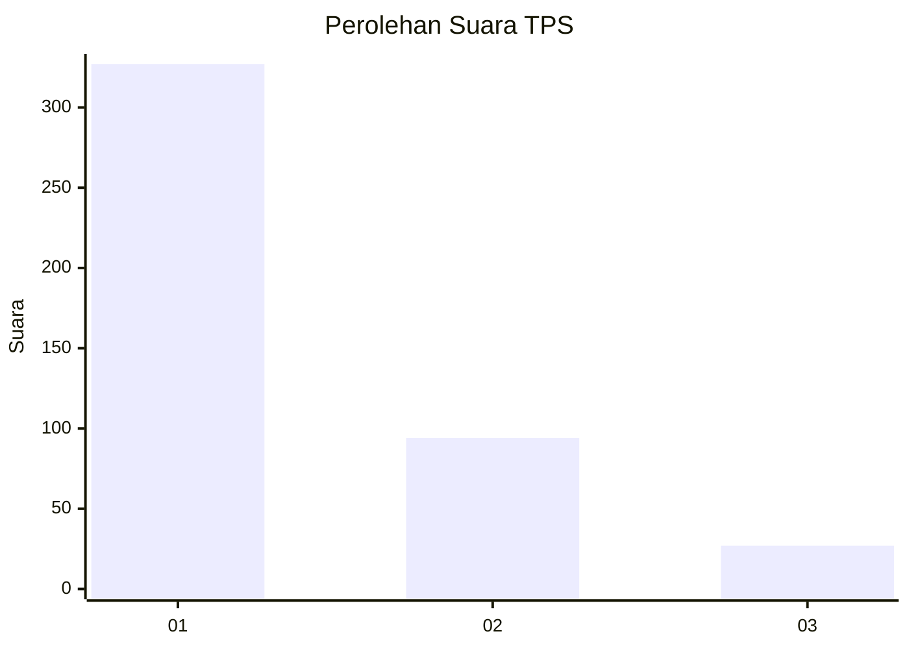
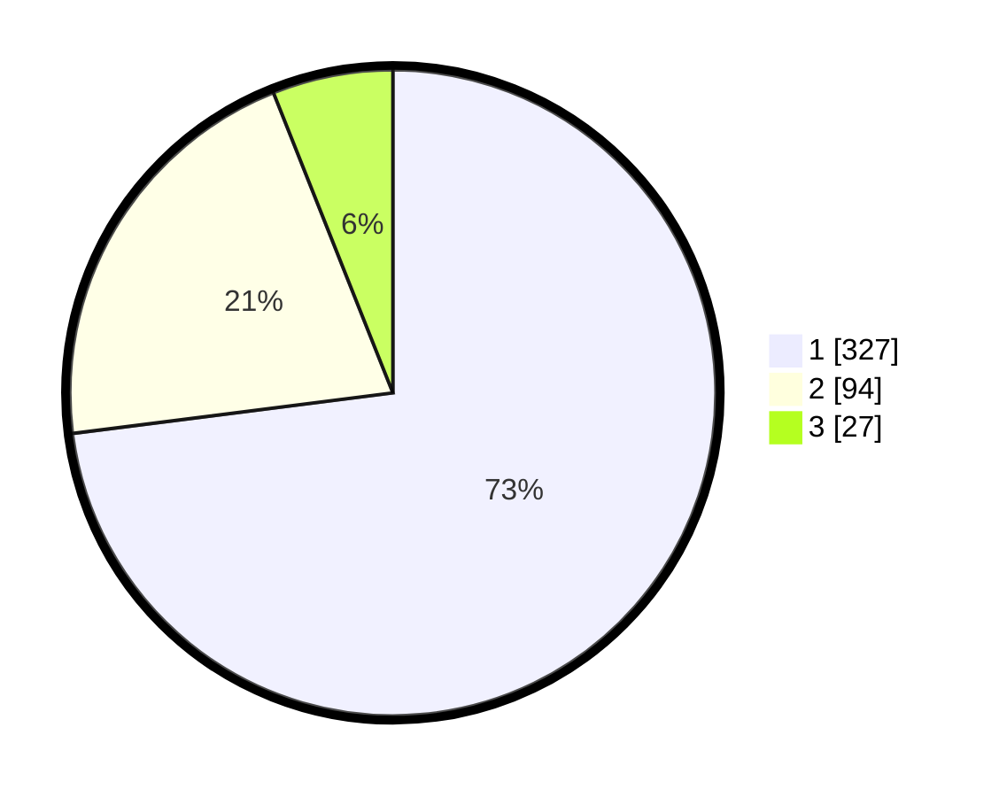

# Hasil

## Grafik

## Tabel

| No. | Nama Paslon    | Suara | Suara (raw) | Persentase |
|:--- |:-------------- | -----:| -----------:| ----------:|
| 1   | ANIES MUHAIMIN | 327   | [327][p-1]  | 72,99      |
| 2   | PRABOWO GIBRAN | 94    | [94][p-2]   | 20,98      |
| 3   | GANJAR MAHFUD  | 27    | [27][p-3]   | 6,03       |

[p-1]: https://github.com/gigit-pemilu/pemilu-2024-99-luar-negeri/blob/main/pilpres/hitung-suara/sub/99-luar-negeri/sub/51-islamabad-pakistan/sub/01-islamabad-pakistan/sub/0001-islamabad-pakistan/sub/002-tps-001/sub/paslon-1.txt
[p-2]: https://github.com/gigit-pemilu/pemilu-2024-99-luar-negeri/blob/main/pilpres/hitung-suara/sub/99-luar-negeri/sub/51-islamabad-pakistan/sub/01-islamabad-pakistan/sub/0001-islamabad-pakistan/sub/002-tps-001/sub/paslon-2.txt
[p-3]: https://github.com/gigit-pemilu/pemilu-2024-99-luar-negeri/blob/main/pilpres/hitung-suara/sub/99-luar-negeri/sub/51-islamabad-pakistan/sub/01-islamabad-pakistan/sub/0001-islamabad-pakistan/sub/002-tps-001/sub/paslon-3.txt

## Foto C Plano

https://sirekap-obj-formc.kpu.go.id/6715/pemilu/ppwp/99/51/01/00/01/9951010001002-20240214-155634--bd44b4c9-1231-4ef4-9319-10659bc7c87d.jpg

https://sirekap-obj-formc.kpu.go.id/6715/pemilu/ppwp/99/51/01/00/01/9951010001002-20240214-155751--0f1abc19-19ee-48ae-a044-8a8496ce7f5b.jpg

https://sirekap-obj-formc.kpu.go.id/6715/pemilu/ppwp/99/51/01/00/01/9951010001002-20240214-160055--79c700a5-3bce-4d40-a185-8b44552f43f9.jpg

## Metadata

| Key        | Value               |
| ---------- | ------------------- |
| Time Stamp | 2024-02-19 06:16:00 |

## DATA PEMILIH TETAP

Jumlah pemilih dalam DPT: **536**.
 * L: **269**.
 * P: **267**.

## DATA PENGGUNA HAK PILIH

Jumlah pengguna hak pilih dalam DPT: **379**.
 * L: **196**.
 * P: **183**.

Jumlah pengguna hak pilih dalam DPTb: **63**.
 * L: **33**.
 * P: **30**.

Jumlah pengguna hak pilih dalam DPK: **14**.
 * L: **6**.
 * P: **8**.

Jumlah pengguna hak pilih: **456**.
 * L: **235**.
 * P: **221**.

## JUMLAH SUARA SAH DAN TIDAK SAH

JUMLAH SELURUH SUARA SAH: **448**.

JUMLAH SUARA TIDAK SAH: **8**.

JUMLAH SELURUH SUARA SAH DAN SUARA TIDAK SAH: **456**.

