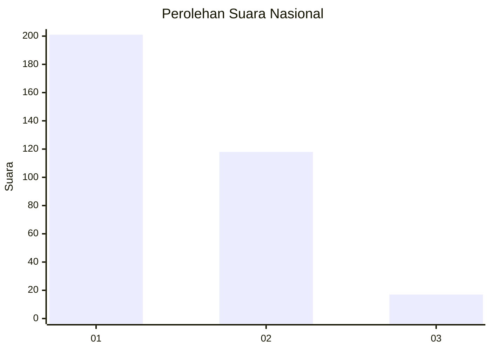
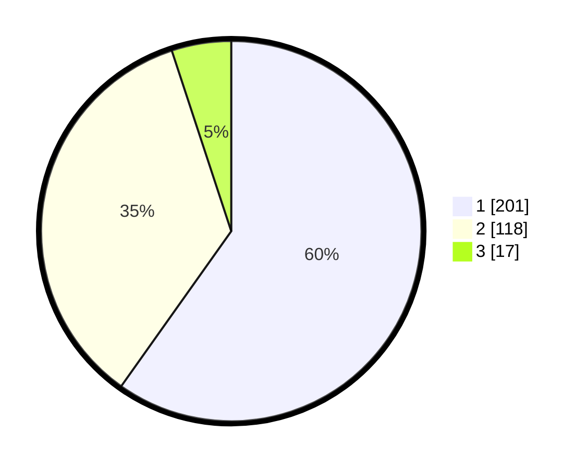

# Hasil

## Grafik

## Tabel

| No. | Nama Paslon    | Suara | Suara (raw) | Persentase |
|:--- |:-------------- | -----:| -----------:| ----------:|
| 1   | ANIES MUHAIMIN | 201   | [201][p-1]  | 59,82      |
| 2   | PRABOWO GIBRAN | 118   | [118][p-2]  | 35,12      |
| 3   | GANJAR MAHFUD  | 17    | [17][p-3]   | 5,06       |

[p-1]: https://github.com/gigit-pemilu/pemilu-2024/blob/main/pilpres/hitung-suara/sub/99-luar-negeri/sub/52-istanbul-turki/sub/01-istanbul-turki/sub/0001-istanbul-turki/sub/001-pos-001/sub/paslon-1.txt
[p-2]: https://github.com/gigit-pemilu/pemilu-2024/blob/main/pilpres/hitung-suara/sub/99-luar-negeri/sub/52-istanbul-turki/sub/01-istanbul-turki/sub/0001-istanbul-turki/sub/001-pos-001/sub/paslon-2.txt
[p-3]: https://github.com/gigit-pemilu/pemilu-2024/blob/main/pilpres/hitung-suara/sub/99-luar-negeri/sub/52-istanbul-turki/sub/01-istanbul-turki/sub/0001-istanbul-turki/sub/001-pos-001/sub/paslon-3.txt

## Foto C Plano

https://sirekap-obj-formc.kpu.go.id/8c46/pemilu/ppwp/99/52/01/00/01/9952010001001-20240216-011322--3f6c47f1-4ad0-4bce-8394-7393adc751a6.jpg

https://sirekap-obj-formc.kpu.go.id/8c46/pemilu/ppwp/99/52/01/00/01/9952010001001-20240216-005910--e814fc63-f074-443c-a711-376e70da7021.jpg

https://sirekap-obj-formc.kpu.go.id/8c46/pemilu/ppwp/99/52/01/00/01/9952010001001-20240216-010055--30c13cc7-1e83-4e05-9d2c-b4cf9d0ce2fb.jpg

## Metadata

| Key        | Value               |
| ---------- | ------------------- |
| Time Stamp | 2024-02-16 01:30:27 |

## DATA PEMILIH TETAP

Jumlah pemilih dalam DPT: **442**.
 * L: **162**.
 * P: **280**.

## DATA PENGGUNA HAK PILIH

Jumlah pengguna hak pilih dalam DPT: **433**.
 * L: **149**.
 * P: **284**.

Jumlah pengguna hak pilih dalam DPTb: **5**.
 * L: **0**.
 * P: **5**.

Jumlah pengguna hak pilih dalam DPK: **9**.
 * L: **3**.
 * P: **6**.

Jumlah pengguna hak pilih: **447**.
 * L: **152**.
 * P: **295**.

## JUMLAH SUARA SAH DAN TIDAK SAH

JUMLAH SELURUH SUARA SAH: **336**.

JUMLAH SUARA TIDAK SAH: **14**.

JUMLAH SELURUH SUARA SAH DAN SUARA TIDAK SAH: **350**.

