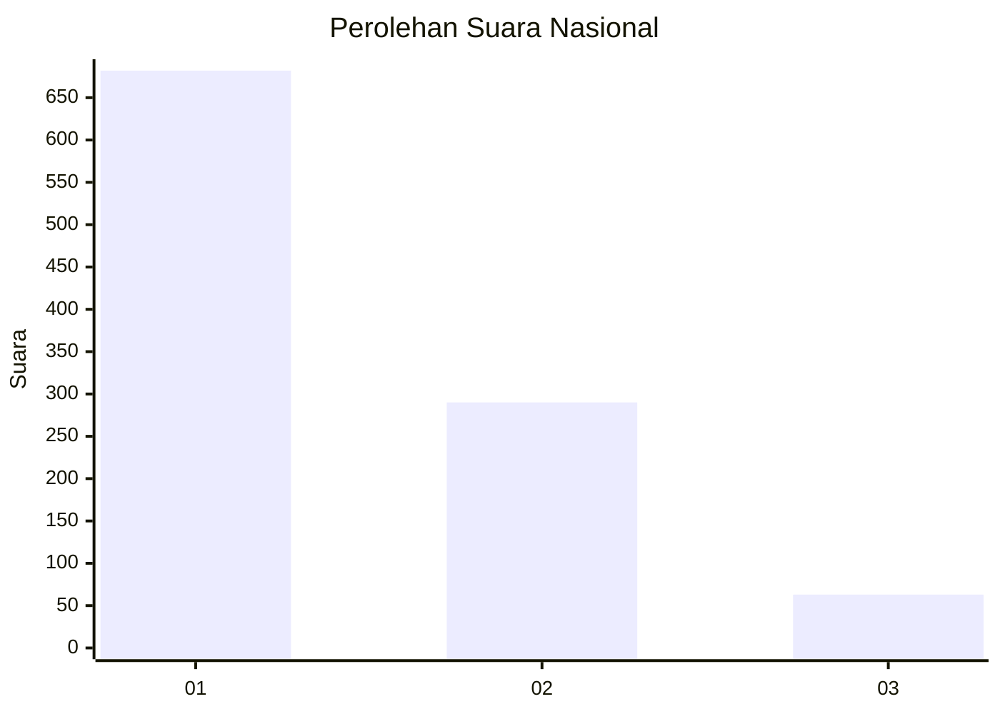
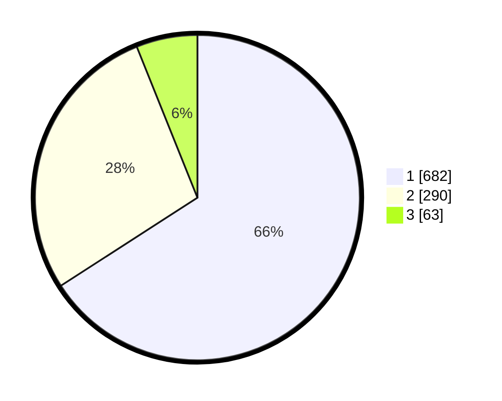

# Hasil

## Grafik

## Tabel

| No. | Nama Paslon    | Suara | Suara (raw) | Persentase |
|:--- |:-------------- | -----:| -----------:| ----------:|
| 1   | ANIES MUHAIMIN | 682   | [682][p-1]  | 65,89      |
| 2   | PRABOWO GIBRAN | 290   | [290][p-2]  | 28,02      |
| 3   | GANJAR MAHFUD  | 63    | [63][p-3]   | 6,09       |

[p-1]: https://github.com/gigit-pemilu/pemilu-2024/blob/main/pilpres/hitung-suara/sub/99-luar-negeri/sub/52-istanbul-turki/sub/01-istanbul-turki/sub/0001-istanbul-turki/sub/002-tps-001/sub/paslon-1.txt
[p-2]: https://github.com/gigit-pemilu/pemilu-2024/blob/main/pilpres/hitung-suara/sub/99-luar-negeri/sub/52-istanbul-turki/sub/01-istanbul-turki/sub/0001-istanbul-turki/sub/002-tps-001/sub/paslon-2.txt
[p-3]: https://github.com/gigit-pemilu/pemilu-2024/blob/main/pilpres/hitung-suara/sub/99-luar-negeri/sub/52-istanbul-turki/sub/01-istanbul-turki/sub/0001-istanbul-turki/sub/002-tps-001/sub/paslon-3.txt

## Foto C Plano

https://sirekap-obj-formc.kpu.go.id/dded/pemilu/ppwp/99/52/01/00/01/9952010001002-20240215-193612--c4919342-d767-4908-b025-0d9013b474a0.jpg

https://sirekap-obj-formc.kpu.go.id/dded/pemilu/ppwp/99/52/01/00/01/9952010001002-20240215-013639--7c719a7e-31fa-4eb2-a1b3-b0a3b3e8dc42.jpg

https://sirekap-obj-formc.kpu.go.id/dded/pemilu/ppwp/99/52/01/00/01/9952010001002-20240217-200121--1f195990-92da-43b8-bf28-ac464d2502c3.jpg

## Metadata

| Key        | Value               |
| ---------- | ------------------- |
| Time Stamp | 2024-02-19 06:16:00 |

## DATA PEMILIH TETAP

Jumlah pemilih dalam DPT: **2436**.
 * L: **925**.
 * P: **1511**.

## DATA PENGGUNA HAK PILIH

Jumlah pengguna hak pilih dalam DPT: **725**.
 * L: **337**.
 * P: **388**.

Jumlah pengguna hak pilih dalam DPTb: **123**.
 * L: **60**.
 * P: **63**.

Jumlah pengguna hak pilih dalam DPK: **211**.
 * L: **93**.
 * P: **118**.

Jumlah pengguna hak pilih: **1059**.
 * L: **490**.
 * P: **569**.

## JUMLAH SUARA SAH DAN TIDAK SAH

JUMLAH SELURUH SUARA SAH: **1035**.

JUMLAH SUARA TIDAK SAH: **24**.

JUMLAH SELURUH SUARA SAH DAN SUARA TIDAK SAH: **1059**.

