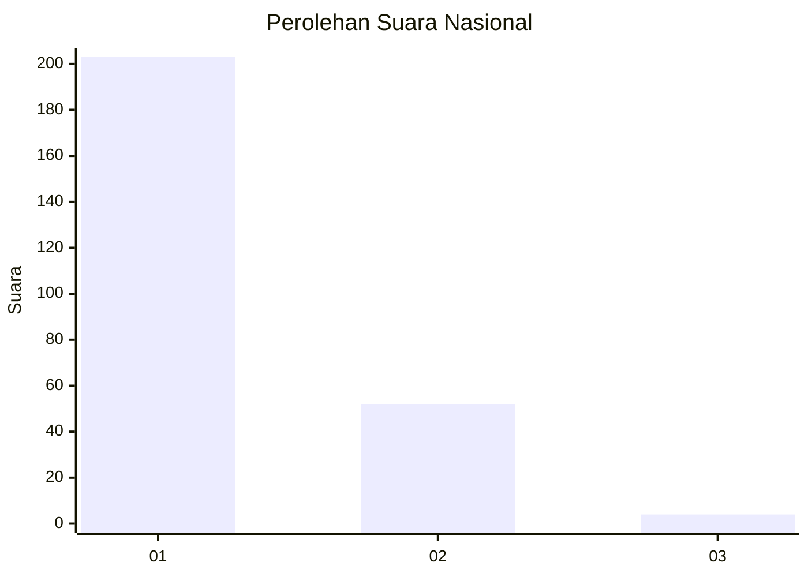
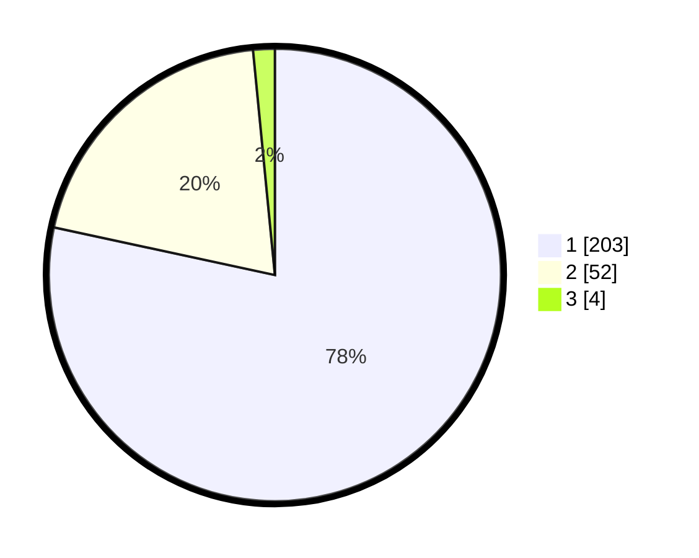

# Hasil

## Grafik

## Tabel

| No. | Nama Paslon    | Suara | Suara (raw) | Persentase |
|:--- |:-------------- | -----:| -----------:| ----------:|
| 1   | ANIES MUHAIMIN | 203   | [203][p-1]  | 78,38      |
| 2   | PRABOWO GIBRAN | 52    | [52][p-2]   | 20,08      |
| 3   | GANJAR MAHFUD  | 4     | [4][p-3]    | 1,54       |

[p-1]: https://github.com/gigit-pemilu/pemilu-2024/blob/main/pilpres/hitung-suara/sub/99-luar-negeri/sub/52-istanbul-turki/sub/01-istanbul-turki/sub/0001-istanbul-turki/sub/003-ksk-001/sub/paslon-1.txt
[p-2]: https://github.com/gigit-pemilu/pemilu-2024/blob/main/pilpres/hitung-suara/sub/99-luar-negeri/sub/52-istanbul-turki/sub/01-istanbul-turki/sub/0001-istanbul-turki/sub/003-ksk-001/sub/paslon-2.txt
[p-3]: https://github.com/gigit-pemilu/pemilu-2024/blob/main/pilpres/hitung-suara/sub/99-luar-negeri/sub/52-istanbul-turki/sub/01-istanbul-turki/sub/0001-istanbul-turki/sub/003-ksk-001/sub/paslon-3.txt

## Foto C Plano

https://sirekap-obj-formc.kpu.go.id/9f3d/pemilu/ppwp/99/52/01/00/01/9952010001003-20240215-195606--0be197c9-756a-430d-a4db-f7bc567bdb09.jpg

https://sirekap-obj-formc.kpu.go.id/9f3d/pemilu/ppwp/99/52/01/00/01/9952010001003-20240215-013519--cfd6ef58-c216-4c8e-85d1-996276b70818.jpg

https://sirekap-obj-formc.kpu.go.id/9f3d/pemilu/ppwp/99/52/01/00/01/9952010001003-20240215-160807--d3a11ece-33cd-4c73-a97d-de72de270977.jpg

## Metadata

| Key        | Value               |
| ---------- | ------------------- |
| Time Stamp | 2024-02-15 23:30:25 |

## DATA PEMILIH TETAP

Jumlah pemilih dalam DPT: **279**.
 * L: **137**.
 * P: **142**.

## DATA PENGGUNA HAK PILIH

Jumlah pengguna hak pilih dalam DPT: **182**.
 * L: **85**.
 * P: **97**.

Jumlah pengguna hak pilih dalam DPTb: **52**.
 * L: **28**.
 * P: **24**.

Jumlah pengguna hak pilih dalam DPK: **30**.
 * L: **19**.
 * P: **11**.

Jumlah pengguna hak pilih: **264**.
 * L: **132**.
 * P: **132**.

## JUMLAH SUARA SAH DAN TIDAK SAH

JUMLAH SELURUH SUARA SAH: **259**.

JUMLAH SUARA TIDAK SAH: **5**.

JUMLAH SELURUH SUARA SAH DAN SUARA TIDAK SAH: **264**.

