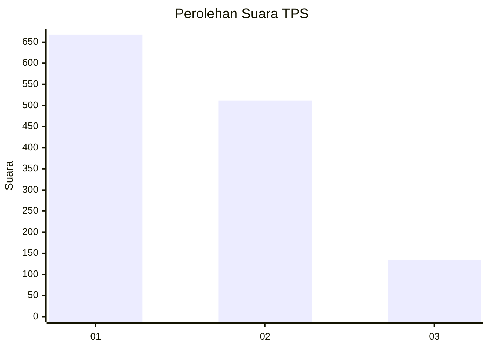
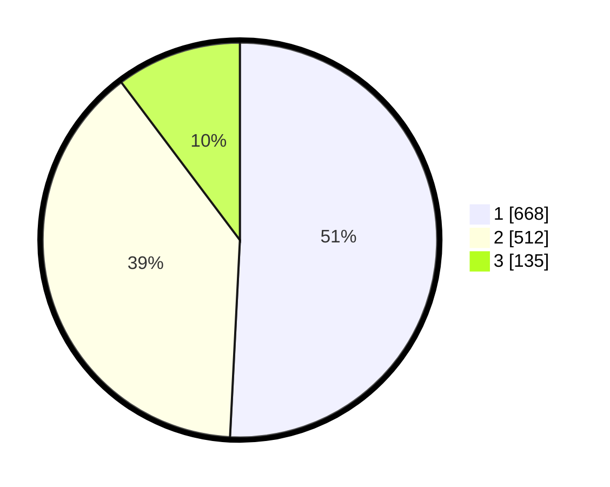

# Hasil

## Grafik

## Tabel

| No. | Nama Paslon    | Suara | Suara (raw) | Persentase |
|:--- |:-------------- | -----:| -----------:| ----------:|
| 1   | ANIES MUHAIMIN | 668   | [668][p-1]  | 50,80      |
| 2   | PRABOWO GIBRAN | 512   | [512][p-2]  | 38,94      |
| 3   | GANJAR MAHFUD  | 135   | [135][p-3]  | 10,27      |

[p-1]: https://github.com/gigit-pemilu/pemilu-2024-99-luar-negeri/blob/main/pilpres/hitung-suara/sub/99-luar-negeri/sub/53-jeddah-arab-saudi/sub/01-jeddah-arab-saudi/sub/0001-jeddah-arab-saudi/sub/001-tps/sub/paslon-1.txt
[p-2]: https://github.com/gigit-pemilu/pemilu-2024-99-luar-negeri/blob/main/pilpres/hitung-suara/sub/99-luar-negeri/sub/53-jeddah-arab-saudi/sub/01-jeddah-arab-saudi/sub/0001-jeddah-arab-saudi/sub/001-tps/sub/paslon-2.txt
[p-3]: https://github.com/gigit-pemilu/pemilu-2024-99-luar-negeri/blob/main/pilpres/hitung-suara/sub/99-luar-negeri/sub/53-jeddah-arab-saudi/sub/01-jeddah-arab-saudi/sub/0001-jeddah-arab-saudi/sub/001-tps/sub/paslon-3.txt

## Foto C Plano

https://sirekap-obj-formc.kpu.go.id/30fd/pemilu/ppwp/99/53/01/00/01/9953010001001-20240216-143604--2852ee4a-9cd8-4293-ad4f-17ad1d2f09c2.jpg

https://sirekap-obj-formc.kpu.go.id/30fd/pemilu/ppwp/99/53/01/00/01/9953010001001-20240216-143606--cec2c98e-6731-410b-bfe3-bcbb1b138217.jpg

https://sirekap-obj-formc.kpu.go.id/30fd/pemilu/ppwp/99/53/01/00/01/9953010001001-20240216-143605--70f56ece-f458-4ef6-b800-9a135681dd96.jpg

## Metadata

| Key        | Value               |
| ---------- | ------------------- |
| Time Stamp | 2024-02-19 06:16:00 |

## DATA PEMILIH TETAP

Jumlah pemilih dalam DPT: **1914**.
 * L: **983**.
 * P: **931**.

## DATA PENGGUNA HAK PILIH

Jumlah pengguna hak pilih dalam DPT: **89**.
 * L: **43**.
 * P: **46**.

Jumlah pengguna hak pilih dalam DPTb: **551**.
 * L: **340**.
 * P: **211**.

Jumlah pengguna hak pilih dalam DPK: **695**.
 * L: **370**.
 * P: **325**.

Jumlah pengguna hak pilih: **1335**.
 * L: **753**.
 * P: **582**.

## JUMLAH SUARA SAH DAN TIDAK SAH

JUMLAH SELURUH SUARA SAH: **1315**.

JUMLAH SUARA TIDAK SAH: **20**.

JUMLAH SELURUH SUARA SAH DAN SUARA TIDAK SAH: **1335**.

