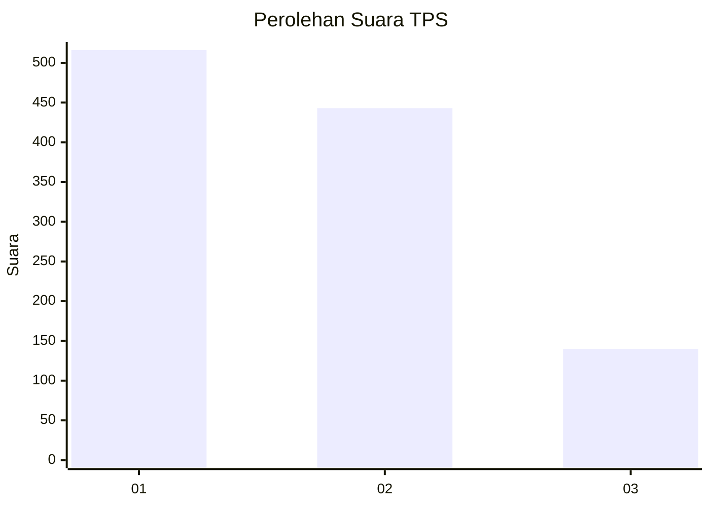
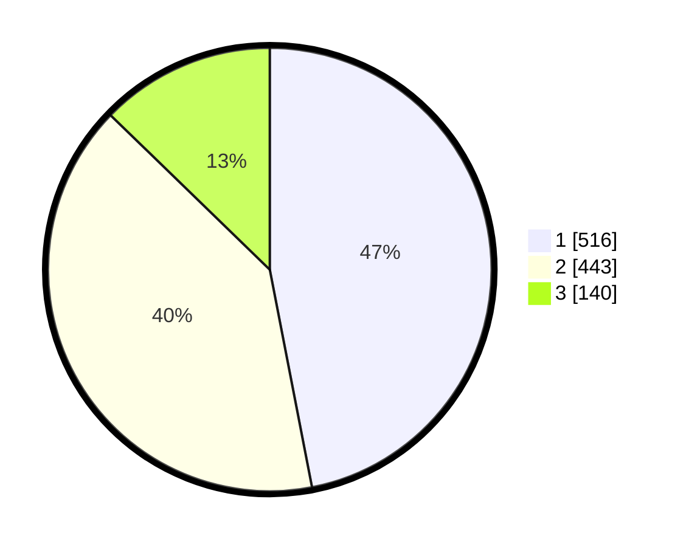

# Hasil

## Grafik

## Tabel

| No. | Nama Paslon    | Suara | Suara (raw) | Persentase |
|:--- |:-------------- | -----:| -----------:| ----------:|
| 1   | ANIES MUHAIMIN | 516   | [516][p-1]  | 46,95      |
| 2   | PRABOWO GIBRAN | 443   | [443][p-2]  | 40,31      |
| 3   | GANJAR MAHFUD  | 140   | [140][p-3]  | 12,74      |

[p-1]: https://github.com/gigit-pemilu/pemilu-2024-99-luar-negeri/blob/main/pilpres/hitung-suara/sub/99-luar-negeri/sub/53-jeddah-arab-saudi/sub/01-jeddah-arab-saudi/sub/0001-jeddah-arab-saudi/sub/002-tps/sub/paslon-1.txt
[p-2]: https://github.com/gigit-pemilu/pemilu-2024-99-luar-negeri/blob/main/pilpres/hitung-suara/sub/99-luar-negeri/sub/53-jeddah-arab-saudi/sub/01-jeddah-arab-saudi/sub/0001-jeddah-arab-saudi/sub/002-tps/sub/paslon-2.txt
[p-3]: https://github.com/gigit-pemilu/pemilu-2024-99-luar-negeri/blob/main/pilpres/hitung-suara/sub/99-luar-negeri/sub/53-jeddah-arab-saudi/sub/01-jeddah-arab-saudi/sub/0001-jeddah-arab-saudi/sub/002-tps/sub/paslon-3.txt

## Foto C Plano

https://sirekap-obj-formc.kpu.go.id/4ecc/pemilu/ppwp/99/53/01/00/01/9953010001002-20240215-231951--716b23b4-23b3-429b-9f2e-734cfc55ecb6.jpg

https://sirekap-obj-formc.kpu.go.id/4ecc/pemilu/ppwp/99/53/01/00/01/9953010001002-20240215-231955--48cddbb3-29db-4e98-b2ac-9d9f1ec0b679.jpg

https://sirekap-obj-formc.kpu.go.id/4ecc/pemilu/ppwp/99/53/01/00/01/9953010001002-20240215-231952--615319a9-a5ee-4bcd-994e-6161ac30b390.jpg

## Metadata

| Key        | Value               |
| ---------- | ------------------- |
| Time Stamp | 2024-02-16 01:00:27 |

## DATA PEMILIH TETAP

Jumlah pemilih dalam DPT: **1903**.
 * L: **757**.
 * P: **1146**.

## DATA PENGGUNA HAK PILIH

Jumlah pengguna hak pilih dalam DPT: **53**.
 * L: **31**.
 * P: **22**.

Jumlah pengguna hak pilih dalam DPTb: **471**.
 * L: **233**.
 * P: **238**.

Jumlah pengguna hak pilih dalam DPK: **590**.
 * L: **175**.
 * P: **415**.

Jumlah pengguna hak pilih: **1114**.
 * L: **439**.
 * P: **675**.

## JUMLAH SUARA SAH DAN TIDAK SAH

JUMLAH SELURUH SUARA SAH: **1099**.

JUMLAH SUARA TIDAK SAH: **15**.

JUMLAH SELURUH SUARA SAH DAN SUARA TIDAK SAH: **1114**.

