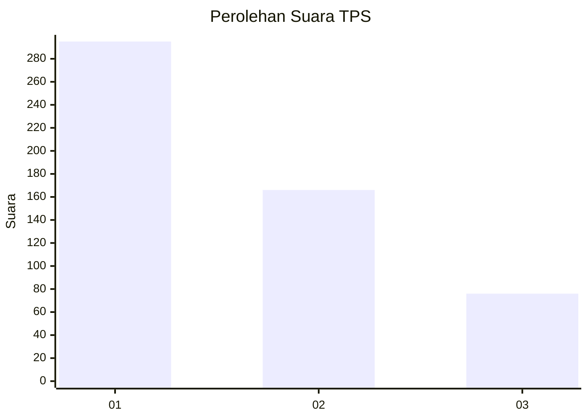
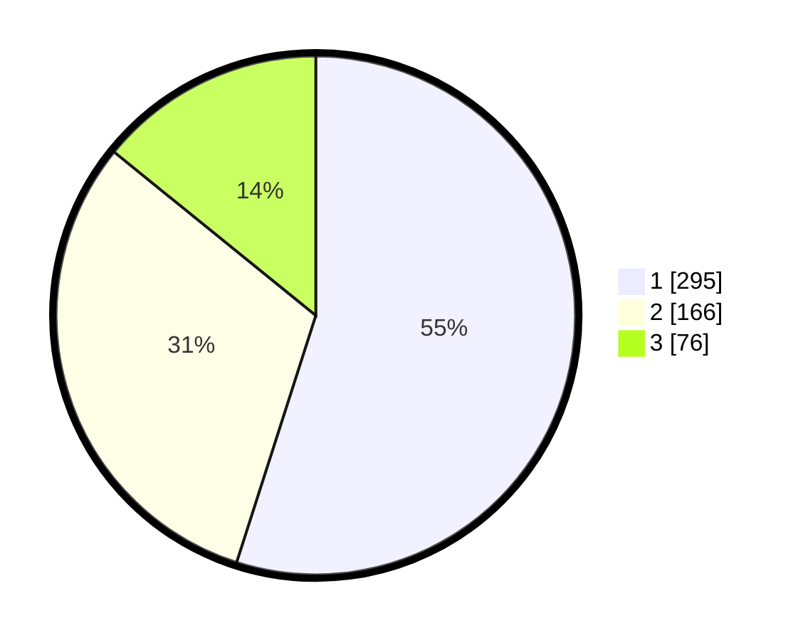

# Hasil

## Grafik

## Tabel

| No. | Nama Paslon    | Suara | Suara (raw) | Persentase |
|:--- |:-------------- | -----:| -----------:| ----------:|
| 1   | ANIES MUHAIMIN | 295   | [295][p-1]  | 54,93      |
| 2   | PRABOWO GIBRAN | 166   | [166][p-2]  | 30,91      |
| 3   | GANJAR MAHFUD  | 76    | [76][p-3]   | 14,15      |

[p-1]: https://github.com/gigit-pemilu/pemilu-2024-99-luar-negeri/blob/main/pilpres/hitung-suara/sub/99-luar-negeri/sub/53-jeddah-arab-saudi/sub/01-jeddah-arab-saudi/sub/0001-jeddah-arab-saudi/sub/003-tps/sub/paslon-1.txt
[p-2]: https://github.com/gigit-pemilu/pemilu-2024-99-luar-negeri/blob/main/pilpres/hitung-suara/sub/99-luar-negeri/sub/53-jeddah-arab-saudi/sub/01-jeddah-arab-saudi/sub/0001-jeddah-arab-saudi/sub/003-tps/sub/paslon-2.txt
[p-3]: https://github.com/gigit-pemilu/pemilu-2024-99-luar-negeri/blob/main/pilpres/hitung-suara/sub/99-luar-negeri/sub/53-jeddah-arab-saudi/sub/01-jeddah-arab-saudi/sub/0001-jeddah-arab-saudi/sub/003-tps/sub/paslon-3.txt

## Foto C Plano

https://sirekap-obj-formc.kpu.go.id/7571/pemilu/ppwp/99/53/01/00/01/9953010001003-20240216-134422--01000c35-34cb-4d7e-a3a8-5914e252fd1a.jpg

https://sirekap-obj-formc.kpu.go.id/7571/pemilu/ppwp/99/53/01/00/01/9953010001003-20240216-134424--7dc27304-cc8d-46d2-aae2-e348abce4d3c.jpg

https://sirekap-obj-formc.kpu.go.id/7571/pemilu/ppwp/99/53/01/00/01/9953010001003-20240216-134423--891e22b9-834f-4bad-ab7a-d674f3311617.jpg

## Metadata

| Key        | Value               |
| ---------- | ------------------- |
| Time Stamp | 2024-02-19 06:16:00 |

## DATA PEMILIH TETAP

Jumlah pemilih dalam DPT: **1897**.
 * L: **766**.
 * P: **1131**.

## DATA PENGGUNA HAK PILIH

Jumlah pengguna hak pilih dalam DPT: **52**.
 * L: **36**.
 * P: **16**.

Jumlah pengguna hak pilih dalam DPTb: **171**.
 * L: **104**.
 * P: **67**.

Jumlah pengguna hak pilih dalam DPK: **316**.
 * L: **136**.
 * P: **180**.

Jumlah pengguna hak pilih: **539**.
 * L: **276**.
 * P: **263**.

## JUMLAH SUARA SAH DAN TIDAK SAH

JUMLAH SELURUH SUARA SAH: **537**.

JUMLAH SUARA TIDAK SAH: **2**.

JUMLAH SELURUH SUARA SAH DAN SUARA TIDAK SAH: **539**.

