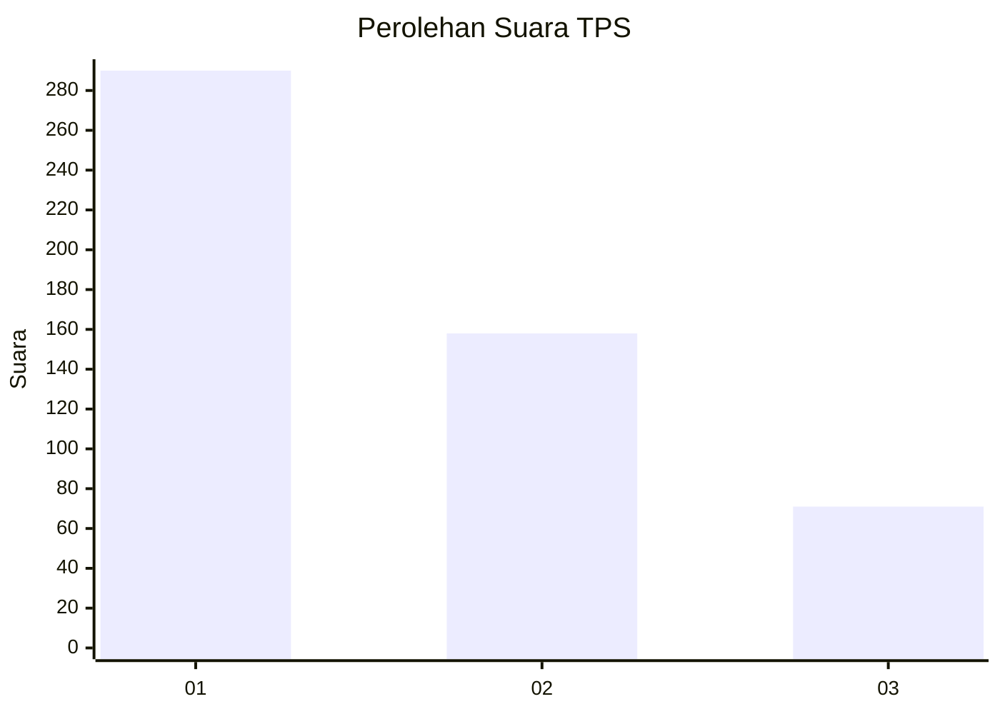
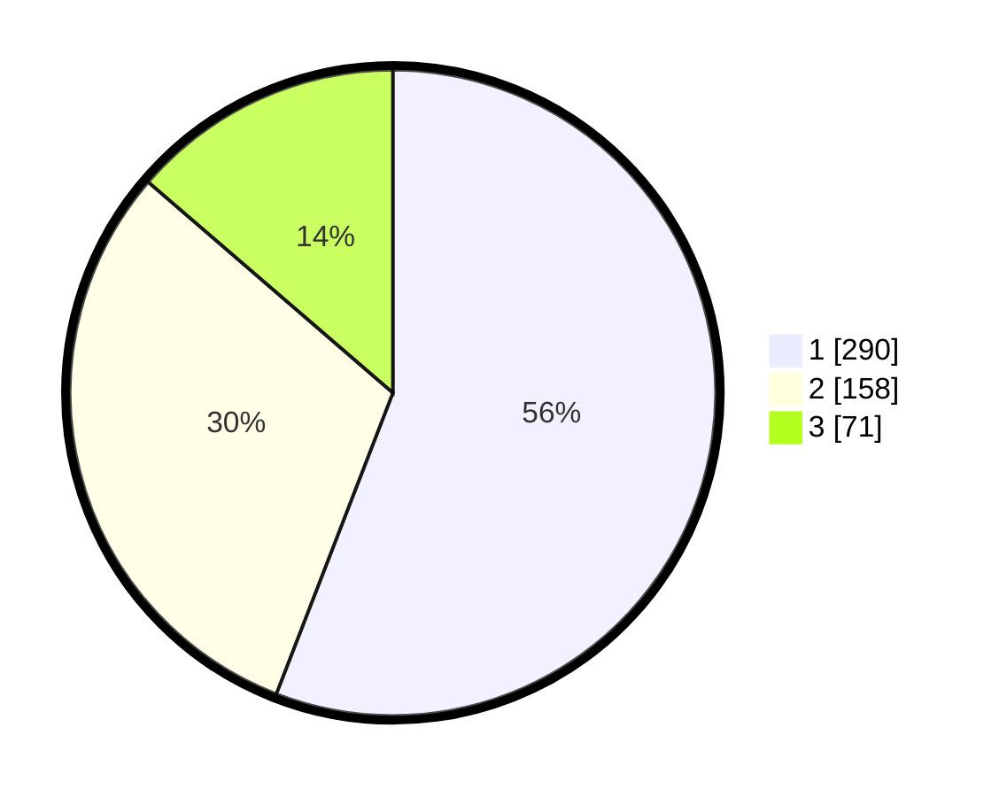

# Hasil

## Grafik

## Tabel

| No. | Nama Paslon    | Suara | Suara (raw) | Persentase |
|:--- |:-------------- | -----:| -----------:| ----------:|
| 1   | ANIES MUHAIMIN | 290   | [290][p-1]  | 55,88      |
| 2   | PRABOWO GIBRAN | 158   | [158][p-2]  | 30,44      |
| 3   | GANJAR MAHFUD  | 71    | [71][p-3]   | 13,68      |

[p-1]: https://github.com/gigit-pemilu/pemilu-2024-99-luar-negeri/blob/main/pilpres/hitung-suara/sub/99-luar-negeri/sub/53-jeddah-arab-saudi/sub/01-jeddah-arab-saudi/sub/0001-jeddah-arab-saudi/sub/004-tps/sub/paslon-1.txt
[p-2]: https://github.com/gigit-pemilu/pemilu-2024-99-luar-negeri/blob/main/pilpres/hitung-suara/sub/99-luar-negeri/sub/53-jeddah-arab-saudi/sub/01-jeddah-arab-saudi/sub/0001-jeddah-arab-saudi/sub/004-tps/sub/paslon-2.txt
[p-3]: https://github.com/gigit-pemilu/pemilu-2024-99-luar-negeri/blob/main/pilpres/hitung-suara/sub/99-luar-negeri/sub/53-jeddah-arab-saudi/sub/01-jeddah-arab-saudi/sub/0001-jeddah-arab-saudi/sub/004-tps/sub/paslon-3.txt

## Foto C Plano

https://sirekap-obj-formc.kpu.go.id/4d5e/pemilu/ppwp/99/53/01/00/01/9953010001004-20240216-015631--b55def09-9d6a-4d58-81e2-5dccf690cef7.jpg

https://sirekap-obj-formc.kpu.go.id/4d5e/pemilu/ppwp/99/53/01/00/01/9953010001004-20240216-015641--75d9194a-9aeb-4a60-9c8a-b4d6bb0fc878.jpg

https://sirekap-obj-formc.kpu.go.id/4d5e/pemilu/ppwp/99/53/01/00/01/9953010001004-20240216-015633--de7c615c-15ef-47fc-83a1-02f970f736cb.jpg

## Metadata

| Key        | Value               |
| ---------- | ------------------- |
| Time Stamp | 2024-02-19 06:16:00 |

## DATA PEMILIH TETAP

Jumlah pemilih dalam DPT: **1898**.
 * L: **824**.
 * P: **1074**.

## DATA PENGGUNA HAK PILIH

Jumlah pengguna hak pilih dalam DPT: **127**.
 * L: **94**.
 * P: **33**.

Jumlah pengguna hak pilih dalam DPTb: **211**.
 * L: **118**.
 * P: **93**.

Jumlah pengguna hak pilih dalam DPK: **185**.
 * L: **75**.
 * P: **110**.

Jumlah pengguna hak pilih: **523**.
 * L: **287**.
 * P: **236**.

## JUMLAH SUARA SAH DAN TIDAK SAH

JUMLAH SELURUH SUARA SAH: **519**.

JUMLAH SUARA TIDAK SAH: **4**.

JUMLAH SELURUH SUARA SAH DAN SUARA TIDAK SAH: **523**.

