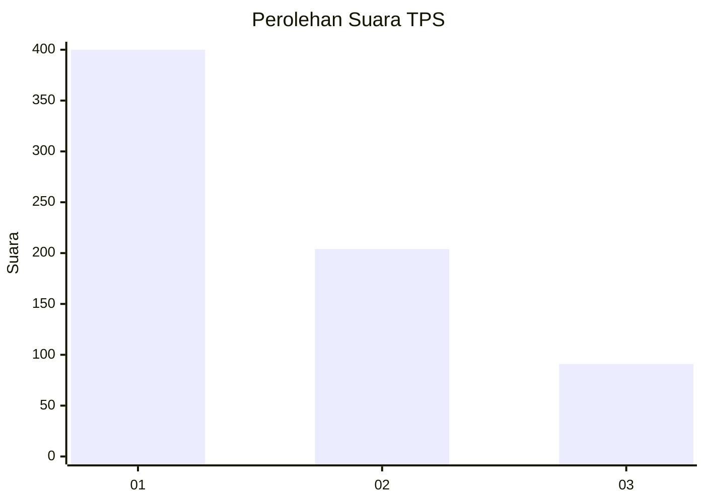
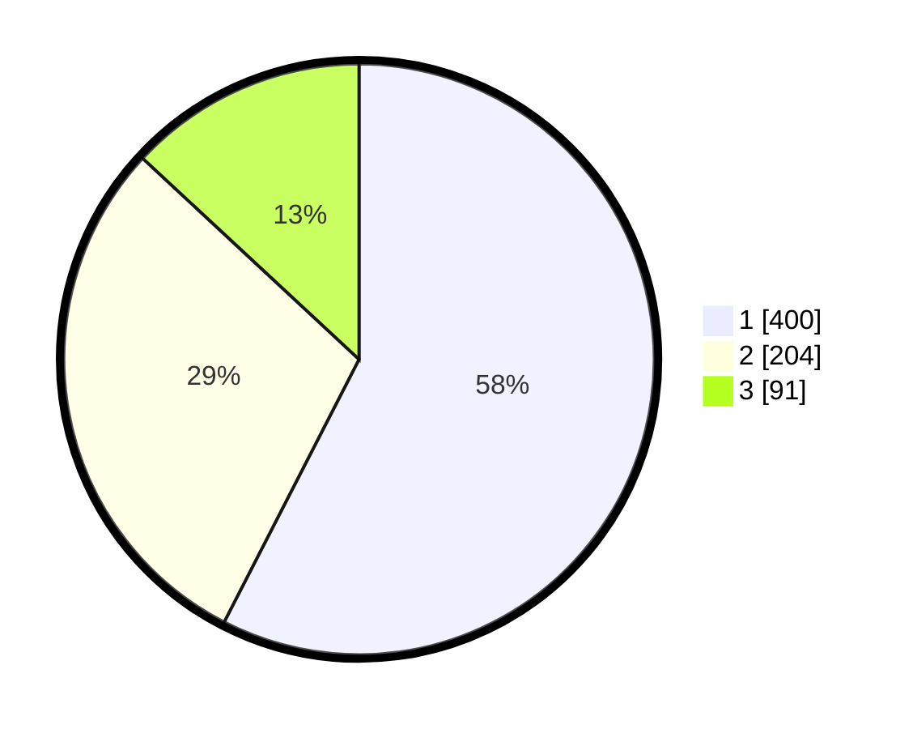

# Hasil

## Grafik

## Tabel

| No. | Nama Paslon    | Suara | Suara (raw) | Persentase |
|:--- |:-------------- | -----:| -----------:| ----------:|
| 1   | ANIES MUHAIMIN | 400   | [400][p-1]  | 57,55      |
| 2   | PRABOWO GIBRAN | 204   | [204][p-2]  | 29,35      |
| 3   | GANJAR MAHFUD  | 91    | [91][p-3]   | 13,09      |

[p-1]: https://github.com/gigit-pemilu/pemilu-2024-99-luar-negeri/blob/main/pilpres/hitung-suara/sub/99-luar-negeri/sub/53-jeddah-arab-saudi/sub/01-jeddah-arab-saudi/sub/0001-jeddah-arab-saudi/sub/005-tps/sub/paslon-1.txt
[p-2]: https://github.com/gigit-pemilu/pemilu-2024-99-luar-negeri/blob/main/pilpres/hitung-suara/sub/99-luar-negeri/sub/53-jeddah-arab-saudi/sub/01-jeddah-arab-saudi/sub/0001-jeddah-arab-saudi/sub/005-tps/sub/paslon-2.txt
[p-3]: https://github.com/gigit-pemilu/pemilu-2024-99-luar-negeri/blob/main/pilpres/hitung-suara/sub/99-luar-negeri/sub/53-jeddah-arab-saudi/sub/01-jeddah-arab-saudi/sub/0001-jeddah-arab-saudi/sub/005-tps/sub/paslon-3.txt

## Foto C Plano

https://sirekap-obj-formc.kpu.go.id/5bc7/pemilu/ppwp/99/53/01/00/01/9953010001005-20240216-141316--af7551c9-05f0-4e59-a562-d1d809245fdf.jpg

https://sirekap-obj-formc.kpu.go.id/5bc7/pemilu/ppwp/99/53/01/00/01/9953010001005-20240216-141317--ffe42a8d-f1ef-4e05-b86c-8818bbad61d3.jpg

https://sirekap-obj-formc.kpu.go.id/5bc7/pemilu/ppwp/99/53/01/00/01/9953010001005-20240216-141316--abd315b1-c4ce-4ecb-a107-9883f7433854.jpg

## Metadata

| Key        | Value               |
| ---------- | ------------------- |
| Time Stamp | 2024-02-19 06:16:00 |

## DATA PEMILIH TETAP

Jumlah pemilih dalam DPT: **1875**.
 * L: **109**.
 * P: **1766**.

## DATA PENGGUNA HAK PILIH

Jumlah pengguna hak pilih dalam DPT: **70**.
 * L: **17**.
 * P: **53**.

Jumlah pengguna hak pilih dalam DPTb: **303**.
 * L: **173**.
 * P: **130**.

Jumlah pengguna hak pilih dalam DPK: **328**.
 * L: **94**.
 * P: **234**.

Jumlah pengguna hak pilih: **701**.
 * L: **284**.
 * P: **417**.

## JUMLAH SUARA SAH DAN TIDAK SAH

JUMLAH SELURUH SUARA SAH: **695**.

JUMLAH SUARA TIDAK SAH: **6**.

JUMLAH SELURUH SUARA SAH DAN SUARA TIDAK SAH: **701**.

