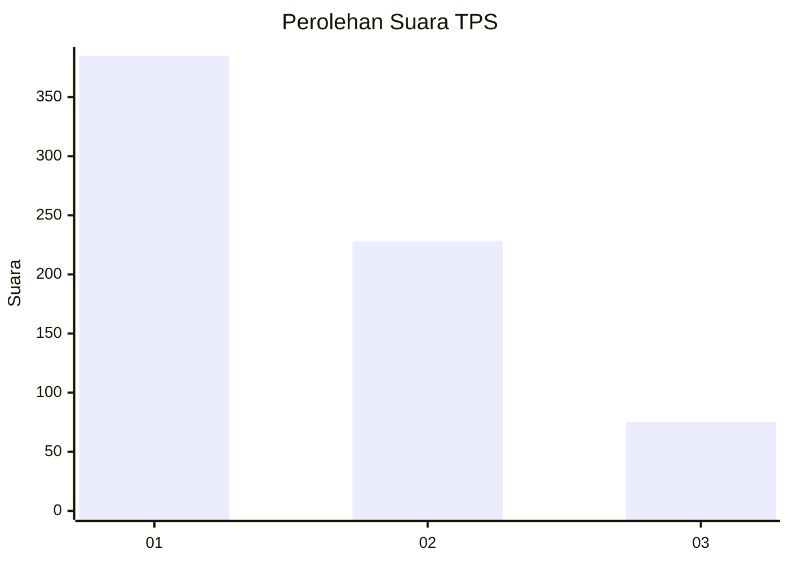
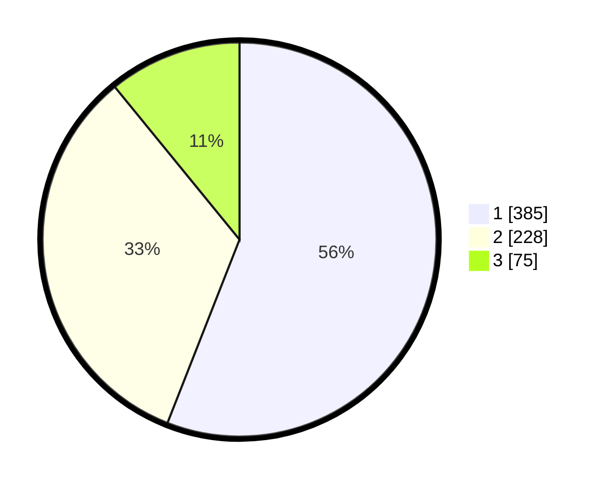

# Hasil

## Grafik

## Tabel

| No. | Nama Paslon    | Suara | Suara (raw) | Persentase |
|:--- |:-------------- | -----:| -----------:| ----------:|
| 1   | ANIES MUHAIMIN | 385   | [385][p-1]  | 55,96      |
| 2   | PRABOWO GIBRAN | 228   | [228][p-2]  | 33,14      |
| 3   | GANJAR MAHFUD  | 75    | [75][p-3]   | 10,90      |

[p-1]: https://github.com/gigit-pemilu/pemilu-2024-99-luar-negeri/blob/main/pilpres/hitung-suara/sub/99-luar-negeri/sub/53-jeddah-arab-saudi/sub/01-jeddah-arab-saudi/sub/0001-jeddah-arab-saudi/sub/006-tps/sub/paslon-1.txt
[p-2]: https://github.com/gigit-pemilu/pemilu-2024-99-luar-negeri/blob/main/pilpres/hitung-suara/sub/99-luar-negeri/sub/53-jeddah-arab-saudi/sub/01-jeddah-arab-saudi/sub/0001-jeddah-arab-saudi/sub/006-tps/sub/paslon-2.txt
[p-3]: https://github.com/gigit-pemilu/pemilu-2024-99-luar-negeri/blob/main/pilpres/hitung-suara/sub/99-luar-negeri/sub/53-jeddah-arab-saudi/sub/01-jeddah-arab-saudi/sub/0001-jeddah-arab-saudi/sub/006-tps/sub/paslon-3.txt

## Foto C Plano

https://sirekap-obj-formc.kpu.go.id/7962/pemilu/ppwp/99/53/01/00/01/9953010001006-20240216-025842--d6e7d115-193b-4889-a34c-0fcbe73bd89f.jpg

https://sirekap-obj-formc.kpu.go.id/7962/pemilu/ppwp/99/53/01/00/01/9953010001006-20240216-025852--28928ee3-80b6-4047-ba7d-67941c10324d.jpg

https://sirekap-obj-formc.kpu.go.id/7962/pemilu/ppwp/99/53/01/00/01/9953010001006-20240216-025850--83404b63-8503-4756-a38d-d28c4c04258d.jpg

## Metadata

| Key        | Value               |
| ---------- | ------------------- |
| Time Stamp | 2024-02-19 06:16:00 |

## DATA PEMILIH TETAP

Jumlah pemilih dalam DPT: **1892**.
 * L: **643**.
 * P: **1249**.

## DATA PENGGUNA HAK PILIH

Jumlah pengguna hak pilih dalam DPT: **88**.
 * L: **32**.
 * P: **56**.

Jumlah pengguna hak pilih dalam DPTb: **264**.
 * L: **76**.
 * P: **188**.

Jumlah pengguna hak pilih dalam DPK: **344**.
 * L: **86**.
 * P: **258**.

Jumlah pengguna hak pilih: **696**.
 * L: **194**.
 * P: **502**.

## JUMLAH SUARA SAH DAN TIDAK SAH

JUMLAH SELURUH SUARA SAH: **688**.

JUMLAH SUARA TIDAK SAH: **11**.

JUMLAH SELURUH SUARA SAH DAN SUARA TIDAK SAH: **699**.

