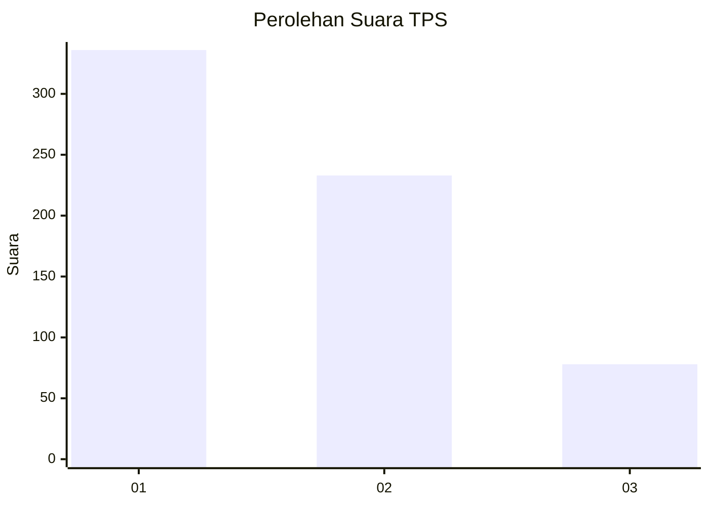
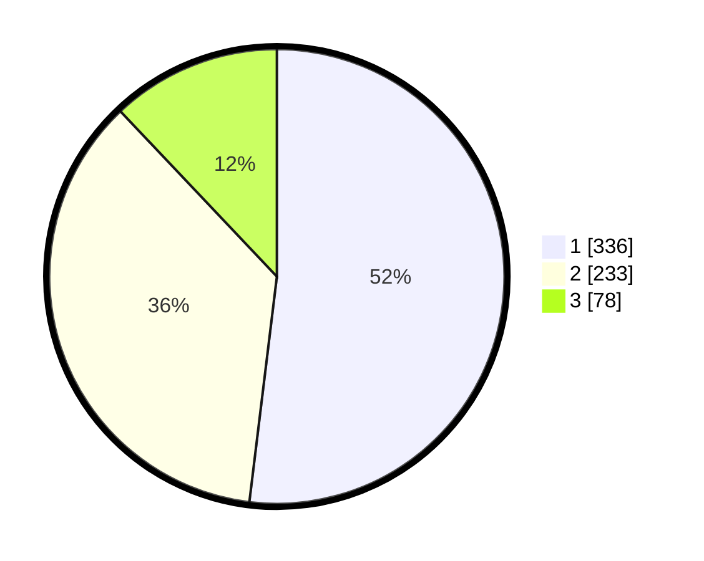

# Hasil

## Grafik

## Tabel

| No. | Nama Paslon    | Suara | Suara (raw) | Persentase |
|:--- |:-------------- | -----:| -----------:| ----------:|
| 1   | ANIES MUHAIMIN | 336   | [336][p-1]  | 51,93      |
| 2   | PRABOWO GIBRAN | 233   | [233][p-2]  | 36,01      |
| 3   | GANJAR MAHFUD  | 78    | [78][p-3]   | 12,06      |

[p-1]: https://github.com/gigit-pemilu/pemilu-2024-99-luar-negeri/blob/main/pilpres/hitung-suara/sub/99-luar-negeri/sub/53-jeddah-arab-saudi/sub/01-jeddah-arab-saudi/sub/0001-jeddah-arab-saudi/sub/007-tps/sub/paslon-1.txt
[p-2]: https://github.com/gigit-pemilu/pemilu-2024-99-luar-negeri/blob/main/pilpres/hitung-suara/sub/99-luar-negeri/sub/53-jeddah-arab-saudi/sub/01-jeddah-arab-saudi/sub/0001-jeddah-arab-saudi/sub/007-tps/sub/paslon-2.txt
[p-3]: https://github.com/gigit-pemilu/pemilu-2024-99-luar-negeri/blob/main/pilpres/hitung-suara/sub/99-luar-negeri/sub/53-jeddah-arab-saudi/sub/01-jeddah-arab-saudi/sub/0001-jeddah-arab-saudi/sub/007-tps/sub/paslon-3.txt

## Foto C Plano

https://sirekap-obj-formc.kpu.go.id/0723/pemilu/ppwp/99/53/01/00/01/9953010001007-20240215-233325--d28063f6-f85d-49ed-98f9-f4ce434775d4.jpg

https://sirekap-obj-formc.kpu.go.id/0723/pemilu/ppwp/99/53/01/00/01/9953010001007-20240215-233328--3a4f4183-8f77-4921-821e-3ddb571b9a98.jpg

https://sirekap-obj-formc.kpu.go.id/0723/pemilu/ppwp/99/53/01/00/01/9953010001007-20240215-233327--7f6a5412-dab8-435f-8da1-8f8842c2157b.jpg

## Metadata

| Key        | Value               |
| ---------- | ------------------- |
| Time Stamp | 2024-02-16 01:30:27 |

## DATA PEMILIH TETAP

Jumlah pemilih dalam DPT: **1901**.
 * L: **610**.
 * P: **1291**.

## DATA PENGGUNA HAK PILIH

Jumlah pengguna hak pilih dalam DPT: **7**.
 * L: **4**.
 * P: **3**.

Jumlah pengguna hak pilih dalam DPTb: **213**.
 * L: **116**.
 * P: **97**.

Jumlah pengguna hak pilih dalam DPK: **438**.
 * L: **174**.
 * P: **264**.

Jumlah pengguna hak pilih: **658**.
 * L: **294**.
 * P: **364**.

## JUMLAH SUARA SAH DAN TIDAK SAH

JUMLAH SELURUH SUARA SAH: **647**.

JUMLAH SUARA TIDAK SAH: **11**.

JUMLAH SELURUH SUARA SAH DAN SUARA TIDAK SAH: **658**.

