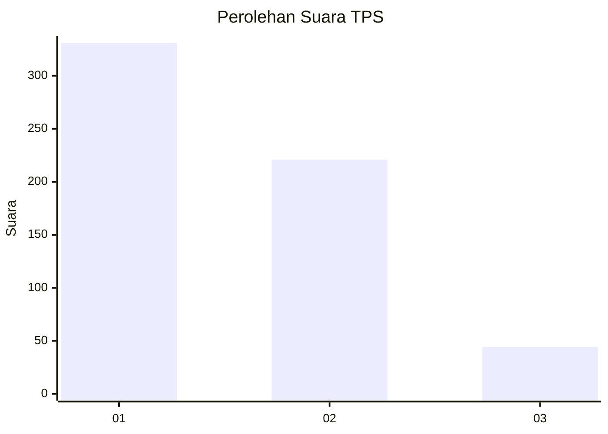
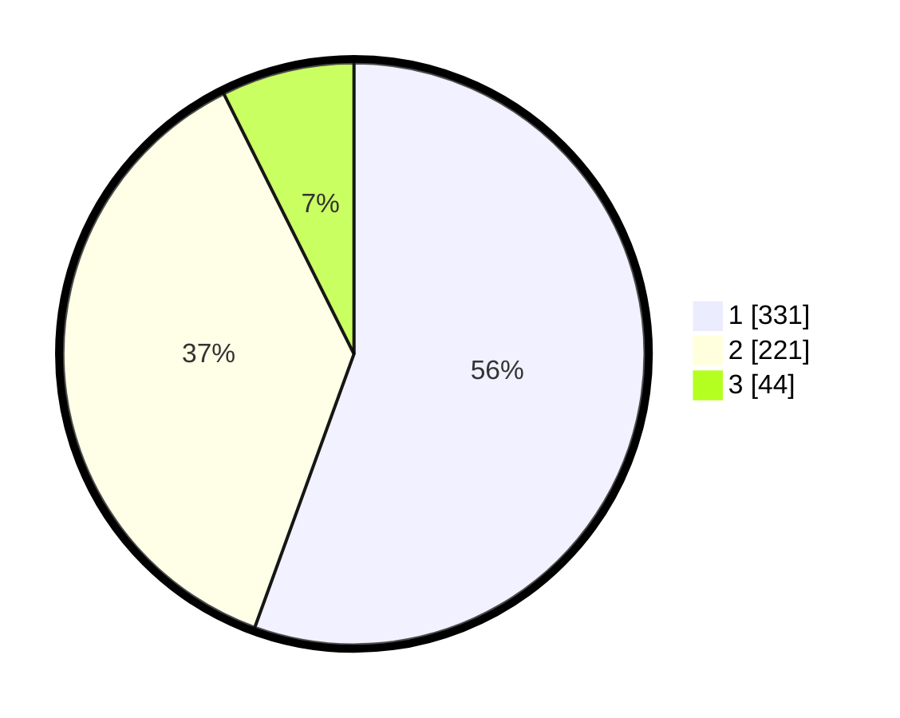

# Hasil

## Grafik

## Tabel

| No. | Nama Paslon    | Suara | Suara (raw) | Persentase |
|:--- |:-------------- | -----:| -----------:| ----------:|
| 1   | ANIES MUHAIMIN | 331   | [331][p-1]  | 55,54      |
| 2   | PRABOWO GIBRAN | 221   | [221][p-2]  | 37,08      |
| 3   | GANJAR MAHFUD  | 44    | [44][p-3]   | 7,38       |

[p-1]: https://github.com/gigit-pemilu/pemilu-2024-99-luar-negeri/blob/main/pilpres/hitung-suara/sub/99-luar-negeri/sub/53-jeddah-arab-saudi/sub/01-jeddah-arab-saudi/sub/0001-jeddah-arab-saudi/sub/008-tps/sub/paslon-1.txt
[p-2]: https://github.com/gigit-pemilu/pemilu-2024-99-luar-negeri/blob/main/pilpres/hitung-suara/sub/99-luar-negeri/sub/53-jeddah-arab-saudi/sub/01-jeddah-arab-saudi/sub/0001-jeddah-arab-saudi/sub/008-tps/sub/paslon-2.txt
[p-3]: https://github.com/gigit-pemilu/pemilu-2024-99-luar-negeri/blob/main/pilpres/hitung-suara/sub/99-luar-negeri/sub/53-jeddah-arab-saudi/sub/01-jeddah-arab-saudi/sub/0001-jeddah-arab-saudi/sub/008-tps/sub/paslon-3.txt

## Foto C Plano

https://sirekap-obj-formc.kpu.go.id/b809/pemilu/ppwp/99/53/01/00/01/9953010001008-20240216-153811--f203a56c-c29d-4570-8506-8af425b86454.jpg

https://sirekap-obj-formc.kpu.go.id/b809/pemilu/ppwp/99/53/01/00/01/9953010001008-20240216-153812--076e7136-71ad-47a6-8b87-eaace9fea583.jpg

https://sirekap-obj-formc.kpu.go.id/b809/pemilu/ppwp/99/53/01/00/01/9953010001008-20240216-153811--3f32d235-59a8-4f3d-a261-0259449c0cc6.jpg

## Metadata

| Key        | Value               |
| ---------- | ------------------- |
| Time Stamp | 2024-02-19 06:16:00 |

## DATA PEMILIH TETAP

Jumlah pemilih dalam DPT: **2239**.
 * L: **286**.
 * P: **1953**.

## DATA PENGGUNA HAK PILIH

Jumlah pengguna hak pilih dalam DPT: **34**.
 * L: **7**.
 * P: **27**.

Jumlah pengguna hak pilih dalam DPTb: **201**.
 * L: **107**.
 * P: **94**.

Jumlah pengguna hak pilih dalam DPK: **369**.
 * L: **145**.
 * P: **224**.

Jumlah pengguna hak pilih: **604**.
 * L: **259**.
 * P: **345**.

## JUMLAH SUARA SAH DAN TIDAK SAH

JUMLAH SELURUH SUARA SAH: **596**.

JUMLAH SUARA TIDAK SAH: **8**.

JUMLAH SELURUH SUARA SAH DAN SUARA TIDAK SAH: **604**.

