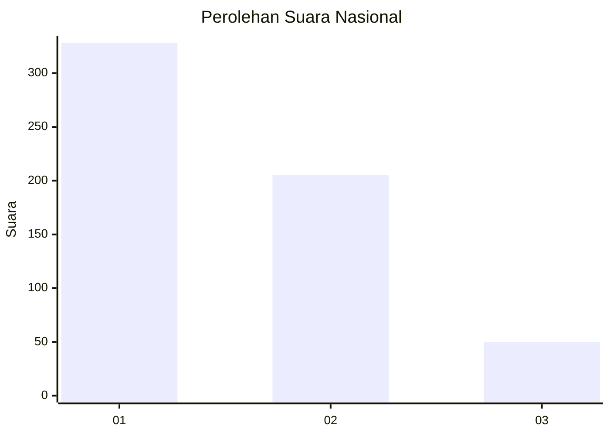
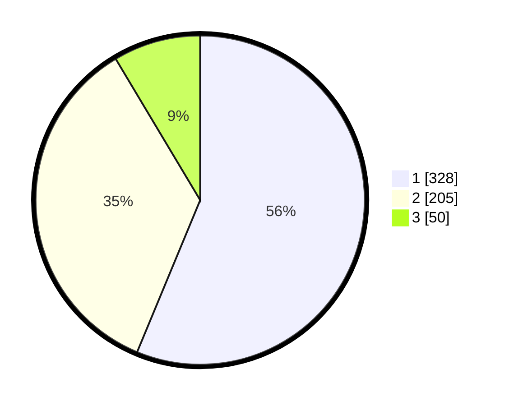

# Hasil

## Grafik

## Tabel

| No. | Nama Paslon    | Suara | Suara (raw) | Persentase |
|:--- |:-------------- | -----:| -----------:| ----------:|
| 1   | ANIES MUHAIMIN | 328   | [328][p-1]  | 56,26      |
| 2   | PRABOWO GIBRAN | 205   | [205][p-2]  | 35,16      |
| 3   | GANJAR MAHFUD  | 50    | [50][p-3]   | 8,58       |

[p-1]: https://github.com/gigit-pemilu/pemilu-2024/blob/main/pilpres/hitung-suara/sub/99-luar-negeri/sub/53-jeddah-arab-saudi/sub/01-jeddah-arab-saudi/sub/0001-jeddah-arab-saudi/sub/009-tps/sub/paslon-1.txt
[p-2]: https://github.com/gigit-pemilu/pemilu-2024/blob/main/pilpres/hitung-suara/sub/99-luar-negeri/sub/53-jeddah-arab-saudi/sub/01-jeddah-arab-saudi/sub/0001-jeddah-arab-saudi/sub/009-tps/sub/paslon-2.txt
[p-3]: https://github.com/gigit-pemilu/pemilu-2024/blob/main/pilpres/hitung-suara/sub/99-luar-negeri/sub/53-jeddah-arab-saudi/sub/01-jeddah-arab-saudi/sub/0001-jeddah-arab-saudi/sub/009-tps/sub/paslon-3.txt

## Foto C Plano

https://sirekap-obj-formc.kpu.go.id/457c/pemilu/ppwp/99/53/01/00/01/9953010001009-20240216-001037--83e9434e-c9e7-4db9-9a6c-e0652843ed2c.jpg

https://sirekap-obj-formc.kpu.go.id/457c/pemilu/ppwp/99/53/01/00/01/9953010001009-20240216-001039--4af8ff05-d15a-482b-883c-b6a4bbfb08e9.jpg

https://sirekap-obj-formc.kpu.go.id/457c/pemilu/ppwp/99/53/01/00/01/9953010001009-20240216-001038--b9530a21-962b-4cbe-b6f3-2ba05cae39c8.jpg

## Metadata

| Key        | Value               |
| ---------- | ------------------- |
| Time Stamp | 2024-02-16 01:30:27 |

## DATA PEMILIH TETAP

Jumlah pemilih dalam DPT: **1973**.
 * L: **33**.
 * P: **1940**.

## DATA PENGGUNA HAK PILIH

Jumlah pengguna hak pilih dalam DPT: **6**.
 * L: **2**.
 * P: **4**.

Jumlah pengguna hak pilih dalam DPTb: **246**.
 * L: **141**.
 * P: **105**.

Jumlah pengguna hak pilih dalam DPK: **338**.
 * L: **134**.
 * P: **204**.

Jumlah pengguna hak pilih: **590**.
 * L: **277**.
 * P: **313**.

## JUMLAH SUARA SAH DAN TIDAK SAH

JUMLAH SELURUH SUARA SAH: **583**.

JUMLAH SUARA TIDAK SAH: **7**.

JUMLAH SELURUH SUARA SAH DAN SUARA TIDAK SAH: **590**.

