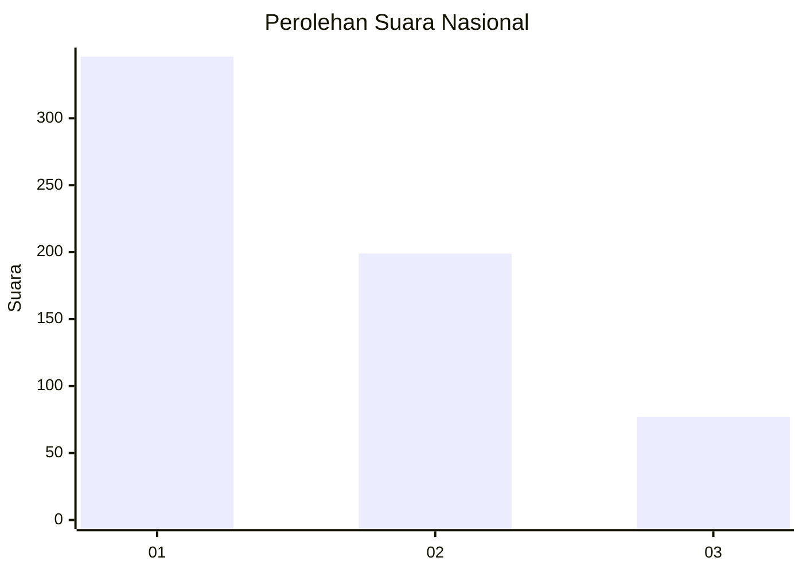
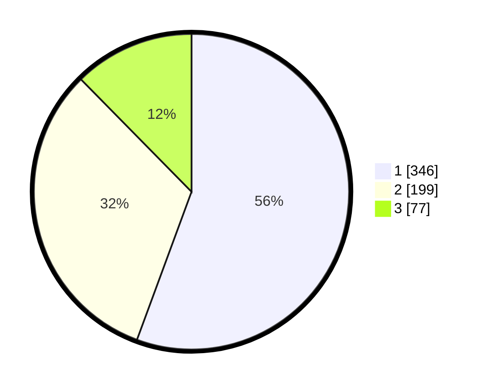

# Hasil

## Grafik

## Tabel

| No. | Nama Paslon    | Suara | Suara (raw) | Persentase |
|:--- |:-------------- | -----:| -----------:| ----------:|
| 1   | ANIES MUHAIMIN | 346   | [346][p-1]  | 55,63      |
| 2   | PRABOWO GIBRAN | 199   | [199][p-2]  | 31,99      |
| 3   | GANJAR MAHFUD  | 77    | [77][p-3]   | 12,38      |

[p-1]: https://github.com/gigit-pemilu/pemilu-2024/blob/main/pilpres/hitung-suara/sub/99-luar-negeri/sub/53-jeddah-arab-saudi/sub/01-jeddah-arab-saudi/sub/0001-jeddah-arab-saudi/sub/010-tps/sub/paslon-1.txt
[p-2]: https://github.com/gigit-pemilu/pemilu-2024/blob/main/pilpres/hitung-suara/sub/99-luar-negeri/sub/53-jeddah-arab-saudi/sub/01-jeddah-arab-saudi/sub/0001-jeddah-arab-saudi/sub/010-tps/sub/paslon-2.txt
[p-3]: https://github.com/gigit-pemilu/pemilu-2024/blob/main/pilpres/hitung-suara/sub/99-luar-negeri/sub/53-jeddah-arab-saudi/sub/01-jeddah-arab-saudi/sub/0001-jeddah-arab-saudi/sub/010-tps/sub/paslon-3.txt

## Foto C Plano

https://sirekap-obj-formc.kpu.go.id/612d/pemilu/ppwp/99/53/01/00/01/9953010001010-20240215-233544--40efa8eb-8b85-4497-b6a7-4ffc3c906271.jpg

https://sirekap-obj-formc.kpu.go.id/612d/pemilu/ppwp/99/53/01/00/01/9953010001010-20240215-233547--5bc1c7b4-11b9-4e05-ab9f-3235b4b52297.jpg

https://sirekap-obj-formc.kpu.go.id/612d/pemilu/ppwp/99/53/01/00/01/9953010001010-20240215-233546--264813f5-3eb4-47c7-8114-d16d94052901.jpg

## Metadata

| Key        | Value               |
| ---------- | ------------------- |
| Time Stamp | 2024-02-16 01:30:27 |

## DATA PEMILIH TETAP

Jumlah pemilih dalam DPT: **1771**.
 * L: **734**.
 * P: **1037**.

## DATA PENGGUNA HAK PILIH

Jumlah pengguna hak pilih dalam DPT: **60**.
 * L: **30**.
 * P: **30**.

Jumlah pengguna hak pilih dalam DPTb: **200**.
 * L: **98**.
 * P: **102**.

Jumlah pengguna hak pilih dalam DPK: **371**.
 * L: **175**.
 * P: **196**.

Jumlah pengguna hak pilih: **631**.
 * L: **303**.
 * P: **328**.

## JUMLAH SUARA SAH DAN TIDAK SAH

JUMLAH SELURUH SUARA SAH: **622**.

JUMLAH SUARA TIDAK SAH: **9**.

JUMLAH SELURUH SUARA SAH DAN SUARA TIDAK SAH: **631**.

