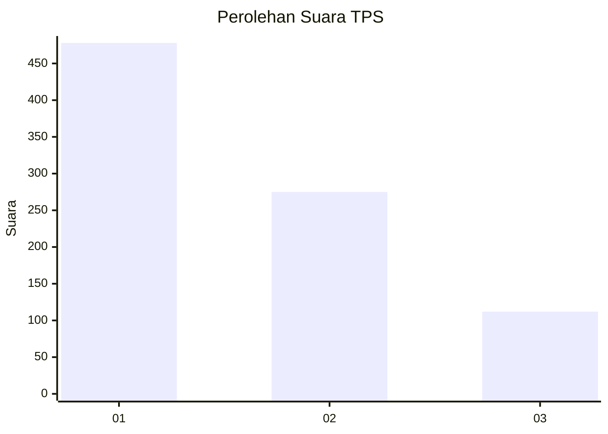
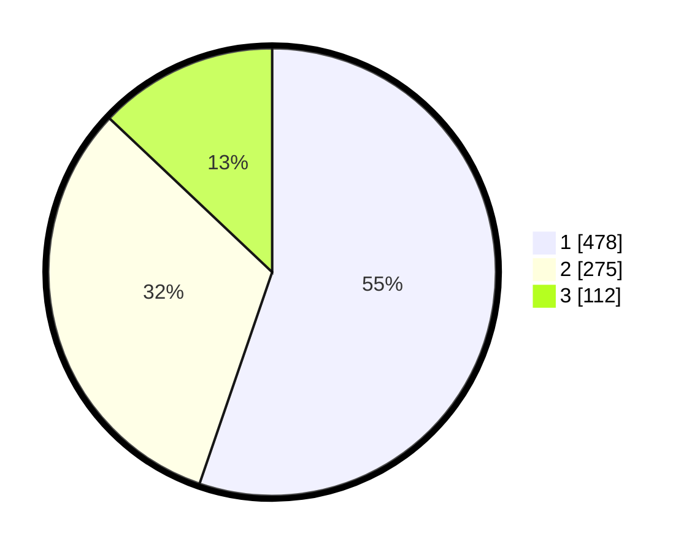

# Hasil

## Grafik

## Tabel

| No. | Nama Paslon    | Suara | Suara (raw) | Persentase |
|:--- |:-------------- | -----:| -----------:| ----------:|
| 1   | ANIES MUHAIMIN | 478   | [478][p-1]  | 55,26      |
| 2   | PRABOWO GIBRAN | 275   | [275][p-2]  | 31,79      |
| 3   | GANJAR MAHFUD  | 112   | [112][p-3]  | 12,95      |

[p-1]: https://github.com/gigit-pemilu/pemilu-2024-99-luar-negeri/blob/main/pilpres/hitung-suara/sub/99-luar-negeri/sub/53-jeddah-arab-saudi/sub/01-jeddah-arab-saudi/sub/0001-jeddah-arab-saudi/sub/011-tps/sub/paslon-1.txt
[p-2]: https://github.com/gigit-pemilu/pemilu-2024-99-luar-negeri/blob/main/pilpres/hitung-suara/sub/99-luar-negeri/sub/53-jeddah-arab-saudi/sub/01-jeddah-arab-saudi/sub/0001-jeddah-arab-saudi/sub/011-tps/sub/paslon-2.txt
[p-3]: https://github.com/gigit-pemilu/pemilu-2024-99-luar-negeri/blob/main/pilpres/hitung-suara/sub/99-luar-negeri/sub/53-jeddah-arab-saudi/sub/01-jeddah-arab-saudi/sub/0001-jeddah-arab-saudi/sub/011-tps/sub/paslon-3.txt

## Foto C Plano

https://sirekap-obj-formc.kpu.go.id/d7a3/pemilu/ppwp/99/53/01/00/01/9953010001011-20240218-002524--8c0a874a-adbf-48e7-ae0d-7a87bbec10e7.jpg

https://sirekap-obj-formc.kpu.go.id/d7a3/pemilu/ppwp/99/53/01/00/01/9953010001011-20240218-002526--ef3d6087-c0dd-4ad6-8a2c-28c290208e5a.jpg

https://sirekap-obj-formc.kpu.go.id/d7a3/pemilu/ppwp/99/53/01/00/01/9953010001011-20240218-002525--177b812c-acd7-4605-97a9-5a1f14a751d7.jpg

## Metadata

| Key        | Value               |
| ---------- | ------------------- |
| Time Stamp | 2024-02-21 16:00:00 |

## DATA PEMILIH TETAP

Jumlah pemilih dalam DPT: **1697**.
 * L: **528**.
 * P: **1169**.

## DATA PENGGUNA HAK PILIH

Jumlah pengguna hak pilih dalam DPT: **118**.
 * L: **62**.
 * P: **56**.

Jumlah pengguna hak pilih dalam DPTb: **217**.
 * L: **132**.
 * P: **85**.

Jumlah pengguna hak pilih dalam DPK: **537**.
 * L: **234**.
 * P: **303**.

Jumlah pengguna hak pilih: **872**.
 * L: **428**.
 * P: **444**.

## JUMLAH SUARA SAH DAN TIDAK SAH

JUMLAH SELURUH SUARA SAH: **865**.

JUMLAH SUARA TIDAK SAH: **7**.

JUMLAH SELURUH SUARA SAH DAN SUARA TIDAK SAH: **872**.

