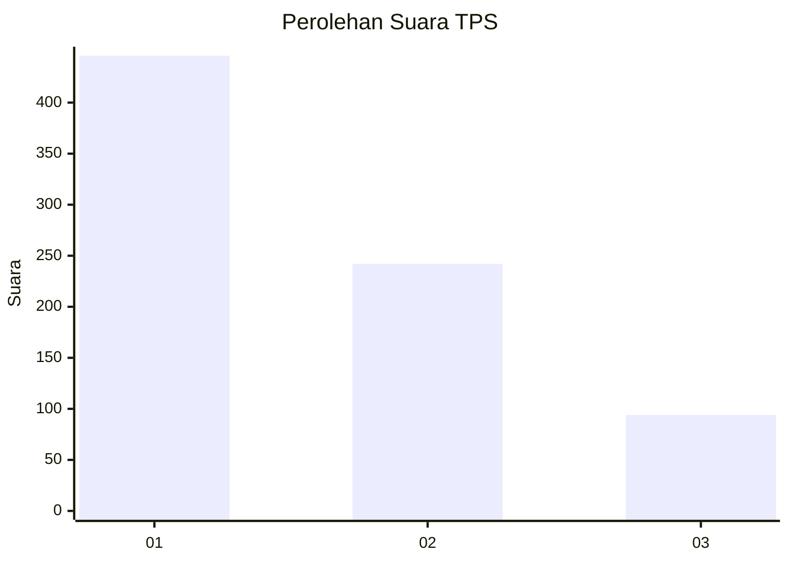
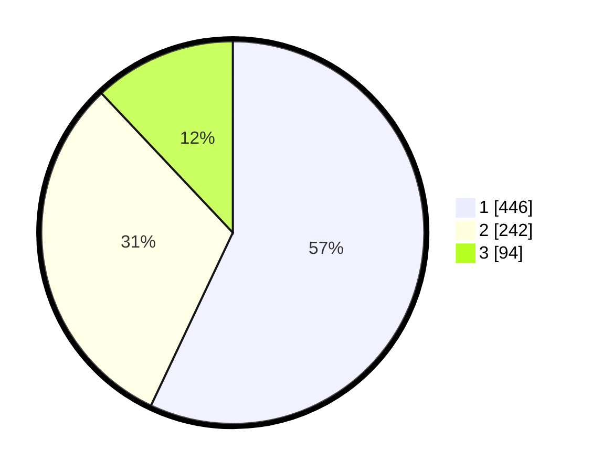

# Hasil

## Grafik

## Tabel

| No. | Nama Paslon    | Suara | Suara (raw) | Persentase |
|:--- |:-------------- | -----:| -----------:| ----------:|
| 1   | ANIES MUHAIMIN | 446   | [446][p-1]  | 57,03      |
| 2   | PRABOWO GIBRAN | 242   | [242][p-2]  | 30,95      |
| 3   | GANJAR MAHFUD  | 94    | [94][p-3]   | 12,02      |

[p-1]: https://github.com/gigit-pemilu/pemilu-2024-99-luar-negeri/blob/main/pilpres/hitung-suara/sub/99-luar-negeri/sub/53-jeddah-arab-saudi/sub/01-jeddah-arab-saudi/sub/0001-jeddah-arab-saudi/sub/012-tps/sub/paslon-1.txt
[p-2]: https://github.com/gigit-pemilu/pemilu-2024-99-luar-negeri/blob/main/pilpres/hitung-suara/sub/99-luar-negeri/sub/53-jeddah-arab-saudi/sub/01-jeddah-arab-saudi/sub/0001-jeddah-arab-saudi/sub/012-tps/sub/paslon-2.txt
[p-3]: https://github.com/gigit-pemilu/pemilu-2024-99-luar-negeri/blob/main/pilpres/hitung-suara/sub/99-luar-negeri/sub/53-jeddah-arab-saudi/sub/01-jeddah-arab-saudi/sub/0001-jeddah-arab-saudi/sub/012-tps/sub/paslon-3.txt

## Foto C Plano

https://sirekap-obj-formc.kpu.go.id/b51d/pemilu/ppwp/99/53/01/00/01/9953010001012-20240218-002814--3b753dce-bd61-4841-a20c-e53e1e6fdcae.jpg

https://sirekap-obj-formc.kpu.go.id/b51d/pemilu/ppwp/99/53/01/00/01/9953010001012-20240218-002816--9b45b5d1-031d-4b6c-af50-b539fc3e1989.jpg

https://sirekap-obj-formc.kpu.go.id/b51d/pemilu/ppwp/99/53/01/00/01/9953010001012-20240218-002815--903b6f6f-ae69-4b94-b476-76cda92416fa.jpg

## Metadata

| Key        | Value               |
| ---------- | ------------------- |
| Time Stamp | 2024-02-19 06:16:00 |

## DATA PEMILIH TETAP

Jumlah pemilih dalam DPT: **1904**.
 * L: **895**.
 * P: **1009**.

## DATA PENGGUNA HAK PILIH

Jumlah pengguna hak pilih dalam DPT: **48**.
 * L: **31**.
 * P: **17**.

Jumlah pengguna hak pilih dalam DPTb: **190**.
 * L: **124**.
 * P: **66**.

Jumlah pengguna hak pilih dalam DPK: **558**.
 * L: **206**.
 * P: **352**.

Jumlah pengguna hak pilih: **796**.
 * L: **361**.
 * P: **435**.

## JUMLAH SUARA SAH DAN TIDAK SAH

JUMLAH SELURUH SUARA SAH: **782**.

JUMLAH SUARA TIDAK SAH: **14**.

JUMLAH SELURUH SUARA SAH DAN SUARA TIDAK SAH: **796**.

