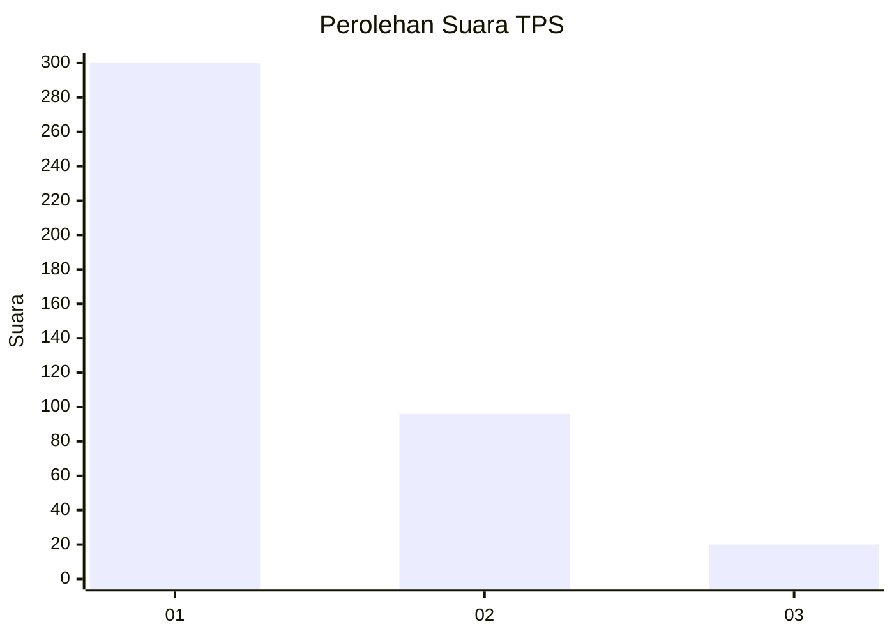
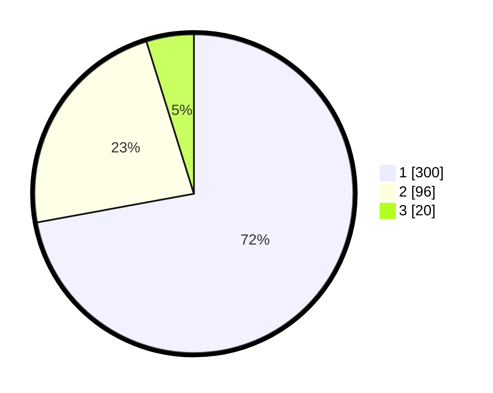

# Hasil

## Grafik

## Tabel

| No. | Nama Paslon    | Suara | Suara (raw) | Persentase |
|:--- |:-------------- | -----:| -----------:| ----------:|
| 1   | ANIES MUHAIMIN | 300   | [300][p-1]  | 72,12      |
| 2   | PRABOWO GIBRAN | 96    | [96][p-2]   | 23,08      |
| 3   | GANJAR MAHFUD  | 20    | [20][p-3]   | 4,81       |

[p-1]: https://github.com/gigit-pemilu/pemilu-2024-99-luar-negeri/blob/main/pilpres/hitung-suara/sub/99-luar-negeri/sub/53-jeddah-arab-saudi/sub/01-jeddah-arab-saudi/sub/0001-jeddah-arab-saudi/sub/013-ksk-001/sub/paslon-1.txt
[p-2]: https://github.com/gigit-pemilu/pemilu-2024-99-luar-negeri/blob/main/pilpres/hitung-suara/sub/99-luar-negeri/sub/53-jeddah-arab-saudi/sub/01-jeddah-arab-saudi/sub/0001-jeddah-arab-saudi/sub/013-ksk-001/sub/paslon-2.txt
[p-3]: https://github.com/gigit-pemilu/pemilu-2024-99-luar-negeri/blob/main/pilpres/hitung-suara/sub/99-luar-negeri/sub/53-jeddah-arab-saudi/sub/01-jeddah-arab-saudi/sub/0001-jeddah-arab-saudi/sub/013-ksk-001/sub/paslon-3.txt

## Foto C Plano

https://sirekap-obj-formc.kpu.go.id/9d99/pemilu/ppwp/99/53/01/00/01/9953010001013-20240215-231713--49eafaaf-5678-4bec-a74f-9ea9c2121f4b.jpg

https://sirekap-obj-formc.kpu.go.id/9d99/pemilu/ppwp/99/53/01/00/01/9953010001013-20240215-231716--b33fdec5-1c37-4466-a66c-ce34491d7be6.jpg

https://sirekap-obj-formc.kpu.go.id/9d99/pemilu/ppwp/99/53/01/00/01/9953010001013-20240215-231715--e9a418e0-de85-4169-a767-b31da8d60529.jpg

## Metadata

| Key        | Value               |
| ---------- | ------------------- |
| Time Stamp | 2024-02-16 01:30:27 |

## DATA PEMILIH TETAP

Jumlah pemilih dalam DPT: **1998**.
 * L: **643**.
 * P: **1355**.

## DATA PENGGUNA HAK PILIH

Jumlah pengguna hak pilih dalam DPT: **27**.
 * L: **15**.
 * P: **12**.

Jumlah pengguna hak pilih dalam DPTb: **178**.
 * L: **106**.
 * P: **72**.

Jumlah pengguna hak pilih dalam DPK: **212**.
 * L: **134**.
 * P: **78**.

Jumlah pengguna hak pilih: **417**.
 * L: **255**.
 * P: **162**.

## JUMLAH SUARA SAH DAN TIDAK SAH

JUMLAH SELURUH SUARA SAH: **416**.

JUMLAH SUARA TIDAK SAH: **1**.

JUMLAH SELURUH SUARA SAH DAN SUARA TIDAK SAH: **417**.

