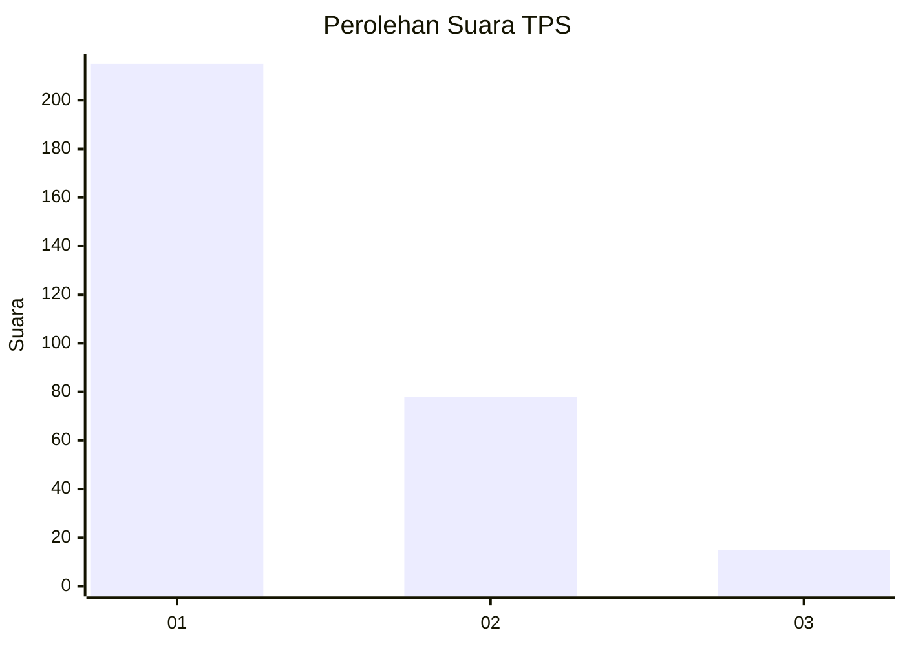
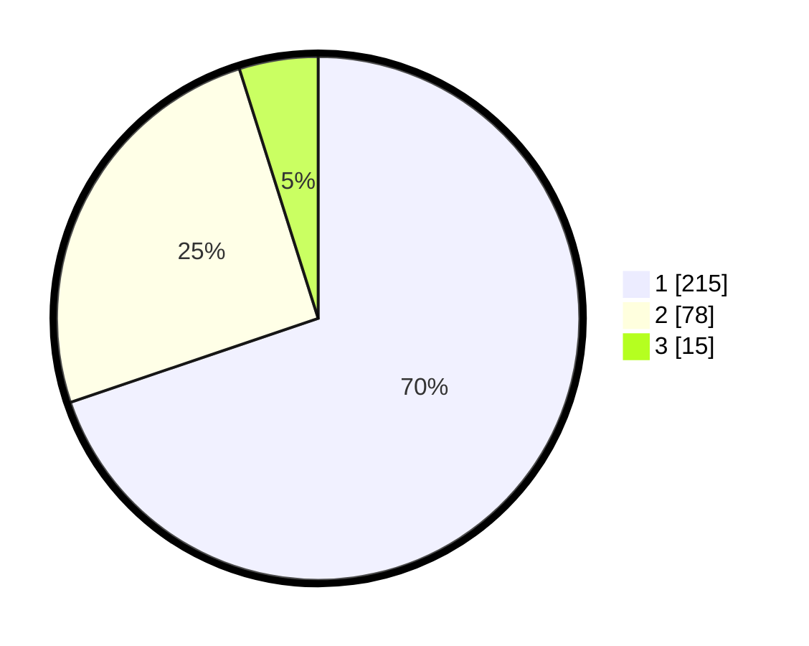

# Hasil

## Grafik

## Tabel

| No. | Nama Paslon    | Suara | Suara (raw) | Persentase |
|:--- |:-------------- | -----:| -----------:| ----------:|
| 1   | ANIES MUHAIMIN | 215   | [215][p-1]  | 69,81      |
| 2   | PRABOWO GIBRAN | 78    | [78][p-2]   | 25,32      |
| 3   | GANJAR MAHFUD  | 15    | [15][p-3]   | 4,87       |

[p-1]: https://github.com/gigit-pemilu/pemilu-2024-99-luar-negeri/blob/main/pilpres/hitung-suara/sub/99-luar-negeri/sub/53-jeddah-arab-saudi/sub/01-jeddah-arab-saudi/sub/0001-jeddah-arab-saudi/sub/014-ksk-002/sub/paslon-1.txt
[p-2]: https://github.com/gigit-pemilu/pemilu-2024-99-luar-negeri/blob/main/pilpres/hitung-suara/sub/99-luar-negeri/sub/53-jeddah-arab-saudi/sub/01-jeddah-arab-saudi/sub/0001-jeddah-arab-saudi/sub/014-ksk-002/sub/paslon-2.txt
[p-3]: https://github.com/gigit-pemilu/pemilu-2024-99-luar-negeri/blob/main/pilpres/hitung-suara/sub/99-luar-negeri/sub/53-jeddah-arab-saudi/sub/01-jeddah-arab-saudi/sub/0001-jeddah-arab-saudi/sub/014-ksk-002/sub/paslon-3.txt

## Foto C Plano

https://sirekap-obj-formc.kpu.go.id/007c/pemilu/ppwp/99/53/01/00/01/9953010001014-20240218-002109--d6fd144d-7d73-49dc-a432-49234c624046.jpg

https://sirekap-obj-formc.kpu.go.id/007c/pemilu/ppwp/99/53/01/00/01/9953010001014-20240218-002111--1d4b40cd-cce3-4332-bfbc-7aed2797b06e.jpg

https://sirekap-obj-formc.kpu.go.id/007c/pemilu/ppwp/99/53/01/00/01/9953010001014-20240218-002110--3bdd6f27-d5f0-433f-a376-86ce621ae50f.jpg

## Metadata

| Key        | Value               |
| ---------- | ------------------- |
| Time Stamp | 2024-02-19 06:16:00 |

## DATA PEMILIH TETAP

Jumlah pemilih dalam DPT: **2035**.
 * L: **939**.
 * P: **1096**.

## DATA PENGGUNA HAK PILIH

Jumlah pengguna hak pilih dalam DPT: **27**.
 * L: **22**.
 * P: **5**.

Jumlah pengguna hak pilih dalam DPTb: **66**.
 * L: **38**.
 * P: **28**.

Jumlah pengguna hak pilih dalam DPK: **218**.
 * L: **130**.
 * P: **88**.

Jumlah pengguna hak pilih: **311**.
 * L: **190**.
 * P: **121**.

## JUMLAH SUARA SAH DAN TIDAK SAH

JUMLAH SELURUH SUARA SAH: **308**.

JUMLAH SUARA TIDAK SAH: **3**.

JUMLAH SELURUH SUARA SAH DAN SUARA TIDAK SAH: **311**.

