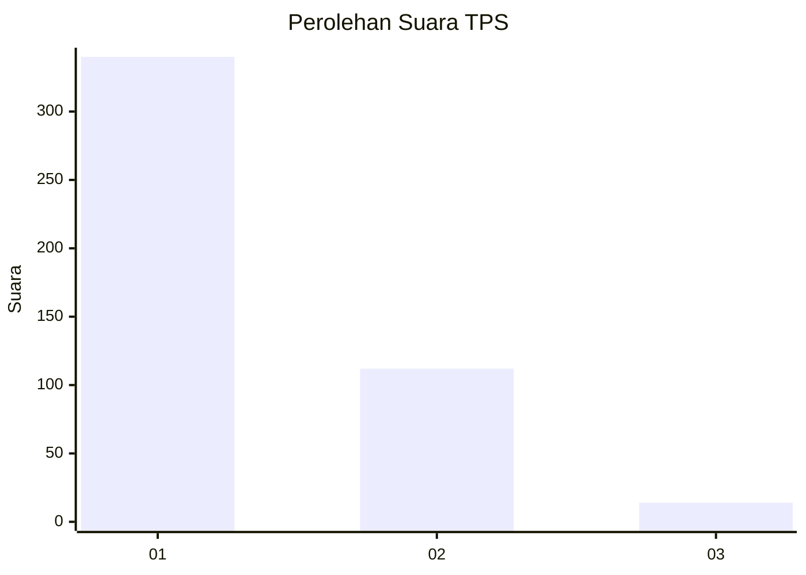
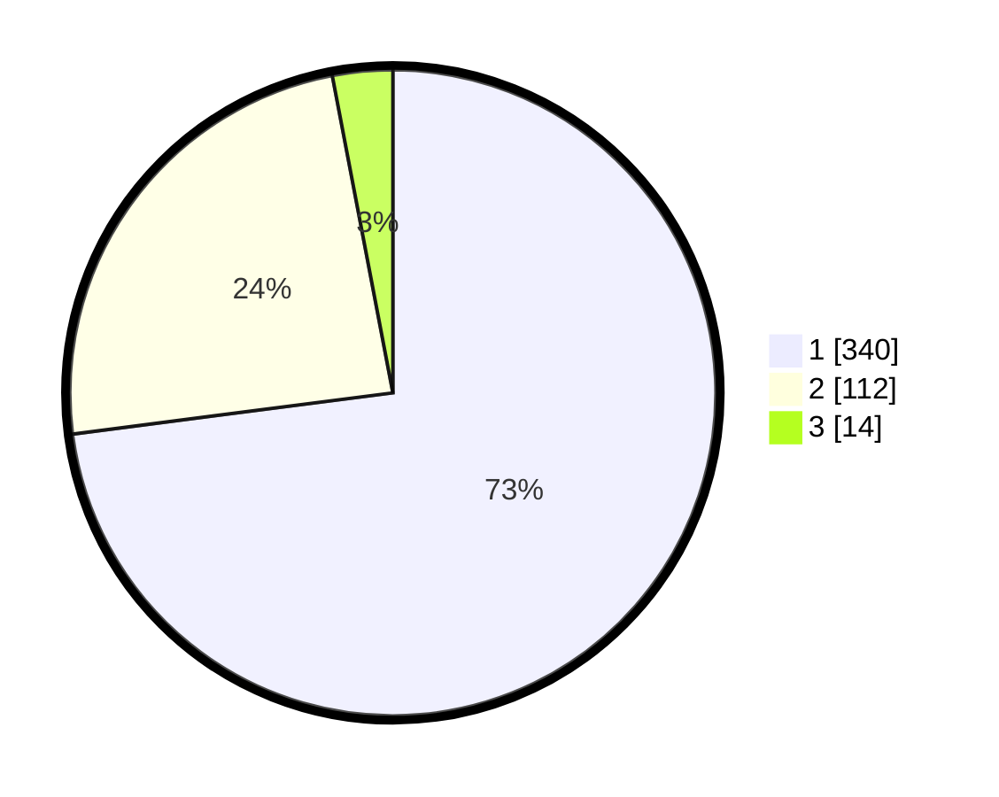

# Hasil

## Grafik

## Tabel

| No. | Nama Paslon    | Suara | Suara (raw) | Persentase |
|:--- |:-------------- | -----:| -----------:| ----------:|
| 1   | ANIES MUHAIMIN | 340   | [340][p-1]  | 72,96      |
| 2   | PRABOWO GIBRAN | 112   | [112][p-2]  | 24,03      |
| 3   | GANJAR MAHFUD  | 14    | [14][p-3]   | 3,00       |

[p-1]: https://github.com/gigit-pemilu/pemilu-2024-99-luar-negeri/blob/main/pilpres/hitung-suara/sub/99-luar-negeri/sub/53-jeddah-arab-saudi/sub/01-jeddah-arab-saudi/sub/0001-jeddah-arab-saudi/sub/015-ksk-003/sub/paslon-1.txt
[p-2]: https://github.com/gigit-pemilu/pemilu-2024-99-luar-negeri/blob/main/pilpres/hitung-suara/sub/99-luar-negeri/sub/53-jeddah-arab-saudi/sub/01-jeddah-arab-saudi/sub/0001-jeddah-arab-saudi/sub/015-ksk-003/sub/paslon-2.txt
[p-3]: https://github.com/gigit-pemilu/pemilu-2024-99-luar-negeri/blob/main/pilpres/hitung-suara/sub/99-luar-negeri/sub/53-jeddah-arab-saudi/sub/01-jeddah-arab-saudi/sub/0001-jeddah-arab-saudi/sub/015-ksk-003/sub/paslon-3.txt

## Foto C Plano

https://sirekap-obj-formc.kpu.go.id/3ba3/pemilu/ppwp/99/53/01/00/01/9953010001015-20240215-035759--a72aa069-8cf1-4609-94d4-1d41bc144251.jpg

https://sirekap-obj-formc.kpu.go.id/3ba3/pemilu/ppwp/99/53/01/00/01/9953010001015-20240216-151211--a51f1ce2-21de-483a-ba12-7658e561cdc3.jpg

https://sirekap-obj-formc.kpu.go.id/3ba3/pemilu/ppwp/99/53/01/00/01/9953010001015-20240215-040321--118d3f89-8ee2-464c-a706-25eec71e7f50.jpg

## Metadata

| Key        | Value               |
| ---------- | ------------------- |
| Time Stamp | 2024-02-21 13:00:00 |

## DATA PEMILIH TETAP

Jumlah pemilih dalam DPT: **1994**.
 * L: **1000**.
 * P: **994**.

## DATA PENGGUNA HAK PILIH

Jumlah pengguna hak pilih dalam DPT: **51**.
 * L: **30**.
 * P: **21**.

Jumlah pengguna hak pilih dalam DPTb: **102**.
 * L: **50**.
 * P: **52**.

Jumlah pengguna hak pilih dalam DPK: **316**.
 * L: **200**.
 * P: **116**.

Jumlah pengguna hak pilih: **469**.
 * L: **280**.
 * P: **189**.

## JUMLAH SUARA SAH DAN TIDAK SAH

JUMLAH SELURUH SUARA SAH: **466**.

JUMLAH SUARA TIDAK SAH: **3**.

JUMLAH SELURUH SUARA SAH DAN SUARA TIDAK SAH: **469**.

