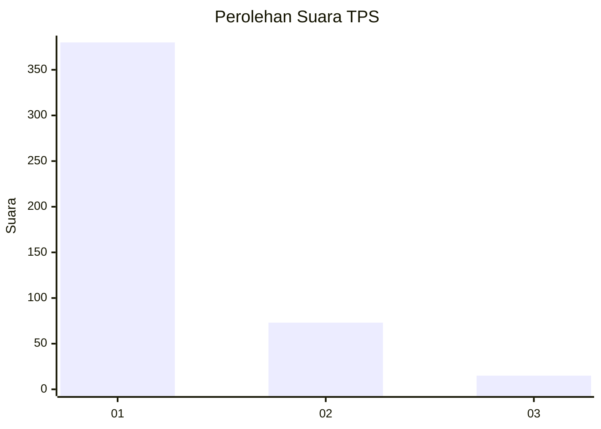
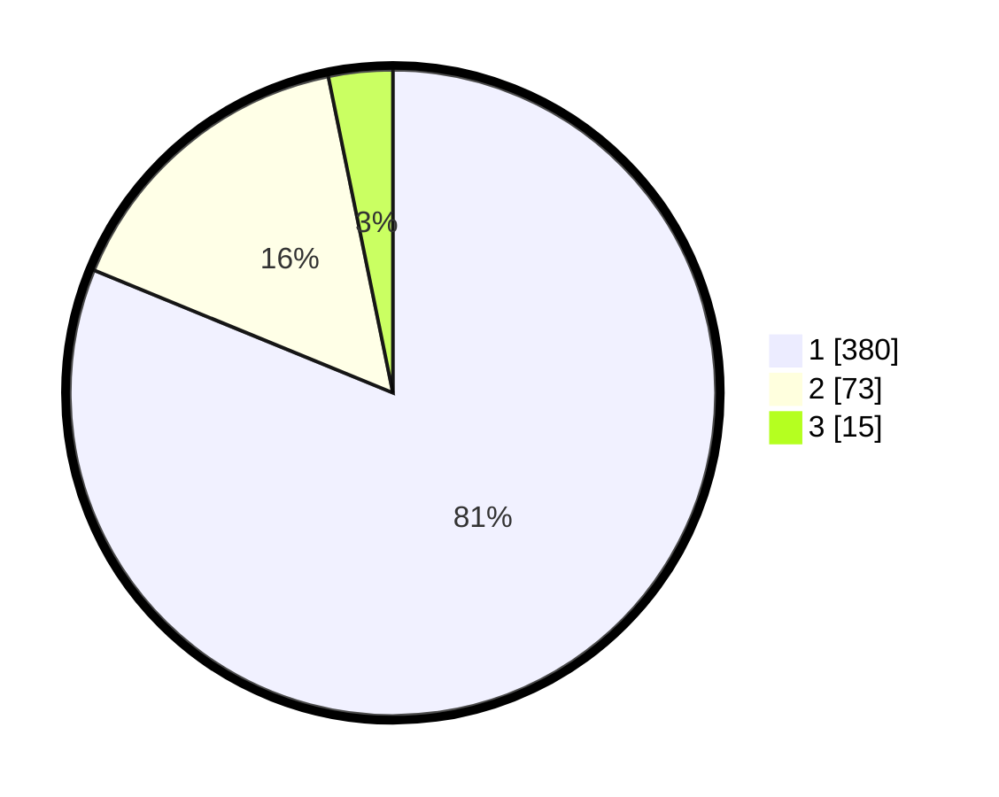

# Hasil

## Grafik

## Tabel

| No. | Nama Paslon    | Suara | Suara (raw) | Persentase |
|:--- |:-------------- | -----:| -----------:| ----------:|
| 1   | ANIES MUHAIMIN | 380   | [380][p-1]  | 81,20      |
| 2   | PRABOWO GIBRAN | 73    | [73][p-2]   | 15,60      |
| 3   | GANJAR MAHFUD  | 15    | [15][p-3]   | 3,21       |

[p-1]: https://github.com/gigit-pemilu/pemilu-2024-99-luar-negeri/blob/main/pilpres/hitung-suara/sub/99-luar-negeri/sub/53-jeddah-arab-saudi/sub/01-jeddah-arab-saudi/sub/0001-jeddah-arab-saudi/sub/016-ksk-004/sub/paslon-1.txt
[p-2]: https://github.com/gigit-pemilu/pemilu-2024-99-luar-negeri/blob/main/pilpres/hitung-suara/sub/99-luar-negeri/sub/53-jeddah-arab-saudi/sub/01-jeddah-arab-saudi/sub/0001-jeddah-arab-saudi/sub/016-ksk-004/sub/paslon-2.txt
[p-3]: https://github.com/gigit-pemilu/pemilu-2024-99-luar-negeri/blob/main/pilpres/hitung-suara/sub/99-luar-negeri/sub/53-jeddah-arab-saudi/sub/01-jeddah-arab-saudi/sub/0001-jeddah-arab-saudi/sub/016-ksk-004/sub/paslon-3.txt

## Foto C Plano

https://sirekap-obj-formc.kpu.go.id/f592/pemilu/ppwp/99/53/01/00/01/9953010001016-20240216-141545--15c6afcb-17c5-4e9a-868e-9d3e606a5d89.jpg

https://sirekap-obj-formc.kpu.go.id/f592/pemilu/ppwp/99/53/01/00/01/9953010001016-20240216-141546--620a8872-33e3-4d1e-9af0-21ae0c56157f.jpg

https://sirekap-obj-formc.kpu.go.id/f592/pemilu/ppwp/99/53/01/00/01/9953010001016-20240215-134654--9a711309-55a6-4798-8ff5-9b2faccf7154.jpg

## Metadata

| Key        | Value               |
| ---------- | ------------------- |
| Time Stamp | 2024-02-19 06:16:00 |

## DATA PEMILIH TETAP

Jumlah pemilih dalam DPT: **1698**.
 * L: **899**.
 * P: **799**.

## DATA PENGGUNA HAK PILIH

Jumlah pengguna hak pilih dalam DPT: **114**.
 * L: **30**.
 * P: **84**.

Jumlah pengguna hak pilih dalam DPTb: **99**.
 * L: **75**.
 * P: **24**.

Jumlah pengguna hak pilih dalam DPK: **264**.
 * L: **160**.
 * P: **104**.

Jumlah pengguna hak pilih: **477**.
 * L: **265**.
 * P: **212**.

## JUMLAH SUARA SAH DAN TIDAK SAH

JUMLAH SELURUH SUARA SAH: **468**.

JUMLAH SUARA TIDAK SAH: **9**.

JUMLAH SELURUH SUARA SAH DAN SUARA TIDAK SAH: **477**.

