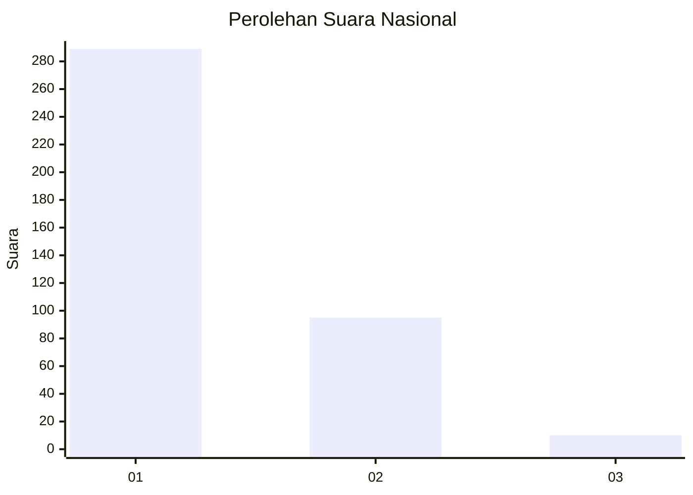
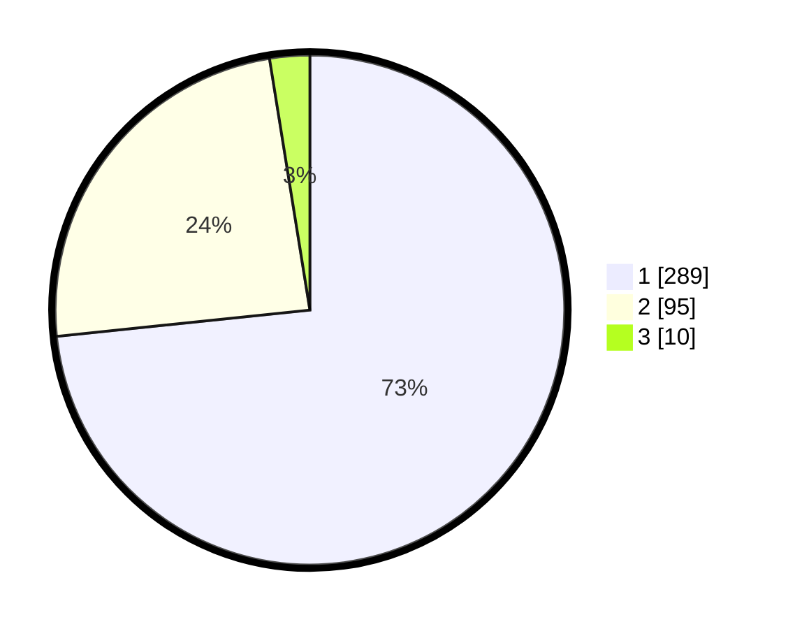

# Hasil

## Grafik

## Tabel

| No. | Nama Paslon    | Suara | Suara (raw) | Persentase |
|:--- |:-------------- | -----:| -----------:| ----------:|
| 1   | ANIES MUHAIMIN | 289   | [289][p-1]  | 73,35      |
| 2   | PRABOWO GIBRAN | 95    | [95][p-2]   | 24,11      |
| 3   | GANJAR MAHFUD  | 10    | [10][p-3]   | 2,54       |

[p-1]: https://github.com/gigit-pemilu/pemilu-2024/blob/main/pilpres/hitung-suara/sub/99-luar-negeri/sub/53-jeddah-arab-saudi/sub/01-jeddah-arab-saudi/sub/0001-jeddah-arab-saudi/sub/017-ksk-005/sub/paslon-1.txt
[p-2]: https://github.com/gigit-pemilu/pemilu-2024/blob/main/pilpres/hitung-suara/sub/99-luar-negeri/sub/53-jeddah-arab-saudi/sub/01-jeddah-arab-saudi/sub/0001-jeddah-arab-saudi/sub/017-ksk-005/sub/paslon-2.txt
[p-3]: https://github.com/gigit-pemilu/pemilu-2024/blob/main/pilpres/hitung-suara/sub/99-luar-negeri/sub/53-jeddah-arab-saudi/sub/01-jeddah-arab-saudi/sub/0001-jeddah-arab-saudi/sub/017-ksk-005/sub/paslon-3.txt

## Foto C Plano

https://sirekap-obj-formc.kpu.go.id/d200/pemilu/ppwp/99/53/01/00/01/9953010001017-20240215-232732--6571b962-8af2-48ee-9d26-a7c2ae863ad8.jpg

https://sirekap-obj-formc.kpu.go.id/d200/pemilu/ppwp/99/53/01/00/01/9953010001017-20240215-232735--713039d8-1649-4dc6-a39c-30602767f5ca.jpg

https://sirekap-obj-formc.kpu.go.id/d200/pemilu/ppwp/99/53/01/00/01/9953010001017-20240215-232734--11f0e85d-27cd-4f56-a22f-14c128fd7040.jpg

## Metadata

| Key        | Value               |
| ---------- | ------------------- |
| Time Stamp | 2024-02-16 01:30:27 |

## DATA PEMILIH TETAP

Jumlah pemilih dalam DPT: **2008**.
 * L: **753**.
 * P: **1255**.

## DATA PENGGUNA HAK PILIH

Jumlah pengguna hak pilih dalam DPT: **12**.
 * L: **9**.
 * P: **3**.

Jumlah pengguna hak pilih dalam DPTb: **125**.
 * L: **62**.
 * P: **63**.

Jumlah pengguna hak pilih dalam DPK: **261**.
 * L: **158**.
 * P: **103**.

Jumlah pengguna hak pilih: **398**.
 * L: **229**.
 * P: **169**.

## JUMLAH SUARA SAH DAN TIDAK SAH

JUMLAH SELURUH SUARA SAH: **394**.

JUMLAH SUARA TIDAK SAH: **4**.

JUMLAH SELURUH SUARA SAH DAN SUARA TIDAK SAH: **398**.

