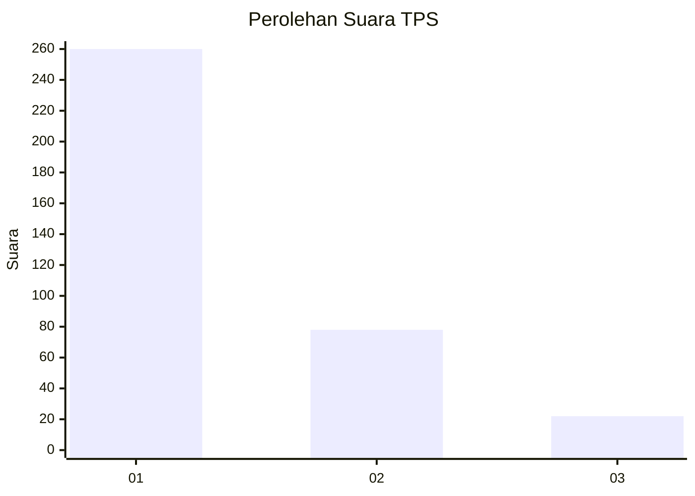
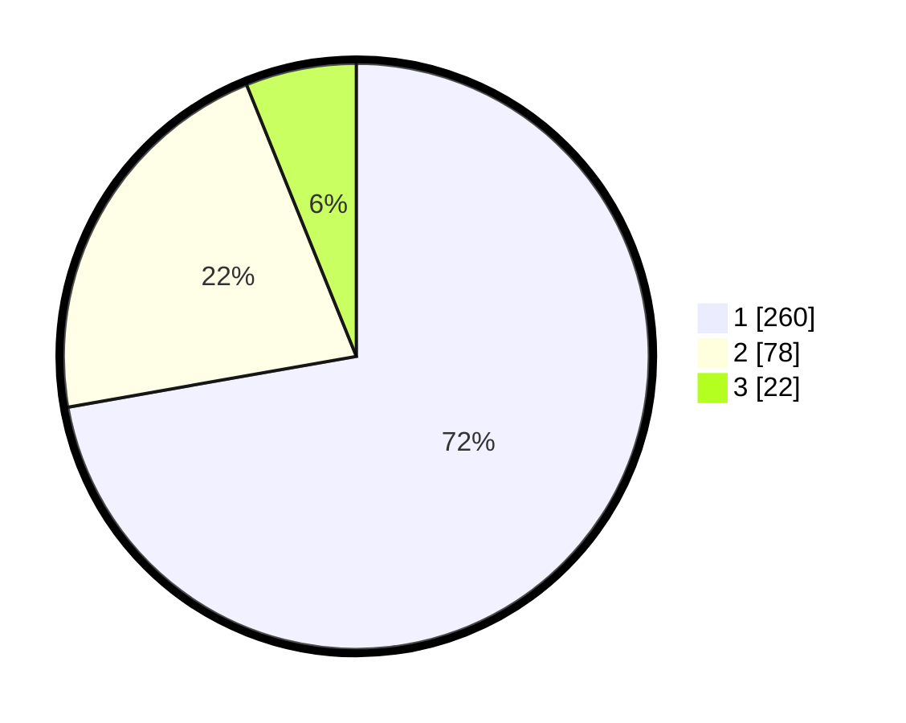

# Hasil

## Grafik

## Tabel

| No. | Nama Paslon    | Suara | Suara (raw) | Persentase |
|:--- |:-------------- | -----:| -----------:| ----------:|
| 1   | ANIES MUHAIMIN | 260   | [260][p-1]  | 72,22      |
| 2   | PRABOWO GIBRAN | 78    | [78][p-2]   | 21,67      |
| 3   | GANJAR MAHFUD  | 22    | [22][p-3]   | 6,11       |

[p-1]: https://github.com/gigit-pemilu/pemilu-2024-99-luar-negeri/blob/main/pilpres/hitung-suara/sub/99-luar-negeri/sub/53-jeddah-arab-saudi/sub/01-jeddah-arab-saudi/sub/0001-jeddah-arab-saudi/sub/018-ksk-006/sub/paslon-1.txt
[p-2]: https://github.com/gigit-pemilu/pemilu-2024-99-luar-negeri/blob/main/pilpres/hitung-suara/sub/99-luar-negeri/sub/53-jeddah-arab-saudi/sub/01-jeddah-arab-saudi/sub/0001-jeddah-arab-saudi/sub/018-ksk-006/sub/paslon-2.txt
[p-3]: https://github.com/gigit-pemilu/pemilu-2024-99-luar-negeri/blob/main/pilpres/hitung-suara/sub/99-luar-negeri/sub/53-jeddah-arab-saudi/sub/01-jeddah-arab-saudi/sub/0001-jeddah-arab-saudi/sub/018-ksk-006/sub/paslon-3.txt

## Foto C Plano

https://sirekap-obj-formc.kpu.go.id/751a/pemilu/ppwp/99/53/01/00/01/9953010001018-20240215-160115--f41f1a95-fa2d-4ed0-a992-c74d602fc6e9.jpg

https://sirekap-obj-formc.kpu.go.id/751a/pemilu/ppwp/99/53/01/00/01/9953010001018-20240216-143207--3d4babad-0374-4c02-bab7-c8fb29c24327.jpg

https://sirekap-obj-formc.kpu.go.id/751a/pemilu/ppwp/99/53/01/00/01/9953010001018-20240215-152541--977567ea-5bfc-47af-8ef6-d48f412e058b.jpg

## Metadata

| Key        | Value               |
| ---------- | ------------------- |
| Time Stamp | 2024-02-19 06:16:00 |

## DATA PEMILIH TETAP

Jumlah pemilih dalam DPT: **2043**.
 * L: **1013**.
 * P: **1030**.

## DATA PENGGUNA HAK PILIH

Jumlah pengguna hak pilih dalam DPT: **24**.
 * L: **22**.
 * P: **2**.

Jumlah pengguna hak pilih dalam DPTb: **52**.
 * L: **35**.
 * P: **17**.

Jumlah pengguna hak pilih dalam DPK: **284**.
 * L: **140**.
 * P: **144**.

Jumlah pengguna hak pilih: **360**.
 * L: **97**.
 * P: **63**.

## JUMLAH SUARA SAH DAN TIDAK SAH

JUMLAH SELURUH SUARA SAH: **360**.

JUMLAH SUARA TIDAK SAH: **0**.

JUMLAH SELURUH SUARA SAH DAN SUARA TIDAK SAH: **360**.

