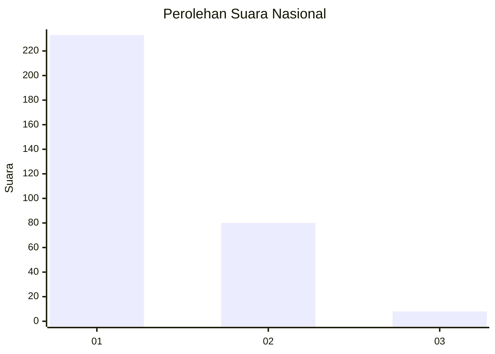
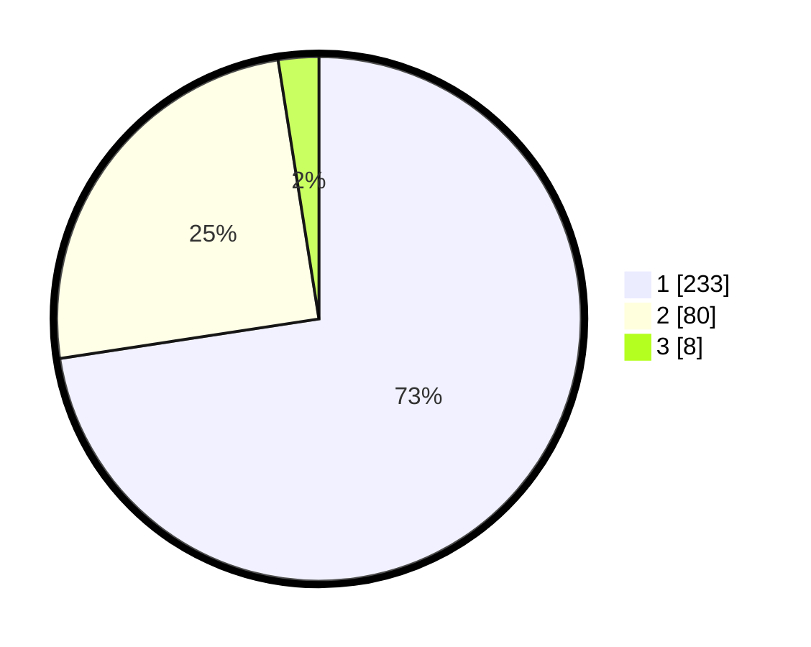

# Hasil

## Grafik

## Tabel

| No. | Nama Paslon    | Suara | Suara (raw) | Persentase |
|:--- |:-------------- | -----:| -----------:| ----------:|
| 1   | ANIES MUHAIMIN | 233   | [233][p-1]  | 72,59      |
| 2   | PRABOWO GIBRAN | 80    | [80][p-2]   | 24,92      |
| 3   | GANJAR MAHFUD  | 8     | [8][p-3]    | 2,49       |

[p-1]: https://github.com/gigit-pemilu/pemilu-2024/blob/main/pilpres/hitung-suara/sub/99-luar-negeri/sub/53-jeddah-arab-saudi/sub/01-jeddah-arab-saudi/sub/0001-jeddah-arab-saudi/sub/019-ksk-007/sub/paslon-1.txt
[p-2]: https://github.com/gigit-pemilu/pemilu-2024/blob/main/pilpres/hitung-suara/sub/99-luar-negeri/sub/53-jeddah-arab-saudi/sub/01-jeddah-arab-saudi/sub/0001-jeddah-arab-saudi/sub/019-ksk-007/sub/paslon-2.txt
[p-3]: https://github.com/gigit-pemilu/pemilu-2024/blob/main/pilpres/hitung-suara/sub/99-luar-negeri/sub/53-jeddah-arab-saudi/sub/01-jeddah-arab-saudi/sub/0001-jeddah-arab-saudi/sub/019-ksk-007/sub/paslon-3.txt

## Foto C Plano

https://sirekap-obj-formc.kpu.go.id/8397/pemilu/ppwp/99/53/01/00/01/9953010001019-20240216-135710--5fbf4069-0cde-40ec-b31f-e08dac5219ce.jpg

https://sirekap-obj-formc.kpu.go.id/8397/pemilu/ppwp/99/53/01/00/01/9953010001019-20240216-135711--fd146eca-0328-430c-b9ba-b2324a1454b5.jpg

https://sirekap-obj-formc.kpu.go.id/8397/pemilu/ppwp/99/53/01/00/01/9953010001019-20240216-135711--9bfc44f6-6318-473d-bb76-6e7f87a04f83.jpg

## Metadata

| Key        | Value               |
| ---------- | ------------------- |
| Time Stamp | 2024-02-19 06:16:00 |

## DATA PEMILIH TETAP

Jumlah pemilih dalam DPT: **2001**.
 * L: **895**.
 * P: **1106**.

## DATA PENGGUNA HAK PILIH

Jumlah pengguna hak pilih dalam DPT: **46**.
 * L: **26**.
 * P: **20**.

Jumlah pengguna hak pilih dalam DPTb: **58**.
 * L: **45**.
 * P: **13**.

Jumlah pengguna hak pilih dalam DPK: **220**.
 * L: **130**.
 * P: **90**.

Jumlah pengguna hak pilih: **324**.
 * L: **201**.
 * P: **123**.

## JUMLAH SUARA SAH DAN TIDAK SAH

JUMLAH SELURUH SUARA SAH: **321**.

JUMLAH SUARA TIDAK SAH: **3**.

JUMLAH SELURUH SUARA SAH DAN SUARA TIDAK SAH: **324**.

