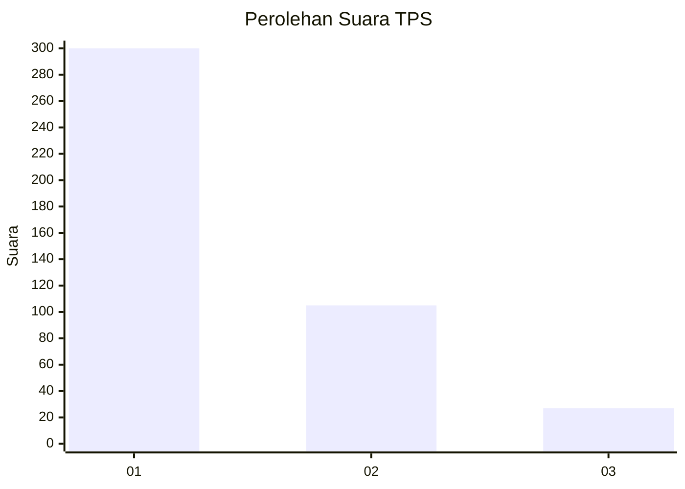
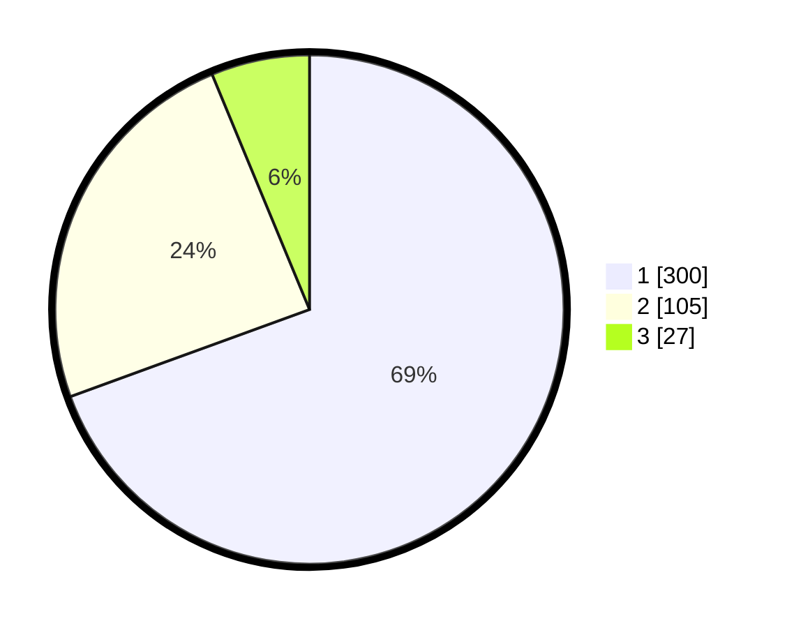

# Hasil

## Grafik

## Tabel

| No. | Nama Paslon    | Suara | Suara (raw) | Persentase |
|:--- |:-------------- | -----:| -----------:| ----------:|
| 1   | ANIES MUHAIMIN | 300   | [300][p-1]  | 69,44      |
| 2   | PRABOWO GIBRAN | 105   | [105][p-2]  | 24,31      |
| 3   | GANJAR MAHFUD  | 27    | [27][p-3]   | 6,25       |

[p-1]: https://github.com/gigit-pemilu/pemilu-2024-99-luar-negeri/blob/main/pilpres/hitung-suara/sub/99-luar-negeri/sub/53-jeddah-arab-saudi/sub/01-jeddah-arab-saudi/sub/0001-jeddah-arab-saudi/sub/020-ksk-008/sub/paslon-1.txt
[p-2]: https://github.com/gigit-pemilu/pemilu-2024-99-luar-negeri/blob/main/pilpres/hitung-suara/sub/99-luar-negeri/sub/53-jeddah-arab-saudi/sub/01-jeddah-arab-saudi/sub/0001-jeddah-arab-saudi/sub/020-ksk-008/sub/paslon-2.txt
[p-3]: https://github.com/gigit-pemilu/pemilu-2024-99-luar-negeri/blob/main/pilpres/hitung-suara/sub/99-luar-negeri/sub/53-jeddah-arab-saudi/sub/01-jeddah-arab-saudi/sub/0001-jeddah-arab-saudi/sub/020-ksk-008/sub/paslon-3.txt

## Foto C Plano

https://sirekap-obj-formc.kpu.go.id/ed13/pemilu/ppwp/99/53/01/00/01/9953010001020-20240216-190442--319c87b9-4e26-4edd-bfcc-0b4aa108226f.jpg

https://sirekap-obj-formc.kpu.go.id/ed13/pemilu/ppwp/99/53/01/00/01/9953010001020-20240216-190443--bf0f5895-80df-466f-a05e-b58e9d4c9162.jpg

https://sirekap-obj-formc.kpu.go.id/ed13/pemilu/ppwp/99/53/01/00/01/9953010001020-20240216-190443--d5ab22b4-82d6-4e31-accc-2f6ab0e8479e.jpg

## Metadata

| Key        | Value               |
| ---------- | ------------------- |
| Time Stamp | 2024-02-19 06:16:00 |

## DATA PEMILIH TETAP

Jumlah pemilih dalam DPT: **1703**.
 * L: **596**.
 * P: **1107**.

## DATA PENGGUNA HAK PILIH

Jumlah pengguna hak pilih dalam DPT: **127**.
 * L: **83**.
 * P: **44**.

Jumlah pengguna hak pilih dalam DPTb: **180**.
 * L: **111**.
 * P: **69**.

Jumlah pengguna hak pilih dalam DPK: **134**.
 * L: **60**.
 * P: **74**.

Jumlah pengguna hak pilih: **441**.
 * L: **254**.
 * P: **187**.

## JUMLAH SUARA SAH DAN TIDAK SAH

JUMLAH SELURUH SUARA SAH: **432**.

JUMLAH SUARA TIDAK SAH: **6**.

JUMLAH SELURUH SUARA SAH DAN SUARA TIDAK SAH: **438**.

