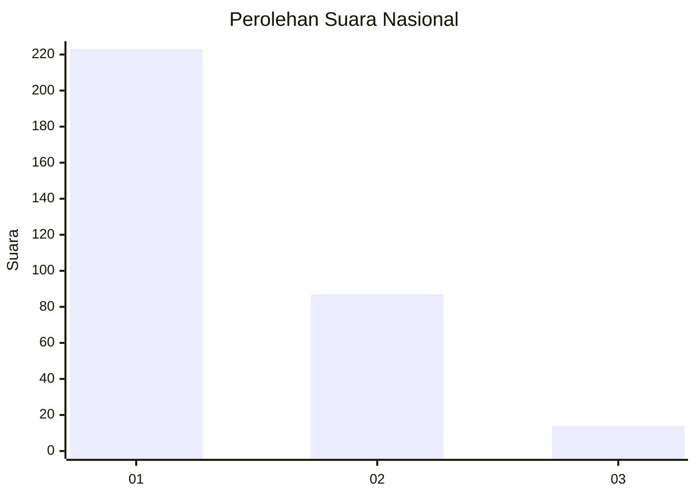
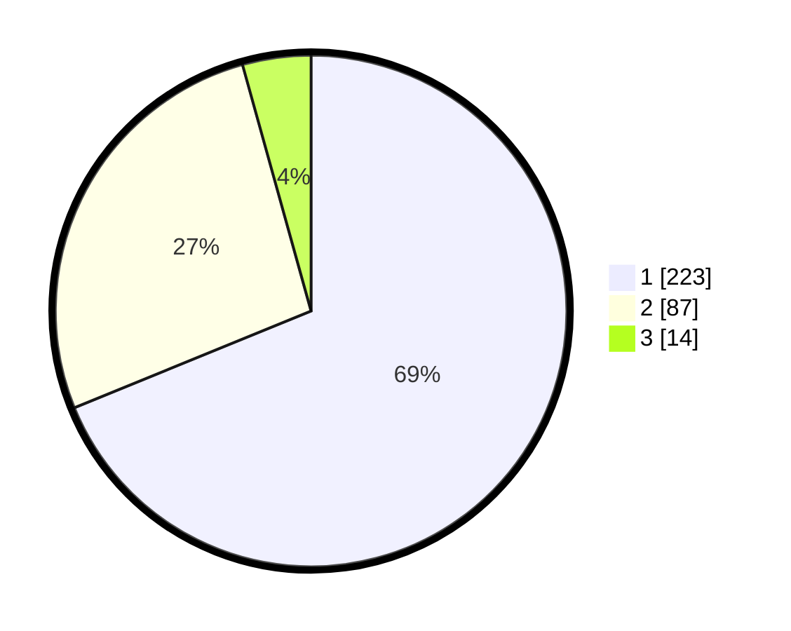

# Hasil

## Grafik

## Tabel

| No. | Nama Paslon    | Suara | Suara (raw) | Persentase |
|:--- |:-------------- | -----:| -----------:| ----------:|
| 1   | ANIES MUHAIMIN | 223   | [223][p-1]  | 68,83      |
| 2   | PRABOWO GIBRAN | 87    | [87][p-2]   | 26,85      |
| 3   | GANJAR MAHFUD  | 14    | [14][p-3]   | 4,32       |

[p-1]: https://github.com/gigit-pemilu/pemilu-2024/blob/main/pilpres/hitung-suara/sub/99-luar-negeri/sub/53-jeddah-arab-saudi/sub/01-jeddah-arab-saudi/sub/0001-jeddah-arab-saudi/sub/021-ksk-009/sub/paslon-1.txt
[p-2]: https://github.com/gigit-pemilu/pemilu-2024/blob/main/pilpres/hitung-suara/sub/99-luar-negeri/sub/53-jeddah-arab-saudi/sub/01-jeddah-arab-saudi/sub/0001-jeddah-arab-saudi/sub/021-ksk-009/sub/paslon-2.txt
[p-3]: https://github.com/gigit-pemilu/pemilu-2024/blob/main/pilpres/hitung-suara/sub/99-luar-negeri/sub/53-jeddah-arab-saudi/sub/01-jeddah-arab-saudi/sub/0001-jeddah-arab-saudi/sub/021-ksk-009/sub/paslon-3.txt

## Foto C Plano

https://sirekap-obj-formc.kpu.go.id/75c2/pemilu/ppwp/99/53/01/00/01/9953010001021-20240216-011005--676e6060-61ce-43fb-8be1-13beb34b6f5d.jpg

https://sirekap-obj-formc.kpu.go.id/75c2/pemilu/ppwp/99/53/01/00/01/9953010001021-20240216-011008--7803d6c9-fd58-40ee-bbc1-881975dc113d.jpg

https://sirekap-obj-formc.kpu.go.id/75c2/pemilu/ppwp/99/53/01/00/01/9953010001021-20240216-011007--38010f64-c7c9-45e6-8087-3a90012d2d57.jpg

## Metadata

| Key        | Value               |
| ---------- | ------------------- |
| Time Stamp | 2024-02-16 01:30:27 |

## DATA PEMILIH TETAP

Jumlah pemilih dalam DPT: **2025**.
 * L: **896**.
 * P: **1129**.

## DATA PENGGUNA HAK PILIH

Jumlah pengguna hak pilih dalam DPT: **18**.
 * L: **12**.
 * P: **6**.

Jumlah pengguna hak pilih dalam DPTb: **152**.
 * L: **93**.
 * P: **59**.

Jumlah pengguna hak pilih dalam DPK: **156**.
 * L: **84**.
 * P: **72**.

Jumlah pengguna hak pilih: **326**.
 * L: **189**.
 * P: **137**.

## JUMLAH SUARA SAH DAN TIDAK SAH

JUMLAH SELURUH SUARA SAH: **324**.

JUMLAH SUARA TIDAK SAH: **2**.

JUMLAH SELURUH SUARA SAH DAN SUARA TIDAK SAH: **326**.

