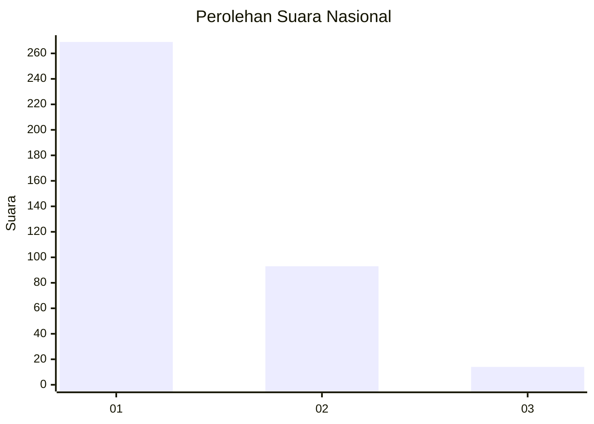
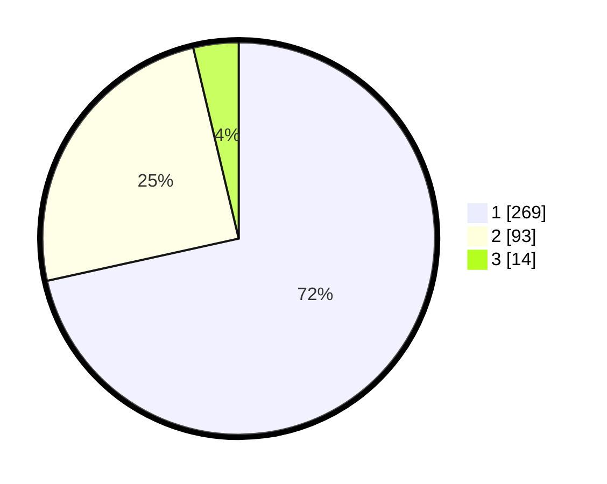

# Hasil

## Grafik

## Tabel

| No. | Nama Paslon    | Suara | Suara (raw) | Persentase |
|:--- |:-------------- | -----:| -----------:| ----------:|
| 1   | ANIES MUHAIMIN | 269   | [269][p-1]  | 71,54      |
| 2   | PRABOWO GIBRAN | 93    | [93][p-2]   | 24,73      |
| 3   | GANJAR MAHFUD  | 14    | [14][p-3]   | 3,72       |

[p-1]: https://github.com/gigit-pemilu/pemilu-2024/blob/main/pilpres/hitung-suara/sub/99-luar-negeri/sub/53-jeddah-arab-saudi/sub/01-jeddah-arab-saudi/sub/0001-jeddah-arab-saudi/sub/022-ksk-010/sub/paslon-1.txt
[p-2]: https://github.com/gigit-pemilu/pemilu-2024/blob/main/pilpres/hitung-suara/sub/99-luar-negeri/sub/53-jeddah-arab-saudi/sub/01-jeddah-arab-saudi/sub/0001-jeddah-arab-saudi/sub/022-ksk-010/sub/paslon-2.txt
[p-3]: https://github.com/gigit-pemilu/pemilu-2024/blob/main/pilpres/hitung-suara/sub/99-luar-negeri/sub/53-jeddah-arab-saudi/sub/01-jeddah-arab-saudi/sub/0001-jeddah-arab-saudi/sub/022-ksk-010/sub/paslon-3.txt

## Foto C Plano

https://sirekap-obj-formc.kpu.go.id/0859/pemilu/ppwp/99/53/01/00/01/9953010001022-20240216-001048--21351cd8-1a03-42a0-a55b-0e59600574b1.jpg

https://sirekap-obj-formc.kpu.go.id/0859/pemilu/ppwp/99/53/01/00/01/9953010001022-20240216-001050--bd3b89c2-8ab2-4fac-ba36-29abaf600152.jpg

https://sirekap-obj-formc.kpu.go.id/0859/pemilu/ppwp/99/53/01/00/01/9953010001022-20240216-001049--e24dd161-ca7a-45b6-806b-e434eeb1ab58.jpg

## Metadata

| Key        | Value               |
| ---------- | ------------------- |
| Time Stamp | 2024-02-16 01:30:27 |

## DATA PEMILIH TETAP

Jumlah pemilih dalam DPT: **2014**.
 * L: **669**.
 * P: **1345**.

## DATA PENGGUNA HAK PILIH

Jumlah pengguna hak pilih dalam DPT: **25**.
 * L: **18**.
 * P: **7**.

Jumlah pengguna hak pilih dalam DPTb: **204**.
 * L: **166**.
 * P: **38**.

Jumlah pengguna hak pilih dalam DPK: **150**.
 * L: **90**.
 * P: **60**.

Jumlah pengguna hak pilih: **379**.
 * L: **274**.
 * P: **105**.

## JUMLAH SUARA SAH DAN TIDAK SAH

JUMLAH SELURUH SUARA SAH: **376**.

JUMLAH SUARA TIDAK SAH: **3**.

JUMLAH SELURUH SUARA SAH DAN SUARA TIDAK SAH: **379**.

