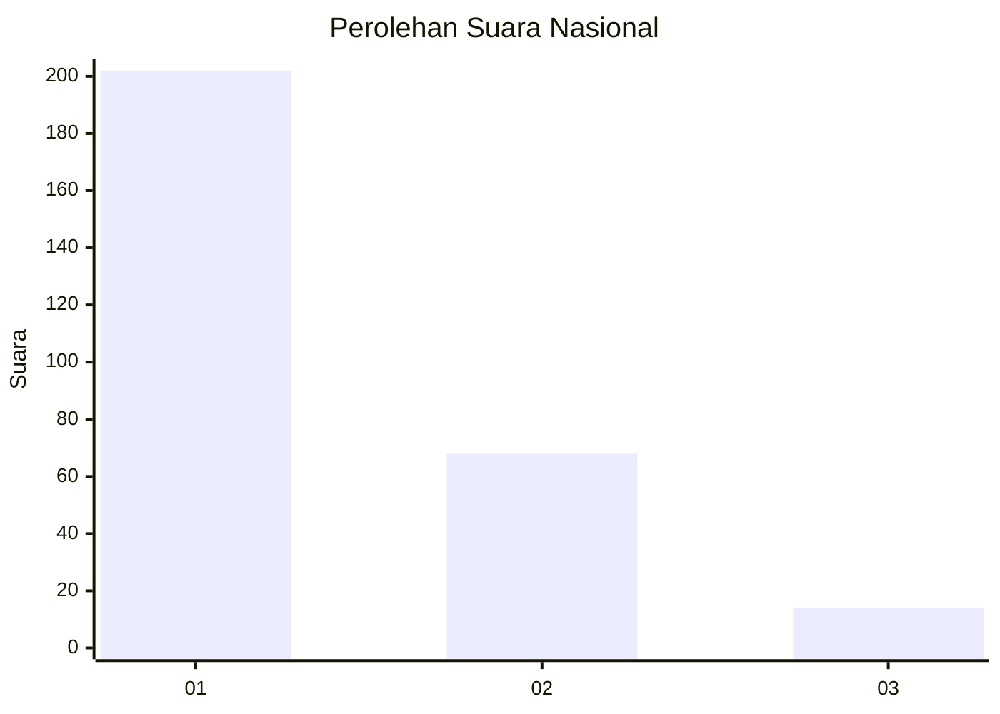
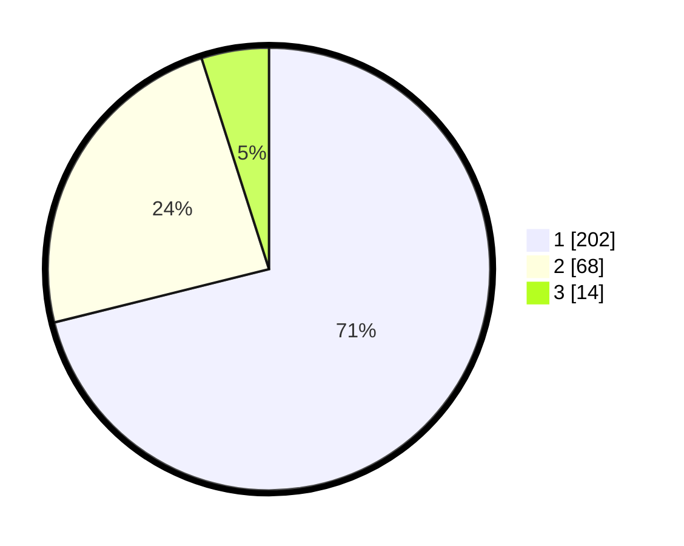

# Hasil

## Grafik

## Tabel

| No. | Nama Paslon    | Suara | Suara (raw) | Persentase |
|:--- |:-------------- | -----:| -----------:| ----------:|
| 1   | ANIES MUHAIMIN | 202   | [202][p-1]  | 71,13      |
| 2   | PRABOWO GIBRAN | 68    | [68][p-2]   | 23,94      |
| 3   | GANJAR MAHFUD  | 14    | [14][p-3]   | 4,93       |

[p-1]: https://github.com/gigit-pemilu/pemilu-2024/blob/main/pilpres/hitung-suara/sub/99-luar-negeri/sub/53-jeddah-arab-saudi/sub/01-jeddah-arab-saudi/sub/0001-jeddah-arab-saudi/sub/023-ksk-011/sub/paslon-1.txt
[p-2]: https://github.com/gigit-pemilu/pemilu-2024/blob/main/pilpres/hitung-suara/sub/99-luar-negeri/sub/53-jeddah-arab-saudi/sub/01-jeddah-arab-saudi/sub/0001-jeddah-arab-saudi/sub/023-ksk-011/sub/paslon-2.txt
[p-3]: https://github.com/gigit-pemilu/pemilu-2024/blob/main/pilpres/hitung-suara/sub/99-luar-negeri/sub/53-jeddah-arab-saudi/sub/01-jeddah-arab-saudi/sub/0001-jeddah-arab-saudi/sub/023-ksk-011/sub/paslon-3.txt

## Foto C Plano

https://sirekap-obj-formc.kpu.go.id/a999/pemilu/ppwp/99/53/01/00/01/9953010001023-20240223-222149--21a986eb-b341-4145-bccb-4f1b4ab58c02.jpg

https://sirekap-obj-formc.kpu.go.id/a999/pemilu/ppwp/99/53/01/00/01/9953010001023-20240223-222513--653753e5-67e4-4f39-96d4-dc5daf1cb661.jpg

https://sirekap-obj-formc.kpu.go.id/a999/pemilu/ppwp/99/53/01/00/01/9953010001023-20240223-222619--060fbce7-03f0-4ecd-b78b-30d6c3acb9e8.jpg

## Metadata

| Key        | Value               |
| ---------- | ------------------- |
| Time Stamp | 2024-02-24 22:31:28 |

## DATA PEMILIH TETAP

Jumlah pemilih dalam DPT: **2011**.
 * L: **1092**.
 * P: **919**.

## DATA PENGGUNA HAK PILIH

Jumlah pengguna hak pilih dalam DPT: **73**.
 * L: **55**.
 * P: **18**.

Jumlah pengguna hak pilih dalam DPTb: **103**.
 * L: **22**.
 * P: **81**.

Jumlah pengguna hak pilih dalam DPK: **112**.
 * L: **71**.
 * P: **41**.

Jumlah pengguna hak pilih: **288**.
 * L: **148**.
 * P: **140**.

## JUMLAH SUARA SAH DAN TIDAK SAH

JUMLAH SELURUH SUARA SAH: **284**.

JUMLAH SUARA TIDAK SAH: **4**.

JUMLAH SELURUH SUARA SAH DAN SUARA TIDAK SAH: **288**.

