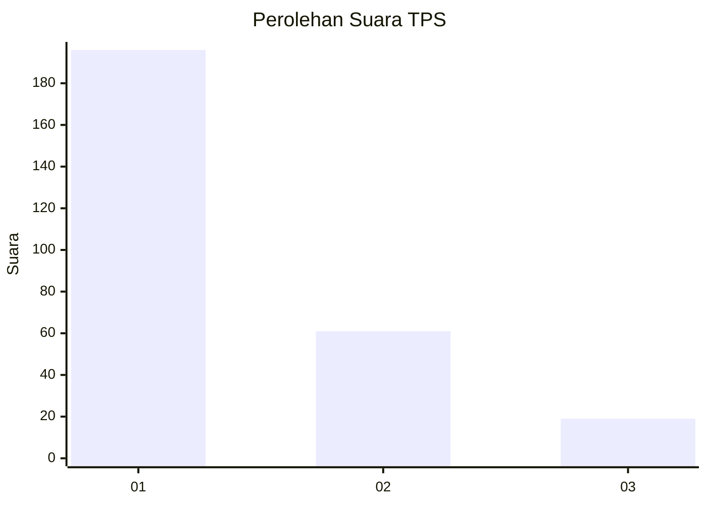
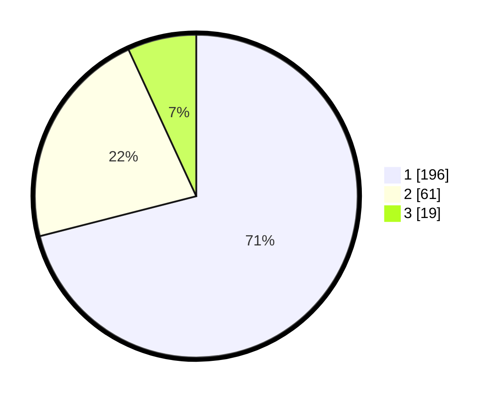

# Hasil

## Grafik

## Tabel

| No. | Nama Paslon    | Suara | Suara (raw) | Persentase |
|:--- |:-------------- | -----:| -----------:| ----------:|
| 1   | ANIES MUHAIMIN | 196   | [196][p-1]  | 71,01      |
| 2   | PRABOWO GIBRAN | 61    | [61][p-2]   | 22,10      |
| 3   | GANJAR MAHFUD  | 19    | [19][p-3]   | 6,88       |

[p-1]: https://github.com/gigit-pemilu/pemilu-2024-99-luar-negeri/blob/main/pilpres/hitung-suara/sub/99-luar-negeri/sub/53-jeddah-arab-saudi/sub/01-jeddah-arab-saudi/sub/0001-jeddah-arab-saudi/sub/024-ksk-012/sub/paslon-1.txt
[p-2]: https://github.com/gigit-pemilu/pemilu-2024-99-luar-negeri/blob/main/pilpres/hitung-suara/sub/99-luar-negeri/sub/53-jeddah-arab-saudi/sub/01-jeddah-arab-saudi/sub/0001-jeddah-arab-saudi/sub/024-ksk-012/sub/paslon-2.txt
[p-3]: https://github.com/gigit-pemilu/pemilu-2024-99-luar-negeri/blob/main/pilpres/hitung-suara/sub/99-luar-negeri/sub/53-jeddah-arab-saudi/sub/01-jeddah-arab-saudi/sub/0001-jeddah-arab-saudi/sub/024-ksk-012/sub/paslon-3.txt

## Foto C Plano

https://sirekap-obj-formc.kpu.go.id/4a6a/pemilu/ppwp/99/53/01/00/01/9953010001024-20240216-010929--fa3b9112-977a-437d-875d-2948272d7616.jpg

https://sirekap-obj-formc.kpu.go.id/4a6a/pemilu/ppwp/99/53/01/00/01/9953010001024-20240216-010942--d10b355f-1b05-402f-a4dd-f4a4a96e9e60.jpg

https://sirekap-obj-formc.kpu.go.id/4a6a/pemilu/ppwp/99/53/01/00/01/9953010001024-20240216-010939--0a712d28-e672-44c9-9a1f-c27aab1741c7.jpg

## Metadata

| Key        | Value               |
| ---------- | ------------------- |
| Time Stamp | 2024-02-16 01:30:27 |

## DATA PEMILIH TETAP

Jumlah pemilih dalam DPT: **1695**.
 * L: **203**.
 * P: **1492**.

## DATA PENGGUNA HAK PILIH

Jumlah pengguna hak pilih dalam DPT: **74**.
 * L: **42**.
 * P: **32**.

Jumlah pengguna hak pilih dalam DPTb: **86**.
 * L: **72**.
 * P: **14**.

Jumlah pengguna hak pilih dalam DPK: **116**.
 * L: **75**.
 * P: **41**.

Jumlah pengguna hak pilih: **276**.
 * L: **189**.
 * P: **87**.

## JUMLAH SUARA SAH DAN TIDAK SAH

JUMLAH SELURUH SUARA SAH: **276**.

JUMLAH SUARA TIDAK SAH: **0**.

JUMLAH SELURUH SUARA SAH DAN SUARA TIDAK SAH: **276**.

