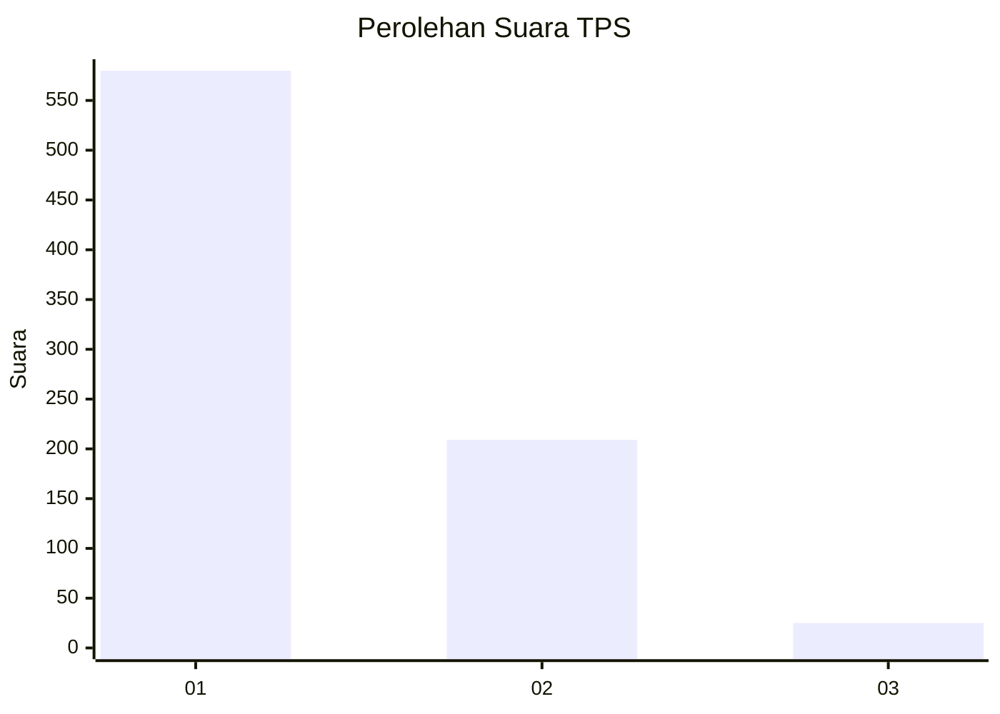
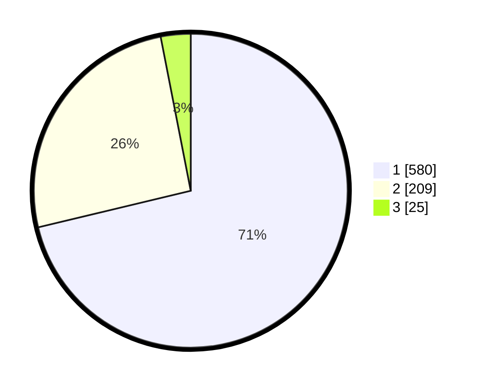

# Hasil

## Grafik

## Tabel

| No. | Nama Paslon    | Suara | Suara (raw) | Persentase |
|:--- |:-------------- | -----:| -----------:| ----------:|
| 1   | ANIES MUHAIMIN | 580   | [580][p-1]  | 71,25      |
| 2   | PRABOWO GIBRAN | 209   | [209][p-2]  | 25,68      |
| 3   | GANJAR MAHFUD  | 25    | [25][p-3]   | 3,07       |

[p-1]: https://github.com/gigit-pemilu/pemilu-2024-99-luar-negeri/blob/main/pilpres/hitung-suara/sub/99-luar-negeri/sub/53-jeddah-arab-saudi/sub/01-jeddah-arab-saudi/sub/0001-jeddah-arab-saudi/sub/025-ksk-013/sub/paslon-1.txt
[p-2]: https://github.com/gigit-pemilu/pemilu-2024-99-luar-negeri/blob/main/pilpres/hitung-suara/sub/99-luar-negeri/sub/53-jeddah-arab-saudi/sub/01-jeddah-arab-saudi/sub/0001-jeddah-arab-saudi/sub/025-ksk-013/sub/paslon-2.txt
[p-3]: https://github.com/gigit-pemilu/pemilu-2024-99-luar-negeri/blob/main/pilpres/hitung-suara/sub/99-luar-negeri/sub/53-jeddah-arab-saudi/sub/01-jeddah-arab-saudi/sub/0001-jeddah-arab-saudi/sub/025-ksk-013/sub/paslon-3.txt

## Foto C Plano

https://sirekap-obj-formc.kpu.go.id/3e6a/pemilu/ppwp/99/53/01/00/01/9953010001025-20240216-021524--50a68e98-d2e2-45f8-a196-fabe9444adbe.jpg

https://sirekap-obj-formc.kpu.go.id/3e6a/pemilu/ppwp/99/53/01/00/01/9953010001025-20240216-021538--63d37bd8-3f56-4b3b-84ac-3a0f70e51d4f.jpg

https://sirekap-obj-formc.kpu.go.id/3e6a/pemilu/ppwp/99/53/01/00/01/9953010001025-20240216-021530--dfea960b-8745-4741-a005-ed1acb66c670.jpg

## Metadata

| Key        | Value               |
| ---------- | ------------------- |
| Time Stamp | 2024-02-21 14:00:00 |

## DATA PEMILIH TETAP

Jumlah pemilih dalam DPT: **899**.
 * L: **0**.
 * P: **0**.

## DATA PENGGUNA HAK PILIH

Jumlah pengguna hak pilih dalam DPT: **10**.
 * L: **7**.
 * P: **3**.

Jumlah pengguna hak pilih dalam DPTb: **169**.
 * L: **71**.
 * P: **98**.

Jumlah pengguna hak pilih dalam DPK: **635**.
 * L: **319**.
 * P: **316**.

Jumlah pengguna hak pilih: **814**.
 * L: **397**.
 * P: **417**.

## JUMLAH SUARA SAH DAN TIDAK SAH

JUMLAH SELURUH SUARA SAH: **814**.

JUMLAH SUARA TIDAK SAH: **2**.

JUMLAH SELURUH SUARA SAH DAN SUARA TIDAK SAH: **816**.

