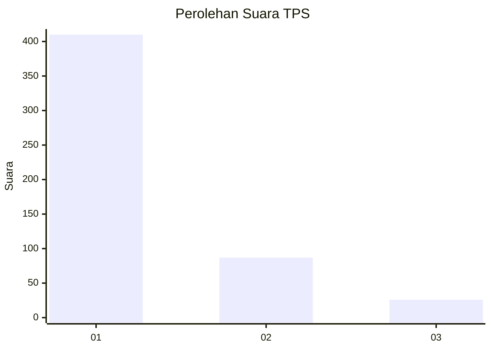
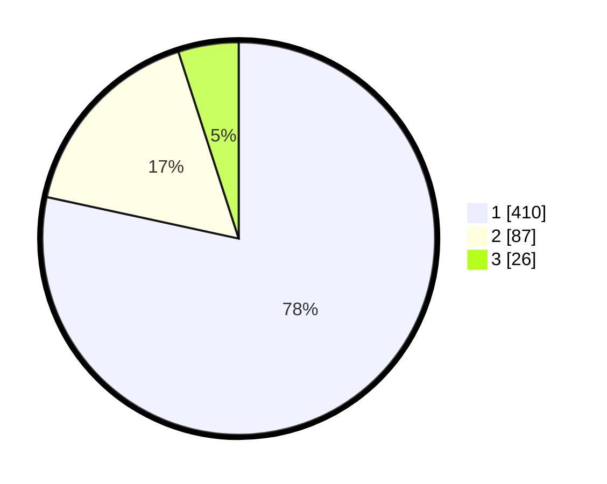

# Hasil

## Grafik

## Tabel

| No. | Nama Paslon    | Suara | Suara (raw) | Persentase |
|:--- |:-------------- | -----:| -----------:| ----------:|
| 1   | ANIES MUHAIMIN | 410   | [410][p-1]  | 78,39      |
| 2   | PRABOWO GIBRAN | 87    | [87][p-2]   | 16,63      |
| 3   | GANJAR MAHFUD  | 26    | [26][p-3]   | 4,97       |

[p-1]: https://github.com/gigit-pemilu/pemilu-2024-99-luar-negeri/blob/main/pilpres/hitung-suara/sub/99-luar-negeri/sub/53-jeddah-arab-saudi/sub/01-jeddah-arab-saudi/sub/0001-jeddah-arab-saudi/sub/026-ksk-014/sub/paslon-1.txt
[p-2]: https://github.com/gigit-pemilu/pemilu-2024-99-luar-negeri/blob/main/pilpres/hitung-suara/sub/99-luar-negeri/sub/53-jeddah-arab-saudi/sub/01-jeddah-arab-saudi/sub/0001-jeddah-arab-saudi/sub/026-ksk-014/sub/paslon-2.txt
[p-3]: https://github.com/gigit-pemilu/pemilu-2024-99-luar-negeri/blob/main/pilpres/hitung-suara/sub/99-luar-negeri/sub/53-jeddah-arab-saudi/sub/01-jeddah-arab-saudi/sub/0001-jeddah-arab-saudi/sub/026-ksk-014/sub/paslon-3.txt

## Foto C Plano

https://sirekap-obj-formc.kpu.go.id/0b70/pemilu/ppwp/99/53/01/00/01/9953010001026-20240216-134626--d701c9bc-176e-457b-89d4-e4b81c7c78bd.jpg

https://sirekap-obj-formc.kpu.go.id/0b70/pemilu/ppwp/99/53/01/00/01/9953010001026-20240216-134628--723631d1-80f3-4c22-8ce0-51abd3bbb6a4.jpg

https://sirekap-obj-formc.kpu.go.id/0b70/pemilu/ppwp/99/53/01/00/01/9953010001026-20240216-134627--575054c0-7aeb-478e-84ab-3819a291a266.jpg

## Metadata

| Key        | Value               |
| ---------- | ------------------- |
| Time Stamp | 2024-02-19 06:16:00 |

## DATA PEMILIH TETAP

Jumlah pemilih dalam DPT: **900**.
 * L: **491**.
 * P: **409**.

## DATA PENGGUNA HAK PILIH

Jumlah pengguna hak pilih dalam DPT: **30**.
 * L: **27**.
 * P: **3**.

Jumlah pengguna hak pilih dalam DPTb: **117**.
 * L: **104**.
 * P: **13**.

Jumlah pengguna hak pilih dalam DPK: **379**.
 * L: **303**.
 * P: **76**.

Jumlah pengguna hak pilih: **526**.
 * L: **434**.
 * P: **92**.

## JUMLAH SUARA SAH DAN TIDAK SAH

JUMLAH SELURUH SUARA SAH: **523**.

JUMLAH SUARA TIDAK SAH: **3**.

JUMLAH SELURUH SUARA SAH DAN SUARA TIDAK SAH: **526**.

