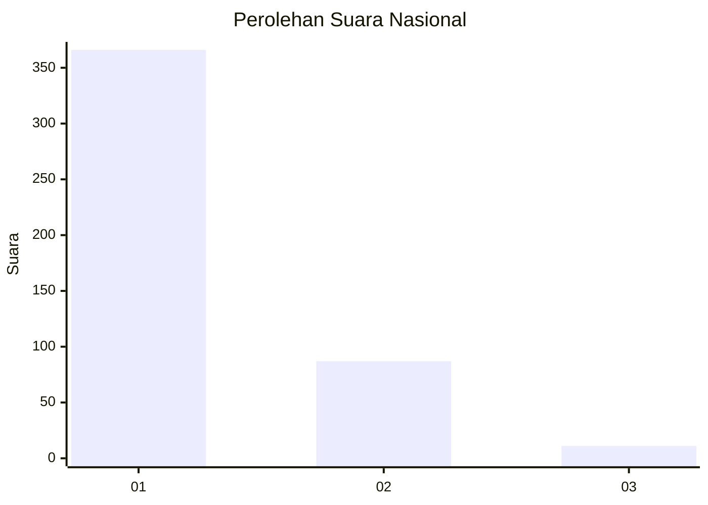
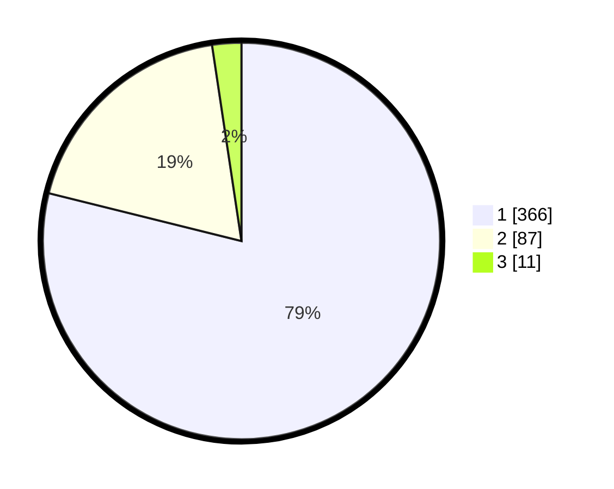

# Hasil

## Grafik

## Tabel

| No. | Nama Paslon    | Suara | Suara (raw) | Persentase |
|:--- |:-------------- | -----:| -----------:| ----------:|
| 1   | ANIES MUHAIMIN | 366   | [366][p-1]  | 78,88      |
| 2   | PRABOWO GIBRAN | 87    | [87][p-2]   | 18,75      |
| 3   | GANJAR MAHFUD  | 11    | [11][p-3]   | 2,37       |

[p-1]: https://github.com/gigit-pemilu/pemilu-2024/blob/main/pilpres/hitung-suara/sub/99-luar-negeri/sub/53-jeddah-arab-saudi/sub/01-jeddah-arab-saudi/sub/0001-jeddah-arab-saudi/sub/027-ksk-015/sub/paslon-1.txt
[p-2]: https://github.com/gigit-pemilu/pemilu-2024/blob/main/pilpres/hitung-suara/sub/99-luar-negeri/sub/53-jeddah-arab-saudi/sub/01-jeddah-arab-saudi/sub/0001-jeddah-arab-saudi/sub/027-ksk-015/sub/paslon-2.txt
[p-3]: https://github.com/gigit-pemilu/pemilu-2024/blob/main/pilpres/hitung-suara/sub/99-luar-negeri/sub/53-jeddah-arab-saudi/sub/01-jeddah-arab-saudi/sub/0001-jeddah-arab-saudi/sub/027-ksk-015/sub/paslon-3.txt

## Foto C Plano

https://sirekap-obj-formc.kpu.go.id/014d/pemilu/ppwp/99/53/01/00/01/9953010001027-20240216-073448--d433281e-855f-4e42-a719-5b448a1550c3.jpg

https://sirekap-obj-formc.kpu.go.id/014d/pemilu/ppwp/99/53/01/00/01/9953010001027-20240216-073449--4921a7d2-d245-49eb-bd0f-493921cce9b0.jpg

https://sirekap-obj-formc.kpu.go.id/014d/pemilu/ppwp/99/53/01/00/01/9953010001027-20240216-073448--79130464-78d0-4070-a096-8fa6359186bb.jpg

## Metadata

| Key        | Value               |
| ---------- | ------------------- |
| Time Stamp | 2024-02-19 06:16:00 |

## DATA PEMILIH TETAP

Jumlah pemilih dalam DPT: **899**.
 * L: **359**.
 * P: **540**.

## DATA PENGGUNA HAK PILIH

Jumlah pengguna hak pilih dalam DPT: **75**.
 * L: **54**.
 * P: **21**.

Jumlah pengguna hak pilih dalam DPTb: **59**.
 * L: **58**.
 * P: **1**.

Jumlah pengguna hak pilih dalam DPK: **334**.
 * L: **269**.
 * P: **65**.

Jumlah pengguna hak pilih: **468**.
 * L: **381**.
 * P: **87**.

## JUMLAH SUARA SAH DAN TIDAK SAH

JUMLAH SELURUH SUARA SAH: **464**.

JUMLAH SUARA TIDAK SAH: **4**.

JUMLAH SELURUH SUARA SAH DAN SUARA TIDAK SAH: **468**.

