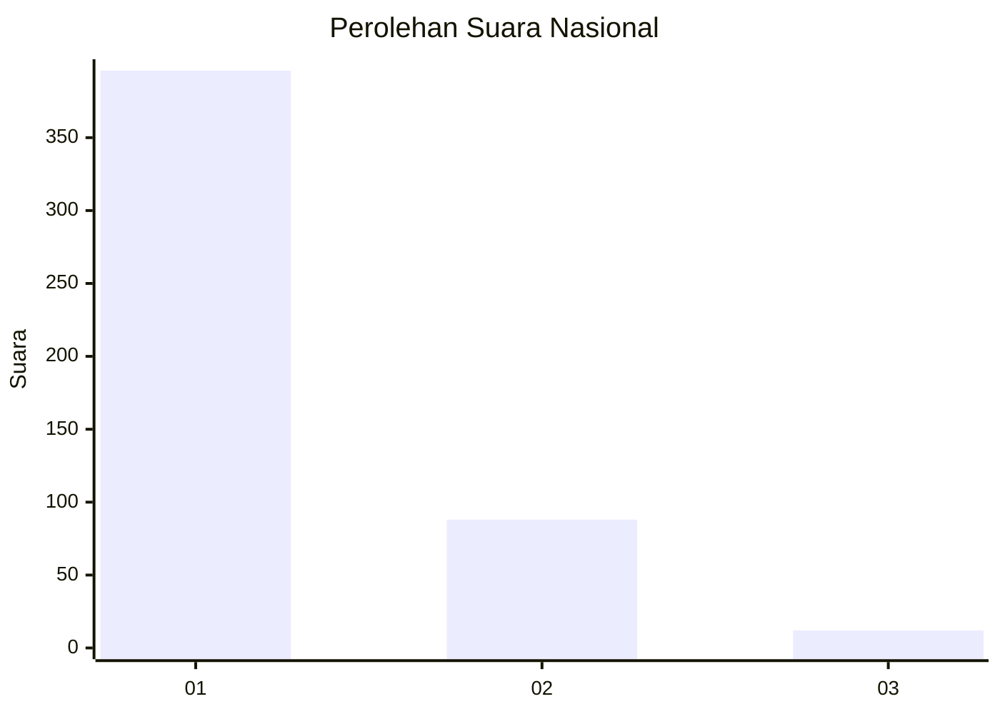
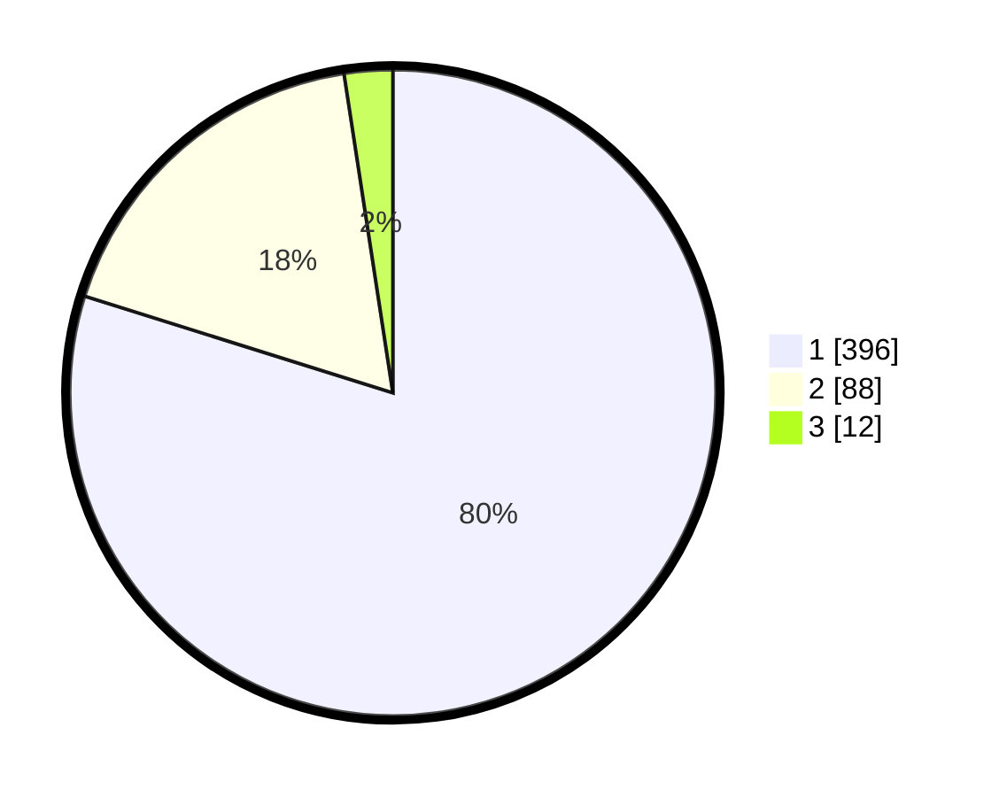

# Hasil

## Grafik

## Tabel

| No. | Nama Paslon    | Suara | Suara (raw) | Persentase |
|:--- |:-------------- | -----:| -----------:| ----------:|
| 1   | ANIES MUHAIMIN | 396   | [396][p-1]  | 79,84      |
| 2   | PRABOWO GIBRAN | 88    | [88][p-2]   | 17,74      |
| 3   | GANJAR MAHFUD  | 12    | [12][p-3]   | 2,42       |

[p-1]: https://github.com/gigit-pemilu/pemilu-2024/blob/main/pilpres/hitung-suara/sub/99-luar-negeri/sub/53-jeddah-arab-saudi/sub/01-jeddah-arab-saudi/sub/0001-jeddah-arab-saudi/sub/028-ksk-016/sub/paslon-1.txt
[p-2]: https://github.com/gigit-pemilu/pemilu-2024/blob/main/pilpres/hitung-suara/sub/99-luar-negeri/sub/53-jeddah-arab-saudi/sub/01-jeddah-arab-saudi/sub/0001-jeddah-arab-saudi/sub/028-ksk-016/sub/paslon-2.txt
[p-3]: https://github.com/gigit-pemilu/pemilu-2024/blob/main/pilpres/hitung-suara/sub/99-luar-negeri/sub/53-jeddah-arab-saudi/sub/01-jeddah-arab-saudi/sub/0001-jeddah-arab-saudi/sub/028-ksk-016/sub/paslon-3.txt

## Foto C Plano

https://sirekap-obj-formc.kpu.go.id/90b6/pemilu/ppwp/99/53/01/00/01/9953010001028-20240216-041101--d74aae25-5c83-4639-b139-fb7e3265f54f.jpg

https://sirekap-obj-formc.kpu.go.id/90b6/pemilu/ppwp/99/53/01/00/01/9953010001028-20240216-041103--85f8e674-e0b5-4518-8ded-99a39cf37938.jpg

https://sirekap-obj-formc.kpu.go.id/90b6/pemilu/ppwp/99/53/01/00/01/9953010001028-20240216-041102--f04eb596-7c73-4033-9f89-c279766a6fe1.jpg

## Metadata

| Key        | Value               |
| ---------- | ------------------- |
| Time Stamp | 2024-02-19 06:16:00 |

## DATA PEMILIH TETAP

Jumlah pemilih dalam DPT: **918**.
 * L: **326**.
 * P: **592**.

## DATA PENGGUNA HAK PILIH

Jumlah pengguna hak pilih dalam DPT: **78**.
 * L: **64**.
 * P: **14**.

Jumlah pengguna hak pilih dalam DPTb: **126**.
 * L: **111**.
 * P: **15**.

Jumlah pengguna hak pilih dalam DPK: **295**.
 * L: **228**.
 * P: **67**.

Jumlah pengguna hak pilih: **499**.
 * L: **403**.
 * P: **96**.

## JUMLAH SUARA SAH DAN TIDAK SAH

JUMLAH SELURUH SUARA SAH: **496**.

JUMLAH SUARA TIDAK SAH: **3**.

JUMLAH SELURUH SUARA SAH DAN SUARA TIDAK SAH: **499**.

