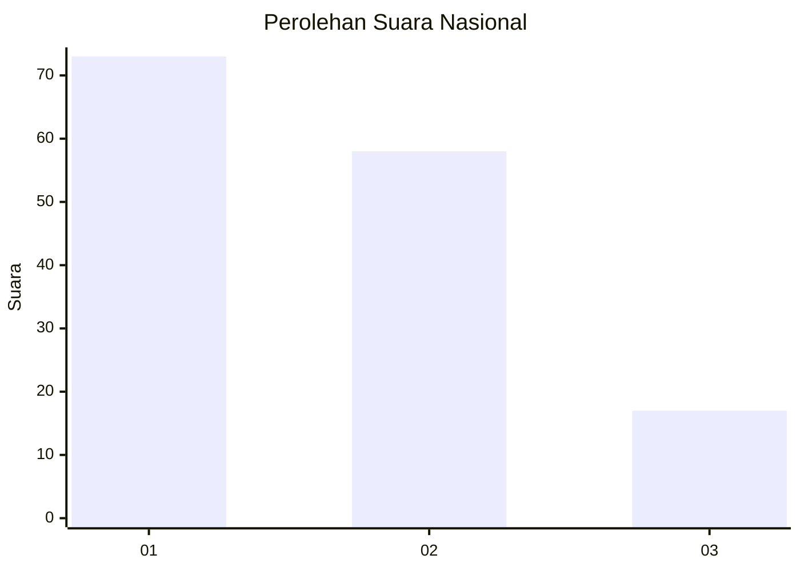
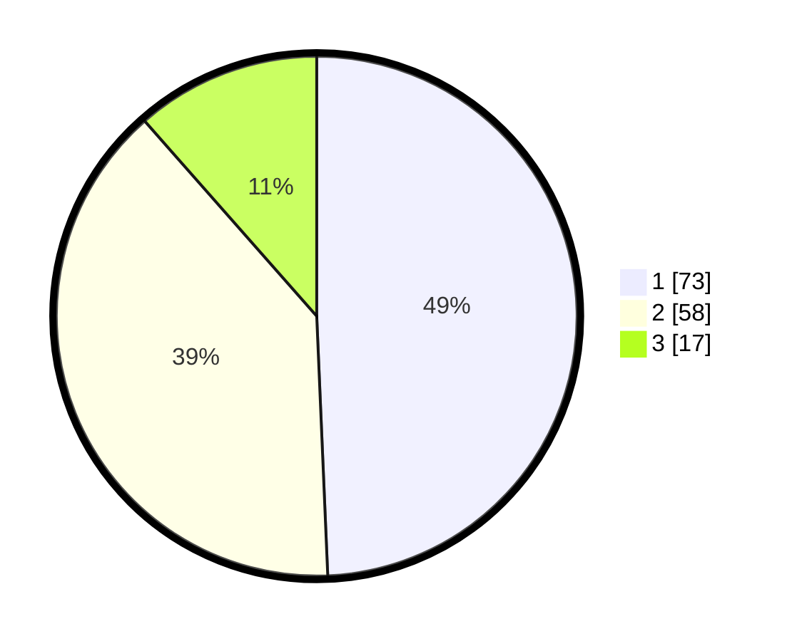

# Hasil

## Grafik

## Tabel

| No. | Nama Paslon    | Suara | Suara (raw) | Persentase |
|:--- |:-------------- | -----:| -----------:| ----------:|
| 1   | ANIES MUHAIMIN | 73    | [73][p-1]   | 49,32      |
| 2   | PRABOWO GIBRAN | 58    | [58][p-2]   | 39,19      |
| 3   | GANJAR MAHFUD  | 17    | [17][p-3]   | 11,49      |

[p-1]: https://github.com/gigit-pemilu/pemilu-2024/blob/main/pilpres/hitung-suara/sub/99-luar-negeri/sub/53-jeddah-arab-saudi/sub/01-jeddah-arab-saudi/sub/0001-jeddah-arab-saudi/sub/036-ksk-024/sub/paslon-1.txt
[p-2]: https://github.com/gigit-pemilu/pemilu-2024/blob/main/pilpres/hitung-suara/sub/99-luar-negeri/sub/53-jeddah-arab-saudi/sub/01-jeddah-arab-saudi/sub/0001-jeddah-arab-saudi/sub/036-ksk-024/sub/paslon-2.txt
[p-3]: https://github.com/gigit-pemilu/pemilu-2024/blob/main/pilpres/hitung-suara/sub/99-luar-negeri/sub/53-jeddah-arab-saudi/sub/01-jeddah-arab-saudi/sub/0001-jeddah-arab-saudi/sub/036-ksk-024/sub/paslon-3.txt

## Foto C Plano

https://sirekap-obj-formc.kpu.go.id/1acc/pemilu/ppwp/99/53/01/00/01/9953010001036-20240214-204423--c0145815-ff96-4d29-8efc-f48d84ee5dbe.jpg

https://sirekap-obj-formc.kpu.go.id/1acc/pemilu/ppwp/99/53/01/00/01/9953010001036-20240214-204552--b549f5bc-9122-42b5-a5d6-59c7e1f6755c.jpg

https://sirekap-obj-formc.kpu.go.id/1acc/pemilu/ppwp/99/53/01/00/01/9953010001036-20240214-204710--4ddc7cd9-22a1-424f-ae07-e6a14c5b67b4.jpg

## Metadata

| Key        | Value               |
| ---------- | ------------------- |
| Time Stamp | 2024-02-15 02:10:27 |

## DATA PEMILIH TETAP

Jumlah pemilih dalam DPT: **442**.
 * L: **128**.
 * P: **314**.

## DATA PENGGUNA HAK PILIH

Jumlah pengguna hak pilih dalam DPT: **11**.
 * L: **8**.
 * P: **3**.

Jumlah pengguna hak pilih dalam DPTb: **55**.
 * L: **37**.
 * P: **18**.

Jumlah pengguna hak pilih dalam DPK: **84**.
 * L: **58**.
 * P: **26**.

Jumlah pengguna hak pilih: **150**.
 * L: **103**.
 * P: **47**.

## JUMLAH SUARA SAH DAN TIDAK SAH

JUMLAH SELURUH SUARA SAH: **148**.

JUMLAH SUARA TIDAK SAH: **2**.

JUMLAH SELURUH SUARA SAH DAN SUARA TIDAK SAH: **150**.

