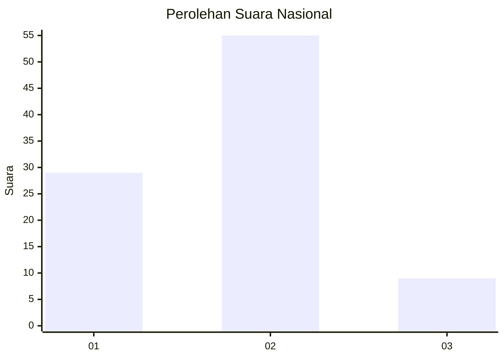
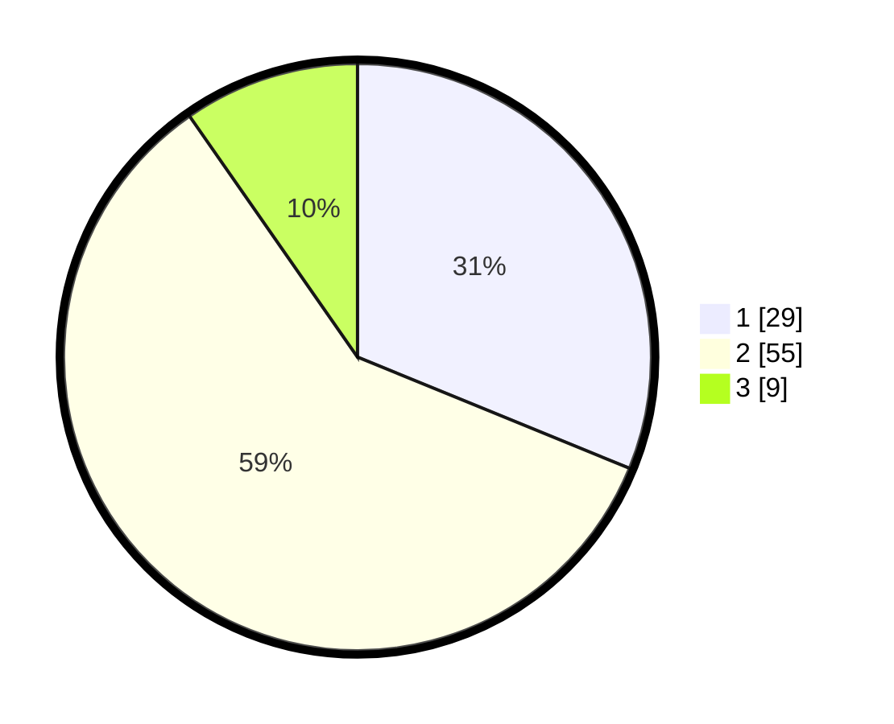

# Hasil

## Grafik

## Tabel

| No. | Nama Paslon    | Suara | Suara (raw) | Persentase |
|:--- |:-------------- | -----:| -----------:| ----------:|
| 1   | ANIES MUHAIMIN | 29    | [29][p-1]   | 31,18      |
| 2   | PRABOWO GIBRAN | 55    | [55][p-2]   | 59,14      |
| 3   | GANJAR MAHFUD  | 9     | [9][p-3]    | 9,68       |

[p-1]: https://github.com/gigit-pemilu/pemilu-2024/blob/main/pilpres/hitung-suara/sub/99-luar-negeri/sub/54-johor-bahru-malaysia/sub/01-johor-bahru-malaysia/sub/0001-johor-bahru-malaysia/sub/003-tps/sub/paslon-1.txt
[p-2]: https://github.com/gigit-pemilu/pemilu-2024/blob/main/pilpres/hitung-suara/sub/99-luar-negeri/sub/54-johor-bahru-malaysia/sub/01-johor-bahru-malaysia/sub/0001-johor-bahru-malaysia/sub/003-tps/sub/paslon-2.txt
[p-3]: https://github.com/gigit-pemilu/pemilu-2024/blob/main/pilpres/hitung-suara/sub/99-luar-negeri/sub/54-johor-bahru-malaysia/sub/01-johor-bahru-malaysia/sub/0001-johor-bahru-malaysia/sub/003-tps/sub/paslon-3.txt

## Foto C Plano

https://sirekap-obj-formc.kpu.go.id/e83e/pemilu/ppwp/99/54/01/00/01/9954010001003-20240218-203750--4256d208-9e94-42c3-add9-cbd7b9753483.jpg

https://sirekap-obj-formc.kpu.go.id/e83e/pemilu/ppwp/99/54/01/00/01/9954010001003-20240218-204015--c6918dff-b807-4e06-b73a-d3f103daf35f.jpg

https://sirekap-obj-formc.kpu.go.id/e83e/pemilu/ppwp/99/54/01/00/01/9954010001003-20240218-204242--dccee673-bf4f-4217-97ad-a1bc540e1394.jpg

## Metadata

| Key        | Value               |
| ---------- | ------------------- |
| Time Stamp | 2024-02-19 06:16:00 |

## DATA PEMILIH TETAP

Jumlah pemilih dalam DPT: **282**.
 * L: **187**.
 * P: **95**.

## DATA PENGGUNA HAK PILIH

Jumlah pengguna hak pilih dalam DPT: **19**.
 * L: **11**.
 * P: **8**.

Jumlah pengguna hak pilih dalam DPTb: **71**.
 * L: **33**.
 * P: **38**.

Jumlah pengguna hak pilih dalam DPK: **4**.
 * L: **1**.
 * P: **3**.

Jumlah pengguna hak pilih: **94**.
 * L: **45**.
 * P: **49**.

## JUMLAH SUARA SAH DAN TIDAK SAH

JUMLAH SELURUH SUARA SAH: **93**.

JUMLAH SUARA TIDAK SAH: **1**.

JUMLAH SELURUH SUARA SAH DAN SUARA TIDAK SAH: **94**.

