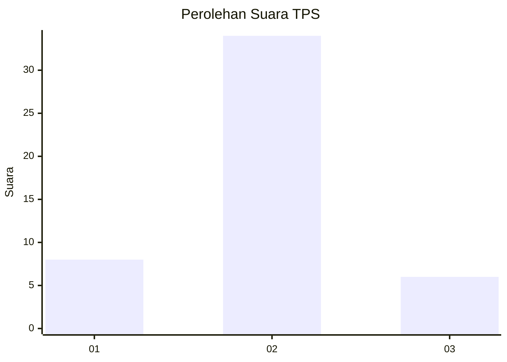
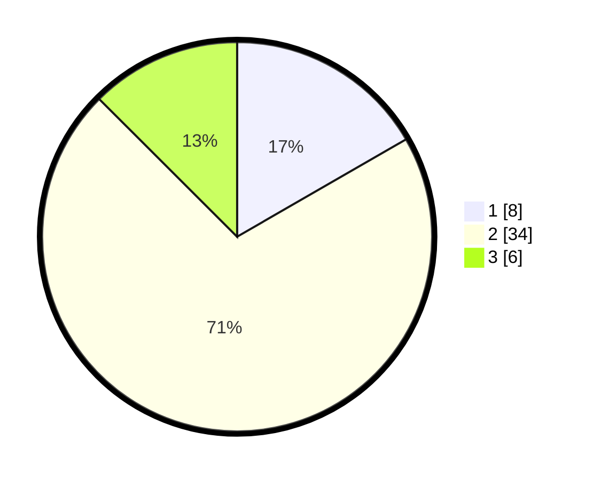

# Hasil

## Grafik

## Tabel

| No. | Nama Paslon    | Suara | Suara (raw) | Persentase |
|:--- |:-------------- | -----:| -----------:| ----------:|
| 1   | ANIES MUHAIMIN | 8     | [8][p-1]    | 16,67      |
| 2   | PRABOWO GIBRAN | 34    | [34][p-2]   | 70,83      |
| 3   | GANJAR MAHFUD  | 6     | [6][p-3]    | 12,50      |

[p-1]: https://github.com/gigit-pemilu/pemilu-2024-99-luar-negeri/blob/main/pilpres/hitung-suara/sub/99-luar-negeri/sub/54-johor-bahru-malaysia/sub/01-johor-bahru-malaysia/sub/0001-johor-bahru-malaysia/sub/006-tps/sub/paslon-1.txt
[p-2]: https://github.com/gigit-pemilu/pemilu-2024-99-luar-negeri/blob/main/pilpres/hitung-suara/sub/99-luar-negeri/sub/54-johor-bahru-malaysia/sub/01-johor-bahru-malaysia/sub/0001-johor-bahru-malaysia/sub/006-tps/sub/paslon-2.txt
[p-3]: https://github.com/gigit-pemilu/pemilu-2024-99-luar-negeri/blob/main/pilpres/hitung-suara/sub/99-luar-negeri/sub/54-johor-bahru-malaysia/sub/01-johor-bahru-malaysia/sub/0001-johor-bahru-malaysia/sub/006-tps/sub/paslon-3.txt

## Foto C Plano

https://sirekap-obj-formc.kpu.go.id/29a2/pemilu/ppwp/99/54/01/00/01/9954010001006-20240214-190407--7ffd10be-bb6c-4a86-82a2-445bc3044b05.jpg

https://sirekap-obj-formc.kpu.go.id/29a2/pemilu/ppwp/99/54/01/00/01/9954010001006-20240214-192639--428cf96c-8097-4c6a-8aed-b3c7f1855bf3.jpg

https://sirekap-obj-formc.kpu.go.id/29a2/pemilu/ppwp/99/54/01/00/01/9954010001006-20240214-191149--6c1cdbf2-f158-4d41-8090-55ef040686cb.jpg

## Metadata

| Key        | Value               |
| ---------- | ------------------- |
| Time Stamp | 2024-02-25 11:00:00 |

## DATA PEMILIH TETAP

Jumlah pemilih dalam DPT: **200**.
 * L: **112**.
 * P: **88**.

## DATA PENGGUNA HAK PILIH

Jumlah pengguna hak pilih dalam DPT: **9**.
 * L: **0**.
 * P: **9**.

Jumlah pengguna hak pilih dalam DPTb: **35**.
 * L: **21**.
 * P: **14**.

Jumlah pengguna hak pilih dalam DPK: **4**.
 * L: **3**.
 * P: **1**.

Jumlah pengguna hak pilih: **48**.
 * L: **24**.
 * P: **24**.

## JUMLAH SUARA SAH DAN TIDAK SAH

JUMLAH SELURUH SUARA SAH: **48**.

JUMLAH SUARA TIDAK SAH: **0**.

JUMLAH SELURUH SUARA SAH DAN SUARA TIDAK SAH: **48**.

