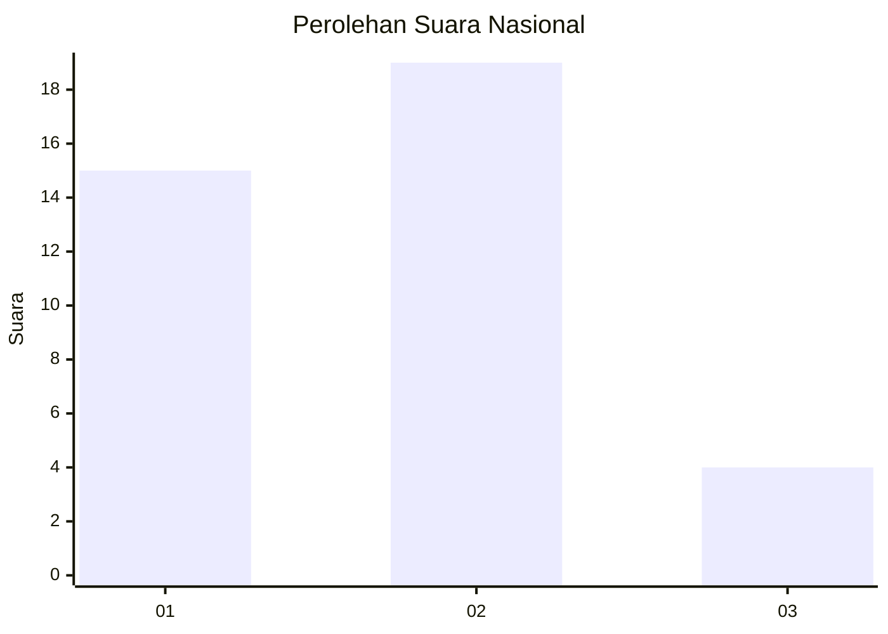
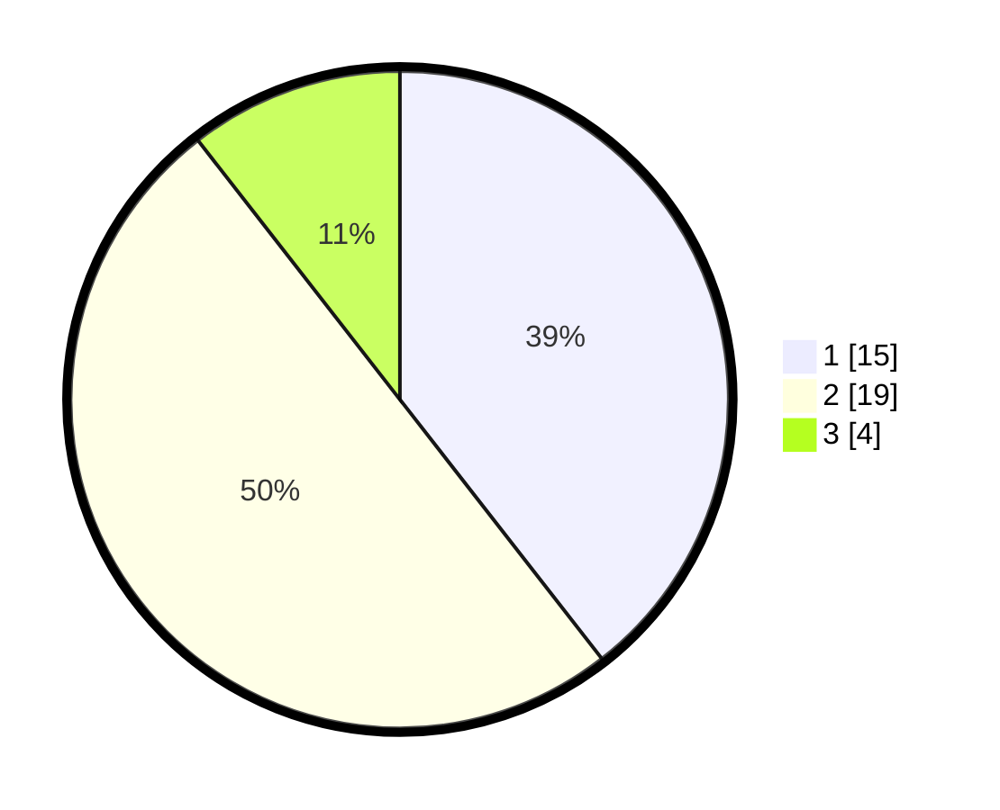

# Hasil

## Grafik

## Tabel

| No. | Nama Paslon    | Suara | Suara (raw) | Persentase |
|:--- |:-------------- | -----:| -----------:| ----------:|
| 1   | ANIES MUHAIMIN | 15    | [15][p-1]   | 39,47      |
| 2   | PRABOWO GIBRAN | 19    | [19][p-2]   | 50,00      |
| 3   | GANJAR MAHFUD  | 4     | [4][p-3]    | 10,53      |

[p-1]: https://github.com/gigit-pemilu/pemilu-2024/blob/main/pilpres/hitung-suara/sub/99-luar-negeri/sub/54-johor-bahru-malaysia/sub/01-johor-bahru-malaysia/sub/0001-johor-bahru-malaysia/sub/008-tps/sub/paslon-1.txt
[p-2]: https://github.com/gigit-pemilu/pemilu-2024/blob/main/pilpres/hitung-suara/sub/99-luar-negeri/sub/54-johor-bahru-malaysia/sub/01-johor-bahru-malaysia/sub/0001-johor-bahru-malaysia/sub/008-tps/sub/paslon-2.txt
[p-3]: https://github.com/gigit-pemilu/pemilu-2024/blob/main/pilpres/hitung-suara/sub/99-luar-negeri/sub/54-johor-bahru-malaysia/sub/01-johor-bahru-malaysia/sub/0001-johor-bahru-malaysia/sub/008-tps/sub/paslon-3.txt

## Foto C Plano

https://sirekap-obj-formc.kpu.go.id/e41e/pemilu/ppwp/99/54/01/00/01/9954010001008-20240214-143416--4fcca539-ceac-4afc-9fe9-0a6f8ff98593.jpg

https://sirekap-obj-formc.kpu.go.id/e41e/pemilu/ppwp/99/54/01/00/01/9954010001008-20240214-143512--b41e9059-866c-4fcb-8be9-1f92cd6b2697.jpg

https://sirekap-obj-formc.kpu.go.id/e41e/pemilu/ppwp/99/54/01/00/01/9954010001008-20240214-143648--480774fa-06a5-4968-a072-4c17fc0033a2.jpg

## Metadata

| Key        | Value               |
| ---------- | ------------------- |
| Time Stamp | 2024-02-15 17:30:25 |

## DATA PEMILIH TETAP

Jumlah pemilih dalam DPT: **251**.
 * L: **56**.
 * P: **195**.

## DATA PENGGUNA HAK PILIH

Jumlah pengguna hak pilih dalam DPT: **18**.
 * L: **2**.
 * P: **16**.

Jumlah pengguna hak pilih dalam DPTb: **16**.
 * L: **8**.
 * P: **8**.

Jumlah pengguna hak pilih dalam DPK: **4**.
 * L: **1**.
 * P: **3**.

Jumlah pengguna hak pilih: **38**.
 * L: **11**.
 * P: **27**.

## JUMLAH SUARA SAH DAN TIDAK SAH

JUMLAH SELURUH SUARA SAH: **38**.

JUMLAH SUARA TIDAK SAH: **0**.

JUMLAH SELURUH SUARA SAH DAN SUARA TIDAK SAH: **38**.

