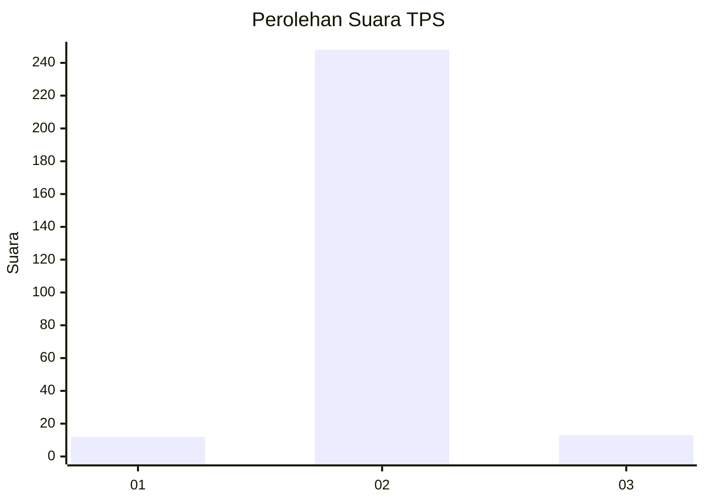
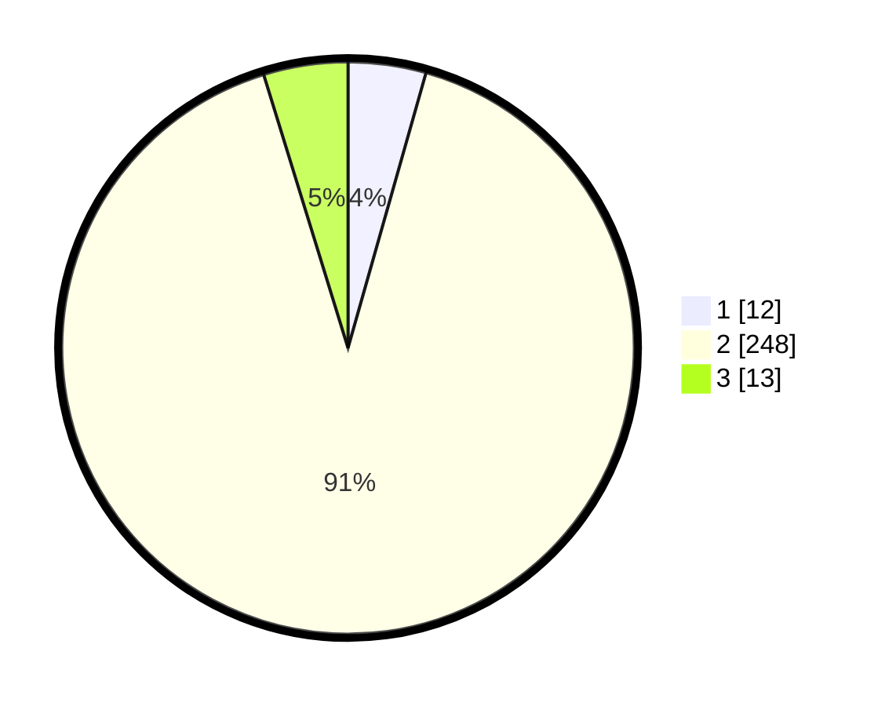

# Hasil

## Grafik

## Tabel

| No. | Nama Paslon    | Suara | Suara (raw) | Persentase |
|:--- |:-------------- | -----:| -----------:| ----------:|
| 1   | ANIES MUHAIMIN | 12    | [12][p-1]   | 4,40       |
| 2   | PRABOWO GIBRAN | 248   | [248][p-2]  | 90,84      |
| 3   | GANJAR MAHFUD  | 13    | [13][p-3]   | 4,76       |

[p-1]: https://github.com/gigit-pemilu/pemilu-2024-99-luar-negeri/blob/main/pilpres/hitung-suara/sub/99-luar-negeri/sub/54-johor-bahru-malaysia/sub/01-johor-bahru-malaysia/sub/0001-johor-bahru-malaysia/sub/011-ksk-001/sub/paslon-1.txt
[p-2]: https://github.com/gigit-pemilu/pemilu-2024-99-luar-negeri/blob/main/pilpres/hitung-suara/sub/99-luar-negeri/sub/54-johor-bahru-malaysia/sub/01-johor-bahru-malaysia/sub/0001-johor-bahru-malaysia/sub/011-ksk-001/sub/paslon-2.txt
[p-3]: https://github.com/gigit-pemilu/pemilu-2024-99-luar-negeri/blob/main/pilpres/hitung-suara/sub/99-luar-negeri/sub/54-johor-bahru-malaysia/sub/01-johor-bahru-malaysia/sub/0001-johor-bahru-malaysia/sub/011-ksk-001/sub/paslon-3.txt

## Foto C Plano

https://sirekap-obj-formc.kpu.go.id/c7ed/pemilu/ppwp/99/54/01/00/01/9954010001011-20240217-235817--ce8ebd5e-2946-40da-924e-87b233b3d3db.jpg

https://sirekap-obj-formc.kpu.go.id/c7ed/pemilu/ppwp/99/54/01/00/01/9954010001011-20240218-000206--ac33420a-5a79-43c6-95b4-17229cdb8907.jpg

https://sirekap-obj-formc.kpu.go.id/c7ed/pemilu/ppwp/99/54/01/00/01/9954010001011-20240218-000359--4130fdd8-6141-458c-9f73-f4868e0fc9af.jpg

## Metadata

| Key        | Value               |
| ---------- | ------------------- |
| Time Stamp | 2024-02-19 06:16:00 |

## DATA PEMILIH TETAP

Jumlah pemilih dalam DPT: **279**.
 * L: **0**.
 * P: **279**.

## DATA PENGGUNA HAK PILIH

Jumlah pengguna hak pilih dalam DPT: **205**.
 * L: **0**.
 * P: **205**.

Jumlah pengguna hak pilih dalam DPTb: **46**.
 * L: **6**.
 * P: **40**.

Jumlah pengguna hak pilih dalam DPK: **29**.
 * L: **4**.
 * P: **25**.

Jumlah pengguna hak pilih: **280**.
 * L: **10**.
 * P: **270**.

## JUMLAH SUARA SAH DAN TIDAK SAH

JUMLAH SELURUH SUARA SAH: **273**.

JUMLAH SUARA TIDAK SAH: **7**.

JUMLAH SELURUH SUARA SAH DAN SUARA TIDAK SAH: **280**.

