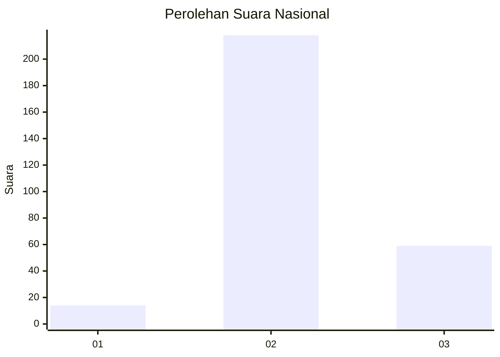

# Hasil

## Grafik

## Tabel

| No. | Nama Paslon    | Suara | Suara (raw) | Persentase |
|:--- |:-------------- | -----:| -----------:| ----------:|
| 1   | ANIES MUHAIMIN | 14    | [14][p-1]   | 4,81       |
| 2   | PRABOWO GIBRAN | 218   | [218][p-2]  | 74,91      |
| 3   | GANJAR MAHFUD  | 59    | [59][p-3]   | 20,27      |

[p-1]: https://github.com/gigit-pemilu/pemilu-2024/blob/main/pilpres/hitung-suara/sub/99-luar-negeri/sub/54-johor-bahru-malaysia/sub/01-johor-bahru-malaysia/sub/0001-johor-bahru-malaysia/sub/012-ksk-002/sub/paslon-1.txt
[p-2]: https://github.com/gigit-pemilu/pemilu-2024/blob/main/pilpres/hitung-suara/sub/99-luar-negeri/sub/54-johor-bahru-malaysia/sub/01-johor-bahru-malaysia/sub/0001-johor-bahru-malaysia/sub/012-ksk-002/sub/paslon-2.txt
[p-3]: https://github.com/gigit-pemilu/pemilu-2024/blob/main/pilpres/hitung-suara/sub/99-luar-negeri/sub/54-johor-bahru-malaysia/sub/01-johor-bahru-malaysia/sub/0001-johor-bahru-malaysia/sub/012-ksk-002/sub/paslon-3.txt

## Foto C Plano

https://sirekap-obj-formc.kpu.go.id/7958/pemilu/ppwp/99/54/01/00/01/9954010001012-20240217-232123--d692aa8e-b5f4-49ca-bd13-651fd88a8ee4.jpg

https://sirekap-obj-formc.kpu.go.id/7958/pemilu/ppwp/99/54/01/00/01/9954010001012-20240217-232430--a2dd8ffa-3069-410a-9710-837be7d076b9.jpg

https://sirekap-obj-formc.kpu.go.id/7958/pemilu/ppwp/99/54/01/00/01/9954010001012-20240217-232549--836544d1-b04e-4d3f-852f-cb802b01eafe.jpg

## Metadata

| Key        | Value               |
| ---------- | ------------------- |
| Time Stamp | 2024-02-19 06:16:00 |

## DATA PEMILIH TETAP

Jumlah pemilih dalam DPT: **296**.
 * L: **0**.
 * P: **296**.

## DATA PENGGUNA HAK PILIH

Jumlah pengguna hak pilih dalam DPT: **62**.
 * L: **0**.
 * P: **62**.

Jumlah pengguna hak pilih dalam DPTb: **52**.
 * L: **46**.
 * P: **6**.

Jumlah pengguna hak pilih dalam DPK: **189**.
 * L: **44**.
 * P: **145**.

Jumlah pengguna hak pilih: **303**.
 * L: **40**.
 * P: **213**.

## JUMLAH SUARA SAH DAN TIDAK SAH

JUMLAH SELURUH SUARA SAH: **291**.

JUMLAH SUARA TIDAK SAH: **12**.

JUMLAH SELURUH SUARA SAH DAN SUARA TIDAK SAH: **303**.

