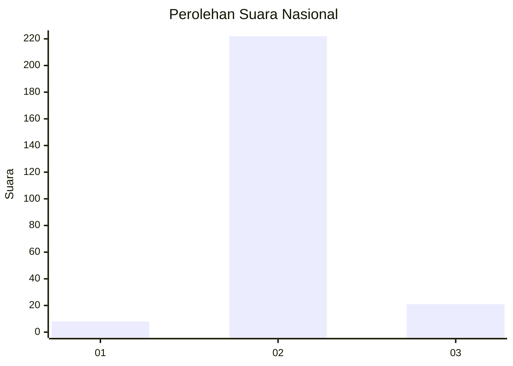
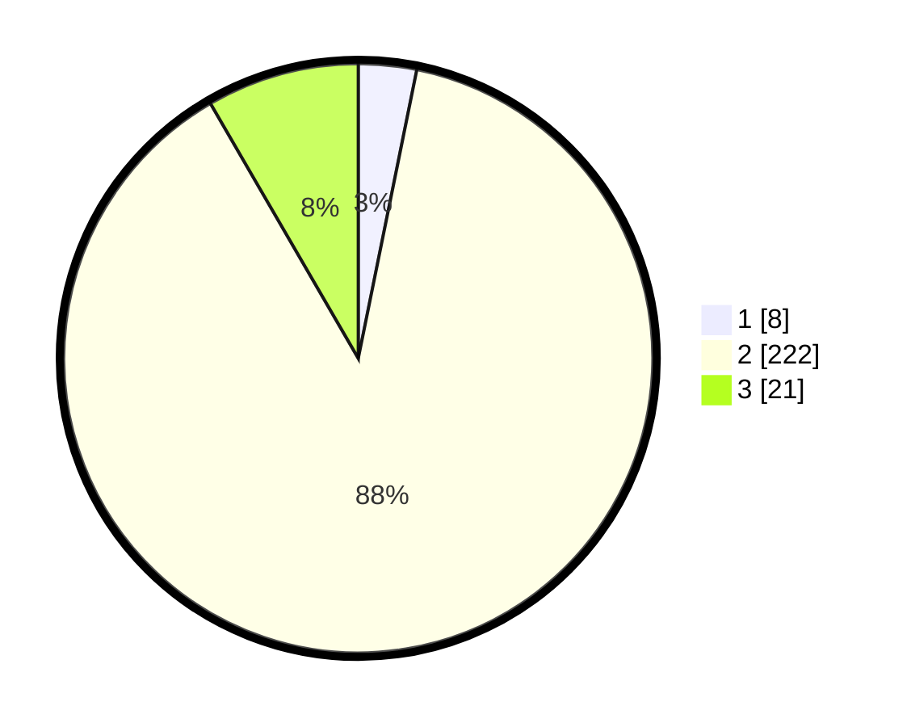

# Hasil

## Grafik

## Tabel

| No. | Nama Paslon    | Suara | Suara (raw) | Persentase |
|:--- |:-------------- | -----:| -----------:| ----------:|
| 1   | ANIES MUHAIMIN | 8     | [8][p-1]    | 3,19       |
| 2   | PRABOWO GIBRAN | 222   | [222][p-2]  | 88,45      |
| 3   | GANJAR MAHFUD  | 21    | [21][p-3]   | 8,37       |

[p-1]: https://github.com/gigit-pemilu/pemilu-2024/blob/main/pilpres/hitung-suara/sub/99-luar-negeri/sub/54-johor-bahru-malaysia/sub/01-johor-bahru-malaysia/sub/0001-johor-bahru-malaysia/sub/026-ksk-016/sub/paslon-1.txt
[p-2]: https://github.com/gigit-pemilu/pemilu-2024/blob/main/pilpres/hitung-suara/sub/99-luar-negeri/sub/54-johor-bahru-malaysia/sub/01-johor-bahru-malaysia/sub/0001-johor-bahru-malaysia/sub/026-ksk-016/sub/paslon-2.txt
[p-3]: https://github.com/gigit-pemilu/pemilu-2024/blob/main/pilpres/hitung-suara/sub/99-luar-negeri/sub/54-johor-bahru-malaysia/sub/01-johor-bahru-malaysia/sub/0001-johor-bahru-malaysia/sub/026-ksk-016/sub/paslon-3.txt

## Foto C Plano

https://sirekap-obj-formc.kpu.go.id/8074/pemilu/ppwp/99/54/01/00/01/9954010001026-20240217-212616--7b401046-426c-4e85-adca-b2a6f2b61c37.jpg

https://sirekap-obj-formc.kpu.go.id/8074/pemilu/ppwp/99/54/01/00/01/9954010001026-20240217-212855--25646f54-62df-4538-8e6f-2206bbfe353f.jpg

https://sirekap-obj-formc.kpu.go.id/8074/pemilu/ppwp/99/54/01/00/01/9954010001026-20240217-213027--15307e4f-0ddc-4f88-b2ac-c00c7b556e68.jpg

## Metadata

| Key        | Value               |
| ---------- | ------------------- |
| Time Stamp | 2024-02-19 06:16:00 |

## DATA PEMILIH TETAP

Jumlah pemilih dalam DPT: **250**.
 * L: **0**.
 * P: **250**.

## DATA PENGGUNA HAK PILIH

Jumlah pengguna hak pilih dalam DPT: **145**.
 * L: **0**.
 * P: **145**.

Jumlah pengguna hak pilih dalam DPTb: **25**.
 * L: **2**.
 * P: **23**.

Jumlah pengguna hak pilih dalam DPK: **83**.
 * L: **9**.
 * P: **74**.

Jumlah pengguna hak pilih: **253**.
 * L: **11**.
 * P: **242**.

## JUMLAH SUARA SAH DAN TIDAK SAH

JUMLAH SELURUH SUARA SAH: **251**.

JUMLAH SUARA TIDAK SAH: **2**.

JUMLAH SELURUH SUARA SAH DAN SUARA TIDAK SAH: **253**.

