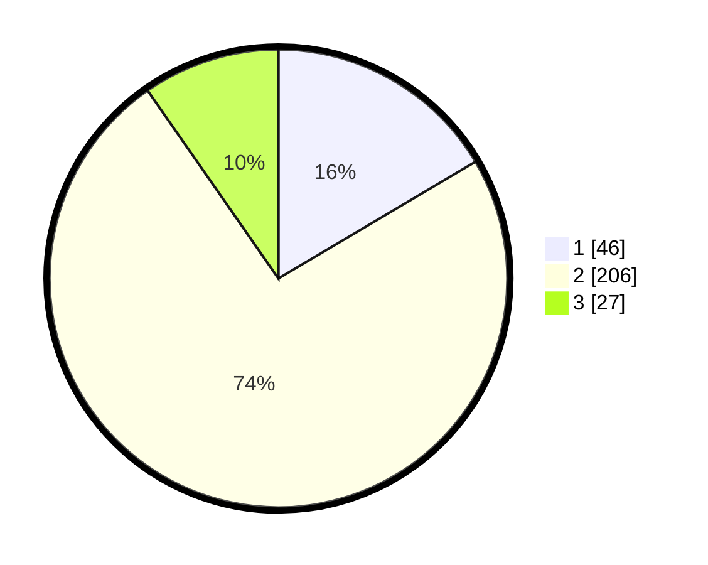

# Hasil

## Grafik

## Tabel

| No. | Nama Paslon    | Suara | Suara (raw) | Persentase |
|:--- |:-------------- | -----:| -----------:| ----------:|
| 1   | ANIES MUHAIMIN | 46    | [46][p-1]   | 16,49      |
| 2   | PRABOWO GIBRAN | 206   | [206][p-2]  | 73,84      |
| 3   | GANJAR MAHFUD  | 27    | [27][p-3]   | 9,68       |

[p-1]: https://github.com/gigit-pemilu/pemilu-2024/blob/main/pilpres/hitung-suara/sub/99-luar-negeri/sub/54-johor-bahru-malaysia/sub/01-johor-bahru-malaysia/sub/0001-johor-bahru-malaysia/sub/091-ksk-081/sub/paslon-1.txt
[p-2]: https://github.com/gigit-pemilu/pemilu-2024/blob/main/pilpres/hitung-suara/sub/99-luar-negeri/sub/54-johor-bahru-malaysia/sub/01-johor-bahru-malaysia/sub/0001-johor-bahru-malaysia/sub/091-ksk-081/sub/paslon-2.txt
[p-3]: https://github.com/gigit-pemilu/pemilu-2024/blob/main/pilpres/hitung-suara/sub/99-luar-negeri/sub/54-johor-bahru-malaysia/sub/01-johor-bahru-malaysia/sub/0001-johor-bahru-malaysia/sub/091-ksk-081/sub/paslon-3.txt

## Foto C Plano

https://sirekap-obj-formc.kpu.go.id/fbd8/pemilu/ppwp/99/54/01/00/01/9954010001091-20240218-130509--165fb04e-1d0e-41fb-bd77-07d89bcf1633.jpg

https://sirekap-obj-formc.kpu.go.id/fbd8/pemilu/ppwp/99/54/01/00/01/9954010001091-20240218-130621--def1122c-989c-409e-bbfb-5890620bc74d.jpg

https://sirekap-obj-formc.kpu.go.id/fbd8/pemilu/ppwp/99/54/01/00/01/9954010001091-20240218-130707--f529b4d6-5d5c-402e-b1fa-0bf7a540358b.jpg

## Metadata

| Key        | Value               |
| ---------- | ------------------- |
| Time Stamp | 2024-02-19 06:16:00 |

## DATA PEMILIH TETAP

Jumlah pemilih dalam DPT: **295**.
 * L: **184**.
 * P: **111**.

## DATA PENGGUNA HAK PILIH

Jumlah pengguna hak pilih dalam DPT: **8**.
 * L: **5**.
 * P: **3**.

Jumlah pengguna hak pilih dalam DPTb: **93**.
 * L: **32**.
 * P: **61**.

Jumlah pengguna hak pilih dalam DPK: **185**.
 * L: **82**.
 * P: **103**.

Jumlah pengguna hak pilih: **286**.
 * L: **119**.
 * P: **167**.

## JUMLAH SUARA SAH DAN TIDAK SAH

JUMLAH SELURUH SUARA SAH: **279**.

JUMLAH SUARA TIDAK SAH: **7**.

JUMLAH SELURUH SUARA SAH DAN SUARA TIDAK SAH: **286**.

