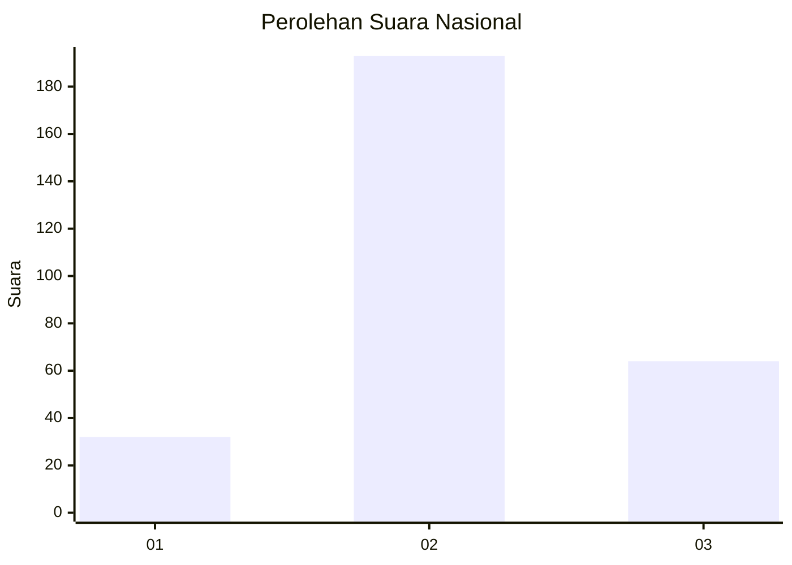
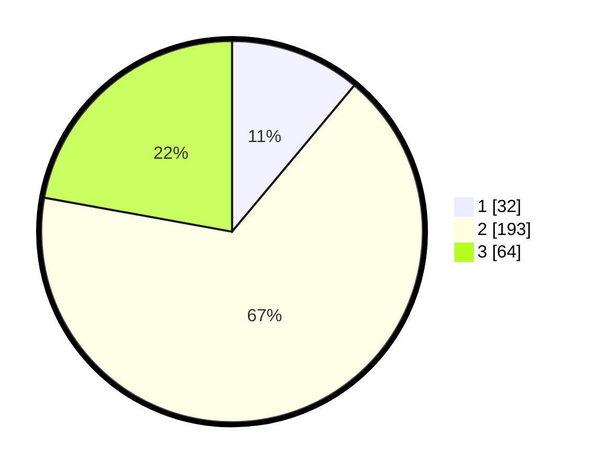

# Hasil

## Grafik

## Tabel

| No. | Nama Paslon    | Suara | Suara (raw) | Persentase |
|:--- |:-------------- | -----:| -----------:| ----------:|
| 1   | ANIES MUHAIMIN | 32    | [32][p-1]   | 11,07      |
| 2   | PRABOWO GIBRAN | 193   | [193][p-2]  | 66,78      |
| 3   | GANJAR MAHFUD  | 64    | [64][p-3]   | 22,15      |

[p-1]: https://github.com/gigit-pemilu/pemilu-2024/blob/main/pilpres/hitung-suara/sub/99-luar-negeri/sub/54-johor-bahru-malaysia/sub/01-johor-bahru-malaysia/sub/0001-johor-bahru-malaysia/sub/139-ksk-129/sub/paslon-1.txt
[p-2]: https://github.com/gigit-pemilu/pemilu-2024/blob/main/pilpres/hitung-suara/sub/99-luar-negeri/sub/54-johor-bahru-malaysia/sub/01-johor-bahru-malaysia/sub/0001-johor-bahru-malaysia/sub/139-ksk-129/sub/paslon-2.txt
[p-3]: https://github.com/gigit-pemilu/pemilu-2024/blob/main/pilpres/hitung-suara/sub/99-luar-negeri/sub/54-johor-bahru-malaysia/sub/01-johor-bahru-malaysia/sub/0001-johor-bahru-malaysia/sub/139-ksk-129/sub/paslon-3.txt

## Foto C Plano

https://sirekap-obj-formc.kpu.go.id/e5af/pemilu/ppwp/99/54/01/00/01/9954010001139-20240218-192856--746f5920-f65c-44d2-90a6-dab410aeaab3.jpg

https://sirekap-obj-formc.kpu.go.id/e5af/pemilu/ppwp/99/54/01/00/01/9954010001139-20240218-193121--2ac374fa-5d18-4c58-ae58-9d510e9635c3.jpg

https://sirekap-obj-formc.kpu.go.id/e5af/pemilu/ppwp/99/54/01/00/01/9954010001139-20240218-193236--e93e1372-27fb-4c4c-9e0d-c3f24e516ffa.jpg

## Metadata

| Key        | Value               |
| ---------- | ------------------- |
| Time Stamp | 2024-02-19 06:16:00 |

## DATA PEMILIH TETAP

Jumlah pemilih dalam DPT: **292**.
 * L: **179**.
 * P: **113**.

## DATA PENGGUNA HAK PILIH

Jumlah pengguna hak pilih dalam DPT: **48**.
 * L: **24**.
 * P: **24**.

Jumlah pengguna hak pilih dalam DPTb: **100**.
 * L: **55**.
 * P: **45**.

Jumlah pengguna hak pilih dalam DPK: **150**.
 * L: **84**.
 * P: **66**.

Jumlah pengguna hak pilih: **298**.
 * L: **163**.
 * P: **135**.

## JUMLAH SUARA SAH DAN TIDAK SAH

JUMLAH SELURUH SUARA SAH: **289**.

JUMLAH SUARA TIDAK SAH: **9**.

JUMLAH SELURUH SUARA SAH DAN SUARA TIDAK SAH: **298**.

