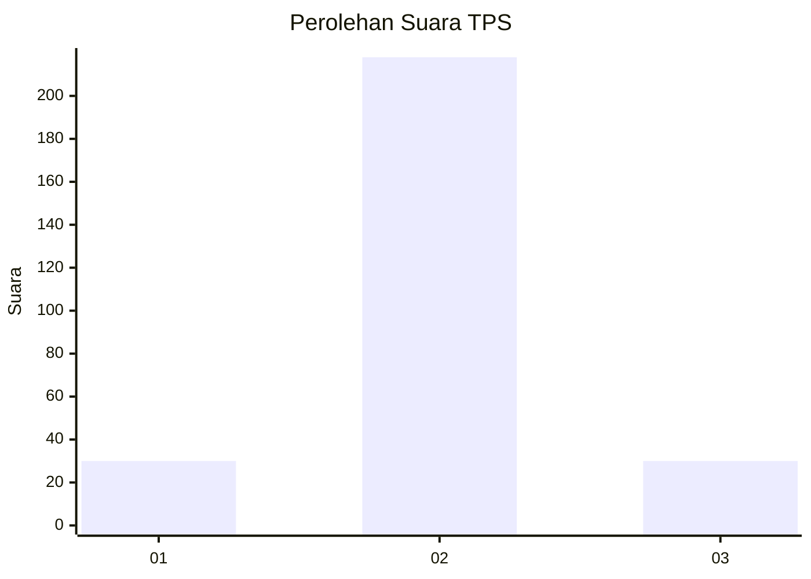
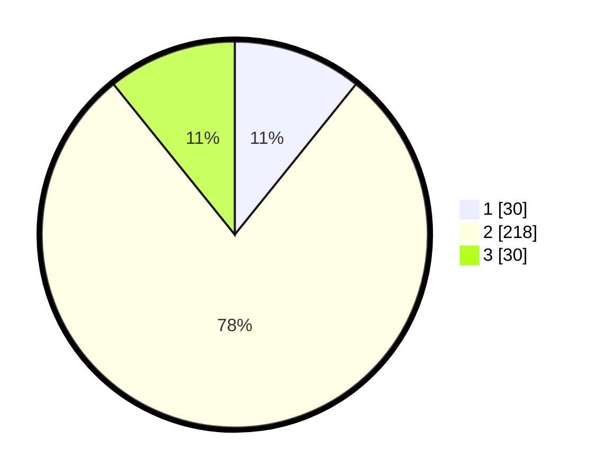

# Hasil

## Grafik

## Tabel

| No. | Nama Paslon    | Suara | Suara (raw) | Persentase |
|:--- |:-------------- | -----:| -----------:| ----------:|
| 1   | ANIES MUHAIMIN | 30    | [30][p-1]   | 10,79      |
| 2   | PRABOWO GIBRAN | 218   | [218][p-2]  | 78,42      |
| 3   | GANJAR MAHFUD  | 30    | [30][p-3]   | 10,79      |

[p-1]: https://github.com/gigit-pemilu/pemilu-2024-99-luar-negeri/blob/main/pilpres/hitung-suara/sub/99-luar-negeri/sub/54-johor-bahru-malaysia/sub/01-johor-bahru-malaysia/sub/0001-johor-bahru-malaysia/sub/163-ksk-153/sub/paslon-1.txt
[p-2]: https://github.com/gigit-pemilu/pemilu-2024-99-luar-negeri/blob/main/pilpres/hitung-suara/sub/99-luar-negeri/sub/54-johor-bahru-malaysia/sub/01-johor-bahru-malaysia/sub/0001-johor-bahru-malaysia/sub/163-ksk-153/sub/paslon-2.txt
[p-3]: https://github.com/gigit-pemilu/pemilu-2024-99-luar-negeri/blob/main/pilpres/hitung-suara/sub/99-luar-negeri/sub/54-johor-bahru-malaysia/sub/01-johor-bahru-malaysia/sub/0001-johor-bahru-malaysia/sub/163-ksk-153/sub/paslon-3.txt

## Foto C Plano

https://sirekap-obj-formc.kpu.go.id/0ed1/pemilu/ppwp/99/54/01/00/01/9954010001163-20240218-204334--b3b59cee-55f9-44e3-a5b5-3e572c94fff1.jpg

https://sirekap-obj-formc.kpu.go.id/0ed1/pemilu/ppwp/99/54/01/00/01/9954010001163-20240218-204622--31edddbd-dfd3-40f1-9f63-e5610c4ed164.jpg

https://sirekap-obj-formc.kpu.go.id/0ed1/pemilu/ppwp/99/54/01/00/01/9954010001163-20240218-204752--6902aaea-d724-4d6f-b475-648276728107.jpg

## Metadata

| Key        | Value               |
| ---------- | ------------------- |
| Time Stamp | 2024-02-24 22:31:28 |

## DATA PEMILIH TETAP

Jumlah pemilih dalam DPT: **275**.
 * L: **141**.
 * P: **134**.

## DATA PENGGUNA HAK PILIH

Jumlah pengguna hak pilih dalam DPT: **12**.
 * L: **8**.
 * P: **4**.

Jumlah pengguna hak pilih dalam DPTb: **72**.
 * L: **55**.
 * P: **17**.

Jumlah pengguna hak pilih dalam DPK: **197**.
 * L: **115**.
 * P: **82**.

Jumlah pengguna hak pilih: **281**.
 * L: **178**.
 * P: **103**.

## JUMLAH SUARA SAH DAN TIDAK SAH

JUMLAH SELURUH SUARA SAH: **278**.

JUMLAH SUARA TIDAK SAH: **3**.

JUMLAH SELURUH SUARA SAH DAN SUARA TIDAK SAH: **281**.

