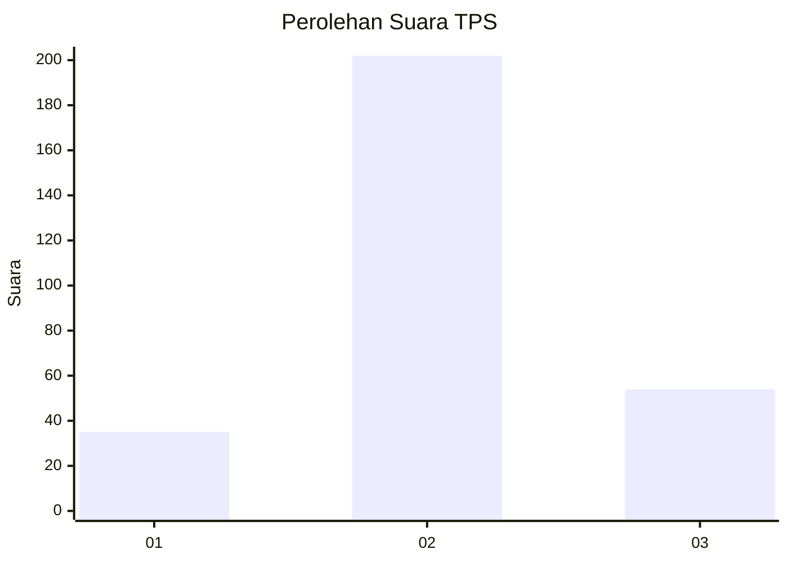
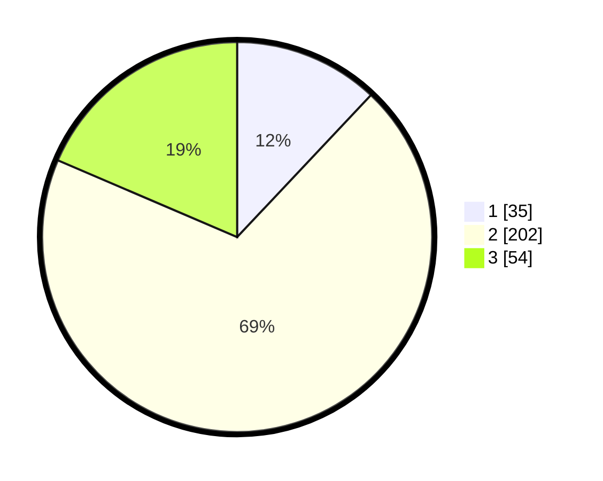

# Hasil

## Grafik

## Tabel

| No. | Nama Paslon    | Suara | Suara (raw) | Persentase |
|:--- |:-------------- | -----:| -----------:| ----------:|
| 1   | ANIES MUHAIMIN | 35    | [35][p-1]   | 12,03      |
| 2   | PRABOWO GIBRAN | 202   | [202][p-2]  | 69,42      |
| 3   | GANJAR MAHFUD  | 54    | [54][p-3]   | 18,56      |

[p-1]: https://github.com/gigit-pemilu/pemilu-2024-99-luar-negeri/blob/main/pilpres/hitung-suara/sub/99-luar-negeri/sub/54-johor-bahru-malaysia/sub/01-johor-bahru-malaysia/sub/0001-johor-bahru-malaysia/sub/332-ksk-322/sub/paslon-1.txt
[p-2]: https://github.com/gigit-pemilu/pemilu-2024-99-luar-negeri/blob/main/pilpres/hitung-suara/sub/99-luar-negeri/sub/54-johor-bahru-malaysia/sub/01-johor-bahru-malaysia/sub/0001-johor-bahru-malaysia/sub/332-ksk-322/sub/paslon-2.txt
[p-3]: https://github.com/gigit-pemilu/pemilu-2024-99-luar-negeri/blob/main/pilpres/hitung-suara/sub/99-luar-negeri/sub/54-johor-bahru-malaysia/sub/01-johor-bahru-malaysia/sub/0001-johor-bahru-malaysia/sub/332-ksk-322/sub/paslon-3.txt

## Foto C Plano

https://sirekap-obj-formc.kpu.go.id/4543/pemilu/ppwp/99/54/01/00/01/9954010001332-20240217-171026--60fc1d9f-2f2f-4aee-85cb-908d83657789.jpg

https://sirekap-obj-formc.kpu.go.id/4543/pemilu/ppwp/99/54/01/00/01/9954010001332-20240217-171252--cb2de2ad-22c6-4cc7-8da9-3c96592360e4.jpg

https://sirekap-obj-formc.kpu.go.id/4543/pemilu/ppwp/99/54/01/00/01/9954010001332-20240217-171402--c636f375-ec7d-451c-920f-6912d8091fd2.jpg

## Metadata

| Key        | Value               |
| ---------- | ------------------- |
| Time Stamp | 2024-02-17 17:30:00 |

## DATA PEMILIH TETAP

Jumlah pemilih dalam DPT: **300**.
 * L: **3**.
 * P: **297**.

## DATA PENGGUNA HAK PILIH

Jumlah pengguna hak pilih dalam DPT: **290**.
 * L: **2**.
 * P: **288**.

Jumlah pengguna hak pilih dalam DPTb: **4**.
 * L: **0**.
 * P: **4**.

Jumlah pengguna hak pilih dalam DPK: **12**.
 * L: **0**.
 * P: **12**.

Jumlah pengguna hak pilih: **306**.
 * L: **2**.
 * P: **304**.

## JUMLAH SUARA SAH DAN TIDAK SAH

JUMLAH SELURUH SUARA SAH: **291**.

JUMLAH SUARA TIDAK SAH: **15**.

JUMLAH SELURUH SUARA SAH DAN SUARA TIDAK SAH: **306**.

